# Task - Implement a Client Server Architecture using MySQL Database Management System (DBMS)

These instructions were followed to implement the above task:

## Step 1. Create and configure two linux-based virtual servers (EC2 instance in AWS)

* mysql server

* mysql client

1. Two EC2 Instances of t3.micro type and Ubuntu 26.04 LTS (HVM) was lunched in the us-east-1 region using the AWS console.

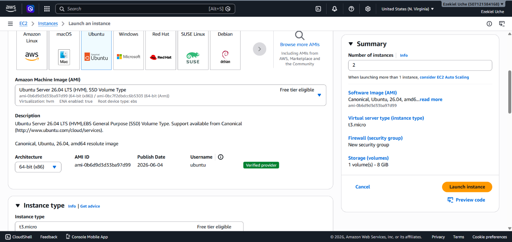

* mysql server

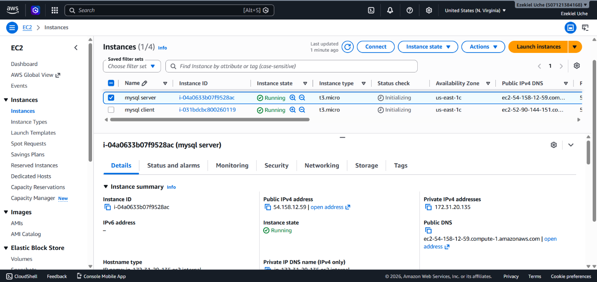

* mysql client

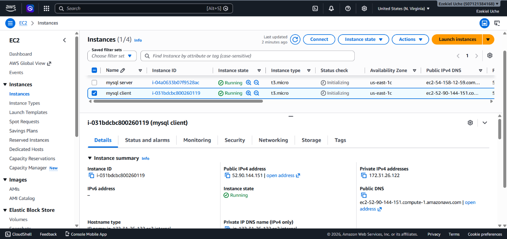

The security group inbound rule for both instances was configured with the default SSH on port 22 with source from anywhere.

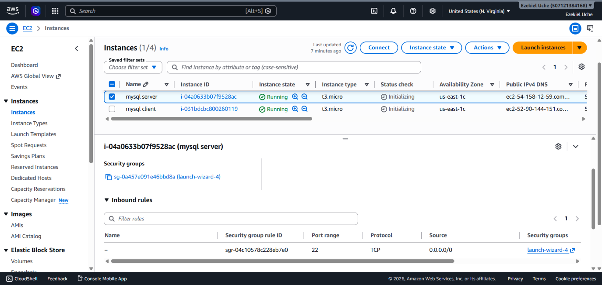

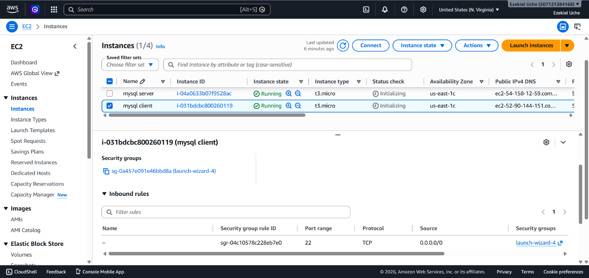

2. Attached SSH key named my-ec2-key to access the instance on port 22

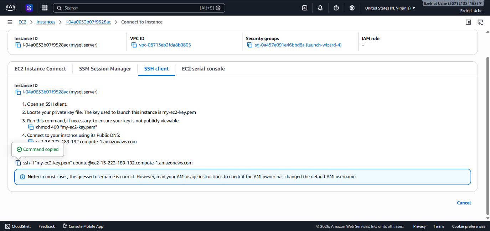

## Step 2 - On mysql server Linux Server, install MySQL Server software

1. The private ssh key permission was changed for the private key file and then used to connect to the instance by running

```
chmod 400 my-ec2-key.pem
ssh -i "my-ec2-key.pem" ubuntu@ec2-13-222-189-192
```

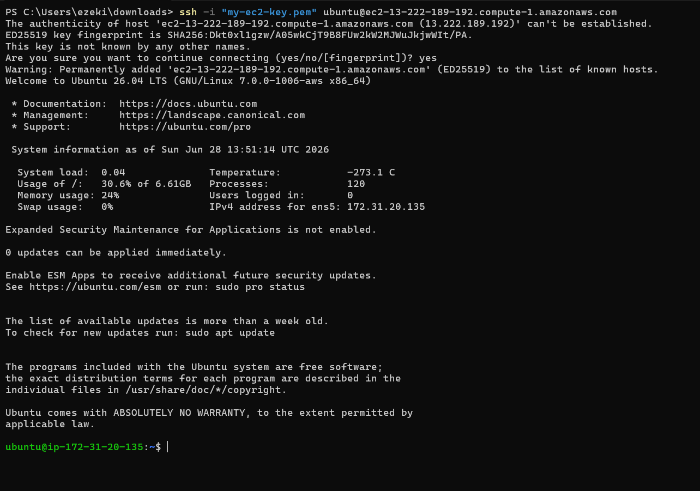

2. Update and upgrade Ubuntu

```
sudo apt update && sudo apt upgrade -y
```


3. Install MySQL Server software

```
sudo apt install mysql-server -y
```

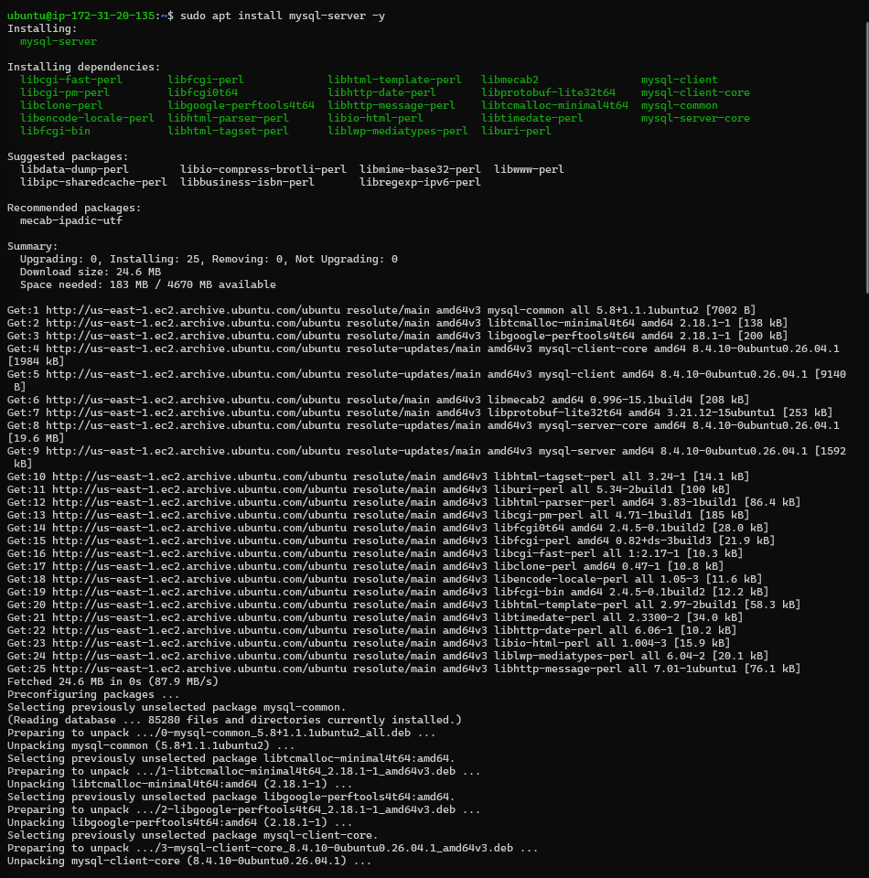

4. Enable mysql server

```
sudo systemctl enable mysql
```


## Step 3 - On mysql client Linux Server install MySQL Client software.

1. Connect to the instance

```
ssh -i "my-ec2-key.pem" ubuntu@ec2-13-220-180-26
```

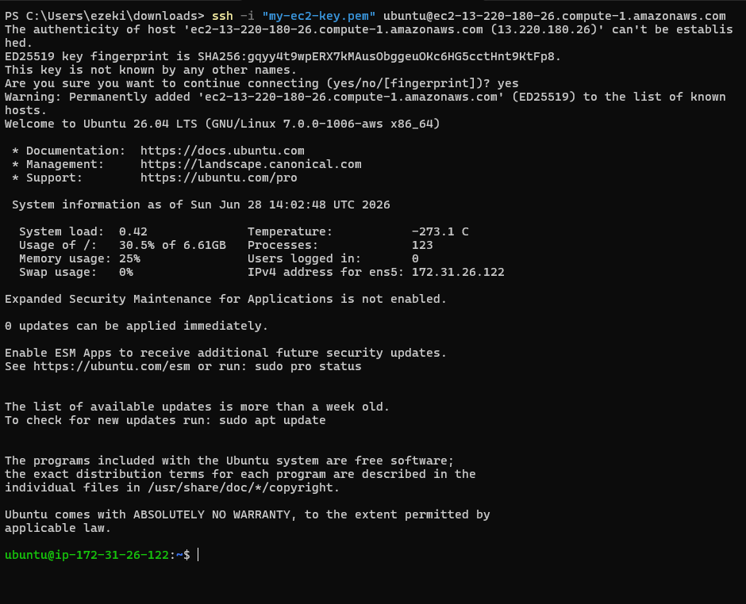

2. Update and upgrade Ubuntu

```
sudo apt update && sudo apt upgrade -y
```


3. Install MySQL Client software

```
sudo apt install mysql-client -y
```

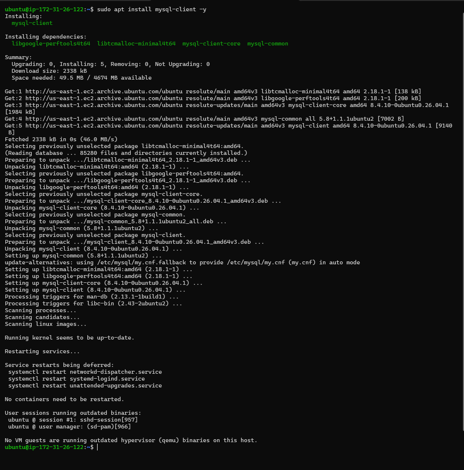

## Step 4 - Use mysql server's local IP address to connect from mysql client.

By default, both of the EC2 virtual servers are located in the same local virtual network, so they can communicate to each other using local IP addresses. Use mysql server's local IP address to connect from mysql client. MySQL server uses TCP port 3306 by default so it has to be opened by creating a new entry in inbound rules in mysql server Security Groups. For extra security, access to mysql server by all IP addresses was not allowed, only the specific local IP address of mysql client was allowed.

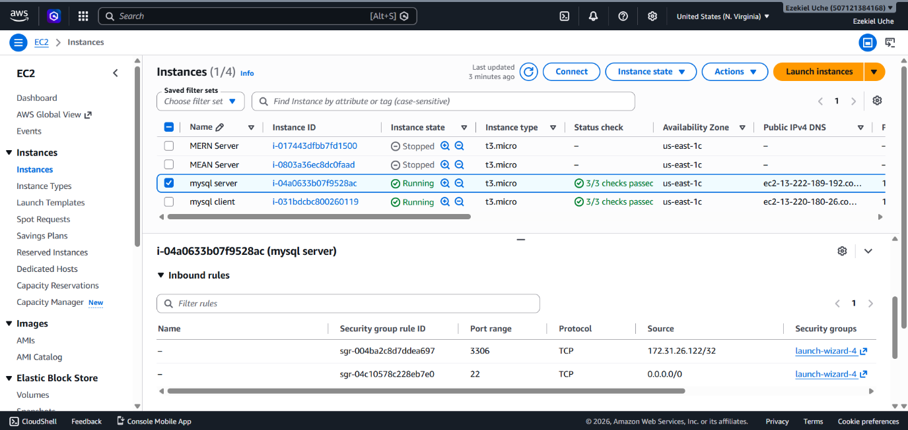

## Step 5 - Configure MySQL server to allow connections from remote hosts.

Befor the configuration stated above, the following were implemented:

1. The security script of MySQL was run on mysql server by running the command:

```
sudo mysql_secure_installation
```

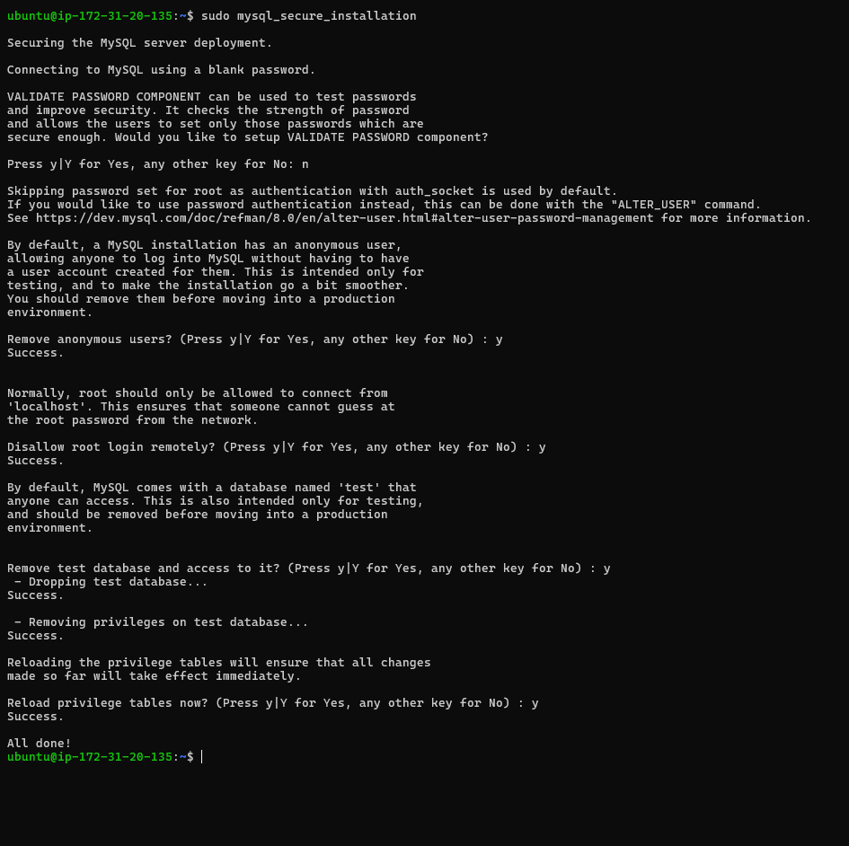

2. Access MySQL shell

```
sudo mysql
```

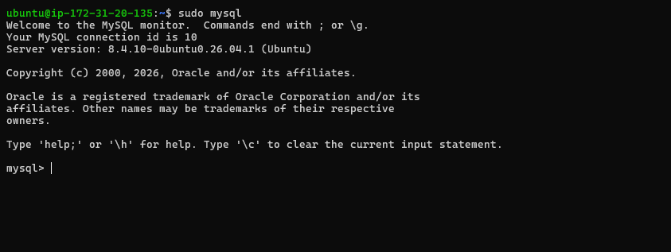

3. On mysql server, create a user named client and a database named test_db.

```
CREATE USER 'client'@'%' IDENTIFIED BY 'PassWord.1';
CREATE DATABASE test_db;
GRANT ALL ON test_db.* TO 'client'@'%' WITH GRANT OPTION;
FLUSH PRIVILEGES;
```

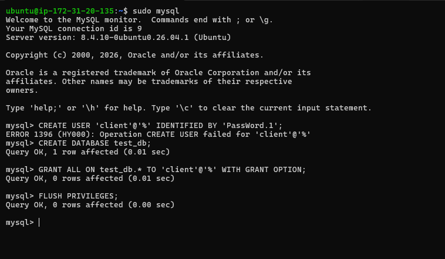

4. Now, configure MySQL server to allow connections from remote hosts.

```
sudo vim /etc/mysql/mysql.conf.d/mysqld.cnf
```


Locate bind-address = 127.0.0.1

Replace 127.0.0.1 with 0.0.0.0

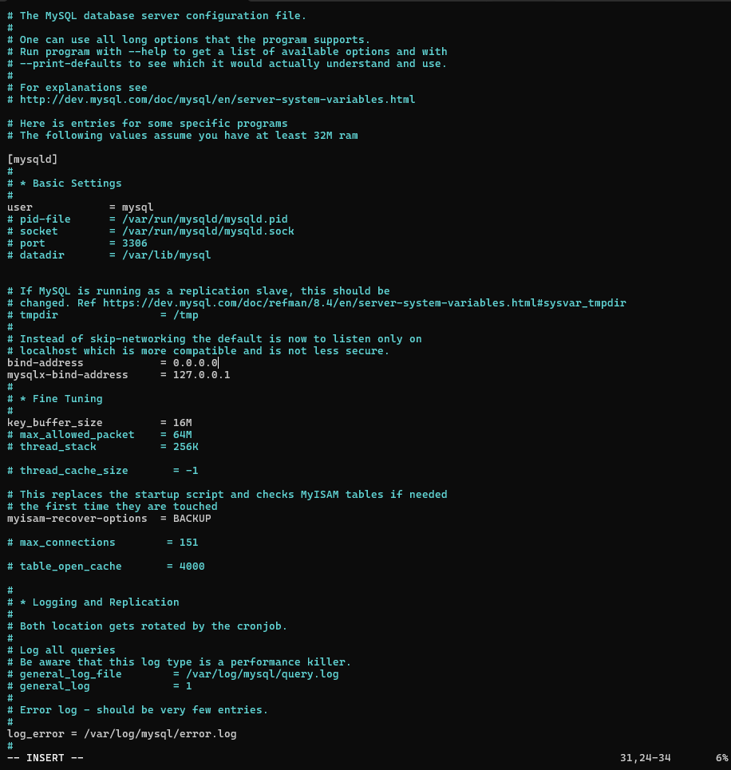

## Step 6 - From mysql client Linxus Sever, connect remotely to mysql server Database Engine without using SSH. The mysql utility must be used to perform this action.

```
sudo mysql -u client -h 172.31.20.135 -p
```

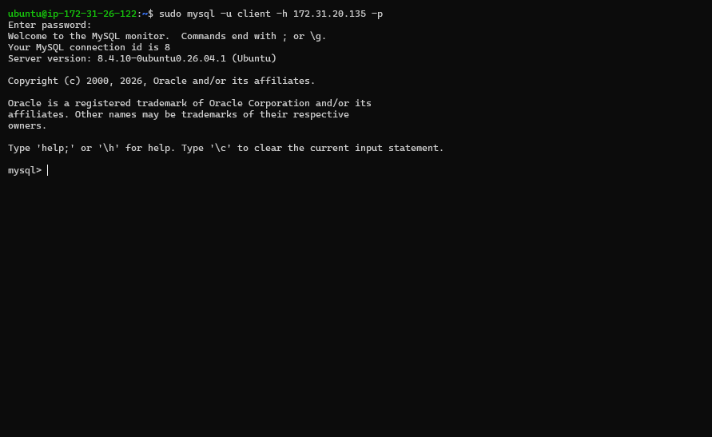

## Step 7 - Check that the connection to the remote MySQL server was successfull and can perform SQL queries.

```
show databases;
```

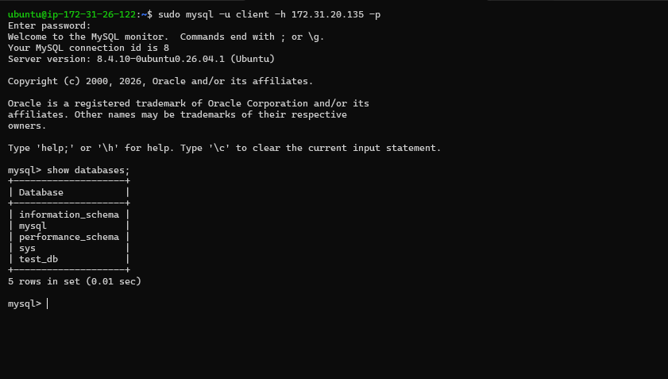

Create table, insert rows into table and select from the table

```
CREATE TABLE test_db.test_table (
item_id INT AUTO_INCREMENT,
content VARCHAR(255),
PRIMARY KEY(item_id)
);
INSERT INTO test_db.test_table (content) VALUES ("who is the G.O.A.T? Messi or Ronaldo");
INSERT INTO test_db.test_table (content) VALUES ("Answer: The G.O.A.T depends on who you’re asking. lol");
SELECT * FROM test_db.test_table;
```


This deployment is a fully functional MySQL Client-Server set up.