# WEB STACK IMPLEMENTATION (LAMP STACK) IN AWS

## Introduction

The LAMP stack is a widely used open-source platform for developing and hosting web applications. It is made up of four key technologies: Linux as the operating system, Apache as the web server, MySQL as the database management system, and PHP (or alternatively Perl or Python) as the server-side scripting language. This documentation provides an overview of the installation, configuration, and implementation of the LAMP stack.

---

## Step 0: Prerequisites

1. EC2 Instance of t3.micro type and Ubuntu 26.04 LTS (HVM) was launched in the us-west-2a region using the AWS console.
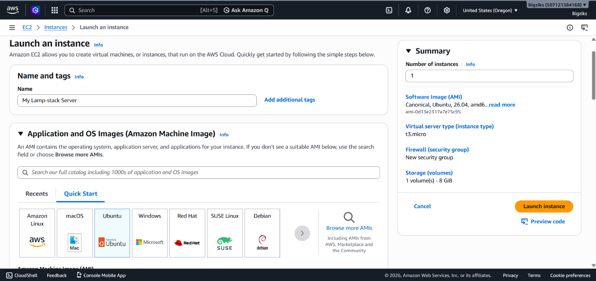

2. Created SSH key pair named lamp-key to access the instance on port 22.
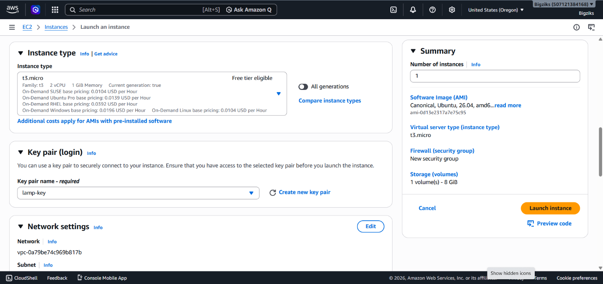

3. The security group was configured with the following inbound rules:
   - Allow traffic on port 80 (HTTP) with source from anywhere on the internet.
   - Allow traffic on port 22 (SSH) with source from any IP address. This is opened by default.
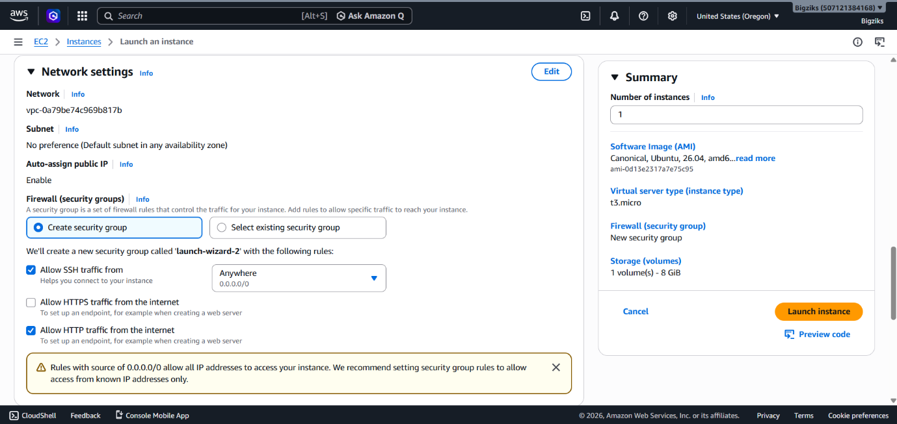

4. The default VPC and Subnet was used for the networking configuration.

5. The private ssh key that got downloaded was located, permission was changed for the private key file and then used to connect to the instance by running:

```bash
chmod 400 lamp-key.pem
ssh -i "lamp-key.pem" ubuntu@ec2-54-218-191-149.us-west-2.compute.amazonaws.com
```
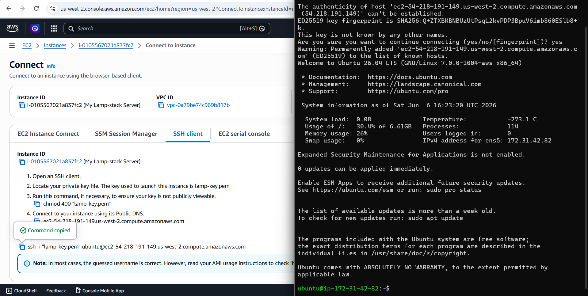

---

## Step 1 - Install Apache and Update the Firewall

1. Update and upgrade list of packages in package manager

```bash
sudo apt update
sudo apt upgrade -y
```
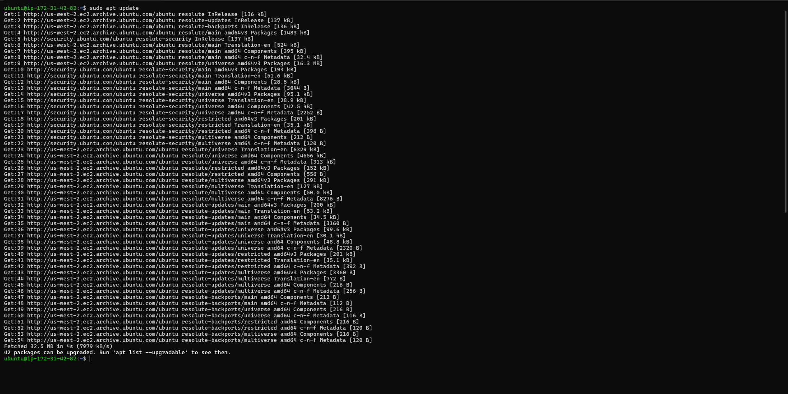
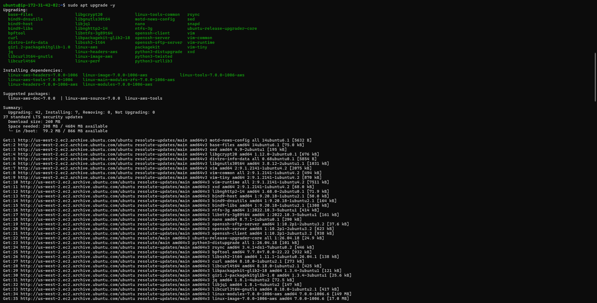

2. Run apache2 package installation

```bash
sudo apt install apache2 -y
```
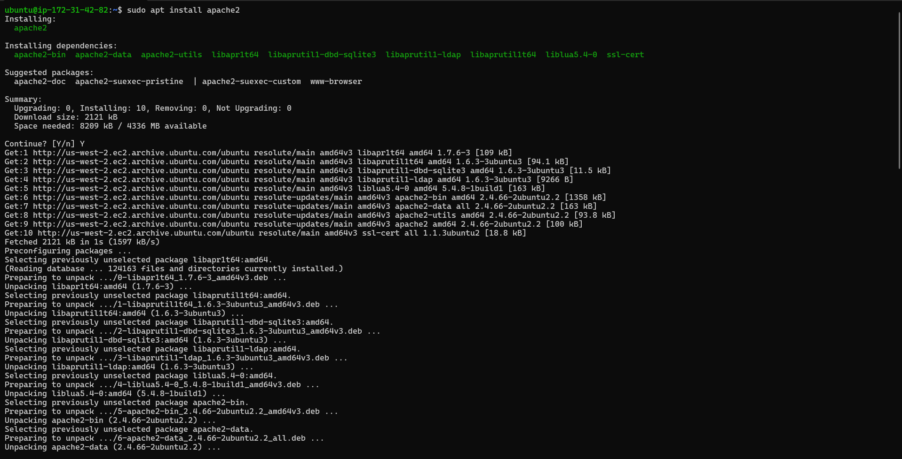

3. Enable and verify that apache is running as a service on the OS.

```bash
sudo systemctl enable apache2
sudo systemctl status apache2
```
If it's green and running, then apache2 is correctly installed.

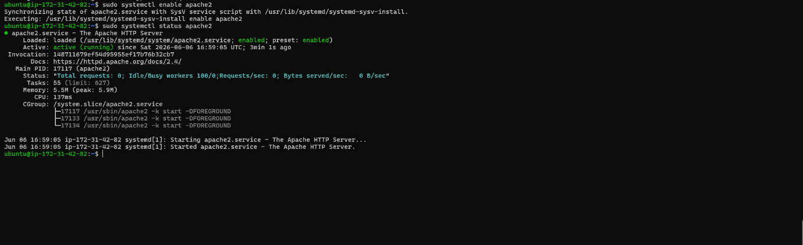

4. The server is running and can be accessed locally in the ubuntu shell by running the command below:

```bash
curl http://localhost:80
OR
curl http://127.0.0.1:80
```
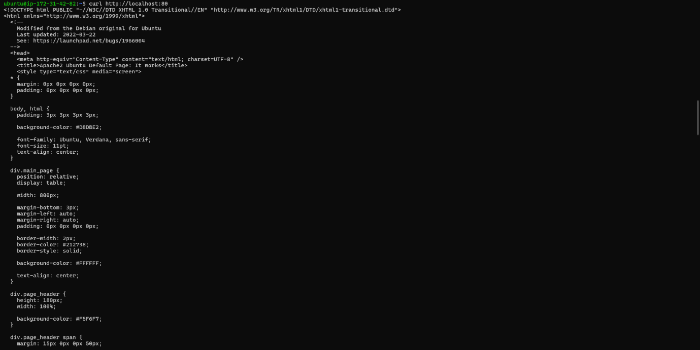

5. Test with the public IP address if the Apache HTTP server can respond to request from the internet using the URL on a browser.

```
http://54.218.191.149:80
```
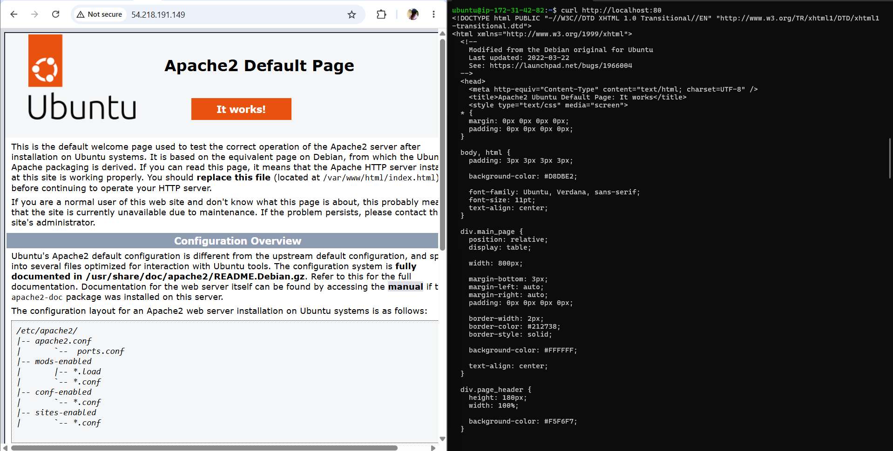

This shows that the web server is correctly installed and it is accessible through the firewall.

---

## Step 2 - Install MySQL

1. Install a relational database (RDB). MySQL was installed in this project. It is a popular relational database management system used within PHP environments.

```bash
sudo apt install mysql-server
```
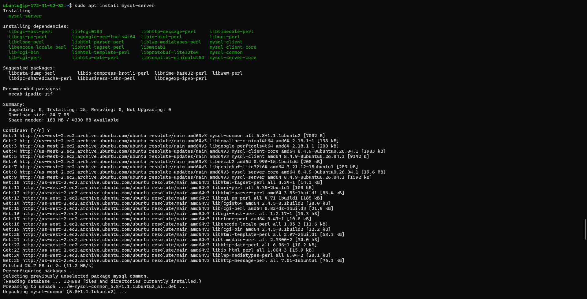
When prompted, install was confirmed by typing y and then Enter.


2. Enable and verify that mysql is running with the commands below

```bash
sudo systemctl enable --now mysql
sudo systemctl status mysql
```

3. Log in to MySQL console

```bash
sudo mysql
```
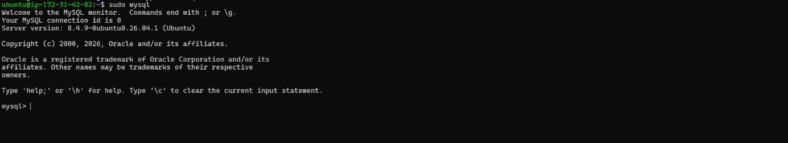

This connects to the MySQL server as the administrative database user root inferred by the use of sudo when running the command.


4. Set a password for root user using mysql_native_password as default authentication method. Here, the user's password was defined as "PassWord.1"

```sql
ALTER USER 'root'@'localhost' IDENTIFIED WITH mysql_native_password BY 'PassWord.1';
```
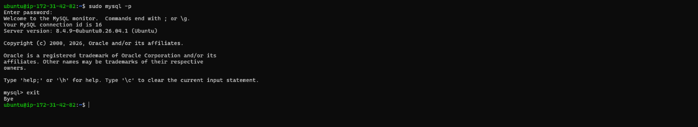

Exit the MySQL shell:
```bash
exit
```

5. Run an interactive script to secure MySQL. The security script comes pre-installed with MySQL. This script removes some insecure settings and locks down access to the database system.

```bash
sudo mysql_secure_installation
```
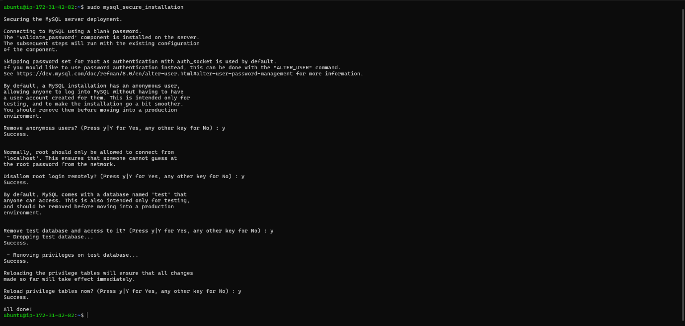

Regardless of whether the VALIDATION PASSWORD PLUGIN is set up, the server will ask to select and confirm a password for MySQL root user.

6. After changing root user password, log in to MySQL console. A command prompt for password was noticed after running the command below.

```bash
sudo mysql -p
```


Exit MySQL shell:
```bash
exit
```

---

## Step 3 - Install PHP

Apache is installed to serve the content and MySQL is installed to store and manage data. PHP is the component of the setup that processes code to display dynamic content to the end user.

The following were installed:
- php package
- php-mysql, a PHP module that allows PHP to communicate with MySQL-based databases
- libapache2-mod-php, to enable Apache to handle PHP files

```bash
sudo apt install php libapache2-mod-php php-mysql
```
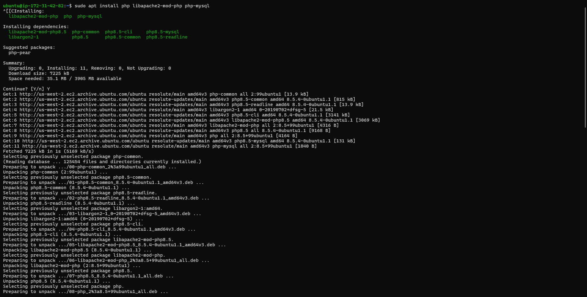

Confirm the PHP version:

```bash
php -v
```
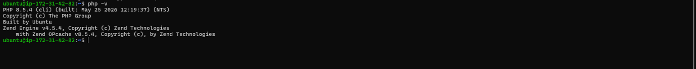

At this point, the LAMP stack is completely installed and fully operational. To test the setup with a PHP script, it's best to set up a proper Apache Virtual Host to hold the website files and folders. Virtual host allows you to have multiple websites located on a single machine and it won't be noticed by the website users.

---

## Step 4 - Create a virtual host for the website using Apache

1. The default directory serving the apache default page is `/var/www/html`. Create your document directory next to the default one. Created the directory for projectlamp using `mkdir` command:

```bash
sudo mkdir /var/www/projectlamp
```

Assign the directory ownership with `$USER` environment variable which references the current system user:

```bash
sudo chown -R $USER:$USER /var/www/projectlamp
```
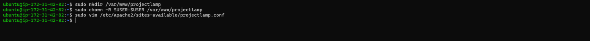

2. Create and open a new configuration file in apache's `sites-available` directory using vim.

```bash
sudo vim /etc/apache2/sites-available/projectlamp.conf
```

Paste in the bare-bones configuration below:

```
<VirtualHost *:80>
    ServerName projectlamp
    ServerAlias www.projectlamp
    ServerAdmin webmaster@localhost
    DocumentRoot /var/www/projectlamp
    ErrorLog ${APACHE_LOG_DIR}/error.log
    CustomLog ${APACHE_LOG_DIR}/access.log combined
</VirtualHost>
```
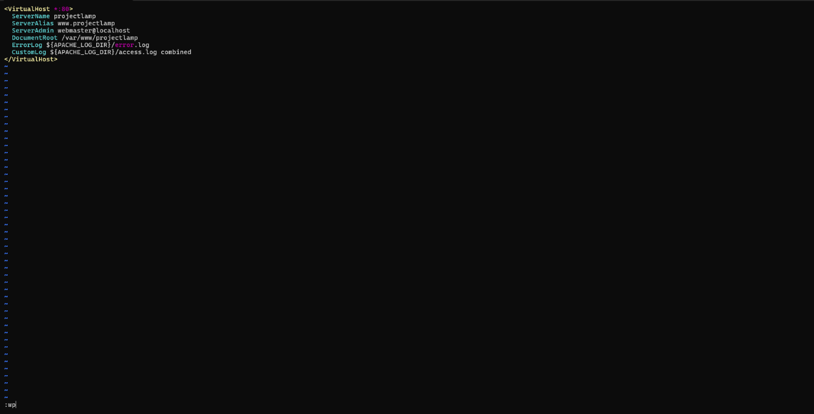

3. Show the new file in sites-available:

```bash
sudo ls /etc/apache2/sites-available
```

Output:
```
000-default.conf  default-ssl.conf  projectlamp.conf
```
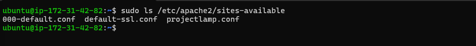

With the VirtualHost configuration, Apache will serve projectlamp using `/var/www/projectlamp` as its web root directory.

4. Enable the new virtual host:

```bash
sudo a2ensite projectlamp
```

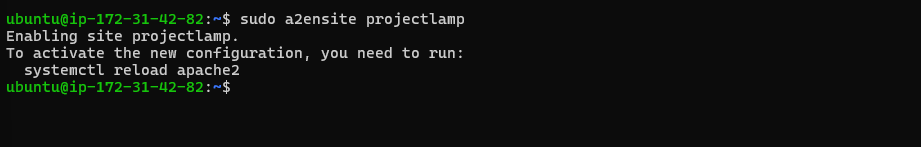

5. Disable apache's default website. This is because Apache's default configuration will overwrite the virtual host if not disabled. This is required if a custom domain is not being used.

```bash
sudo a2dissite 000-default
```

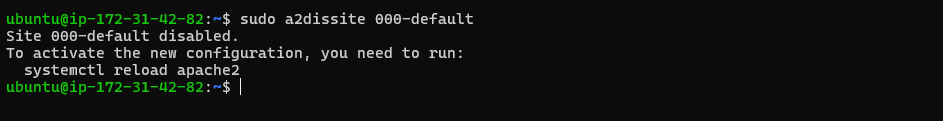

6. Ensure the configuration does not contain syntax errors. The command below was used:

```bash
sudo apache2ctl configtest
```

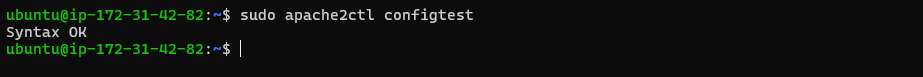

7. Reload apache for changes to take effect:

```bash
sudo systemctl reload apache2
```
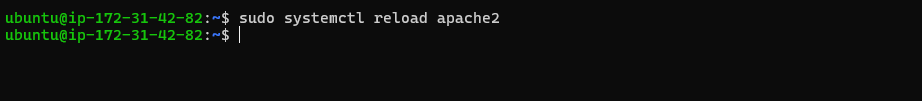

8. The new website is now active but the web root `/var/www/projectlamp` is still empty. Create an index.html file in this location to test that the virtual host works as expected.

```bash
sudo echo 'Hello LAMP from hostname' $(curl -s http://169.254.169.254/latest/meta-data/public-hostname) 'with public IP' $(curl -s http://169.254.169.254/latest/meta-data/public-ipv4) > /var/www/projectlamp/index.html
```
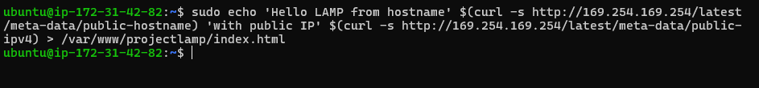

9. Open the website on a browser using the public IP address:

```
http://54.218.191.149:80
```
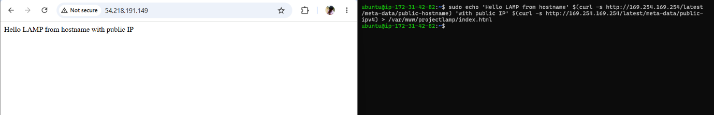

10. Open the website with public DNS name (port is optional):

```
http://<public-DNS-name>:80
```
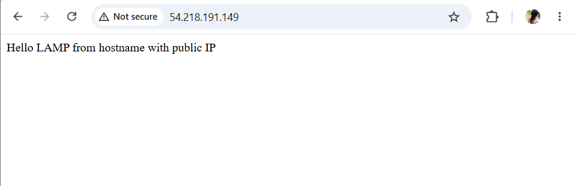
This file can be left in place as a temporary landing page for the application until an index.php file is set up to replace it. Once this is done, the index.html file should be renamed or removed from the document root as it will take precedence over index.php file by default.

---

## Step 5 - Enable PHP on the website

With the default `DirectoryIndex` setting on Apache, `index.html` file will always take precedence over `index.php` file. This is useful for setting up maintenance pages in PHP applications, by creating a temporary `index.html` file containing an informative message for visitors. The `index.html` then becomes the landing page for the application. Once maintenance is over, the `index.html` is renamed or removed from the document root, bringing back the regular application page.

If the behaviour needs to be changed, `/etc/apache2/mods-enabled/dir.conf` file should be edited and the order in which the `index.php` file is listed within the `DirectoryIndex` directive should be changed.

1. Open the `dir.conf` file with vim to change the behaviour:

```bash
sudo vim /etc/apache2/mods-enabled/dir.conf
```

```
<IfModule mod_dir.c>
    # Change this:
    # DirectoryIndex index.html index.cgi index.pl index.php index.xhtml index.htm
    # To this:
    DirectoryIndex index.php index.html index.cgi index.pl index.xhtml index.htm
</IfModule>
```
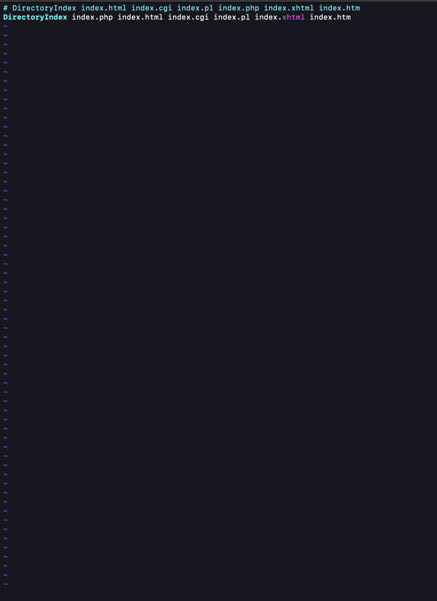

2. Reload Apache so the changes take effect:

```bash
sudo systemctl reload apache2
```
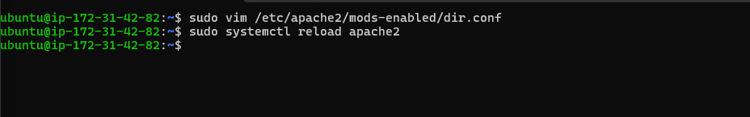

3. Create a PHP test script to confirm that Apache is able to handle and process requests for PHP files. A new `index.php` file was created inside the custom web root folder.

```bash
vim /var/www/projectlamp/index.php
```

Add the text below in the `index.php` file:

```php
<?php
phpinfo();
```
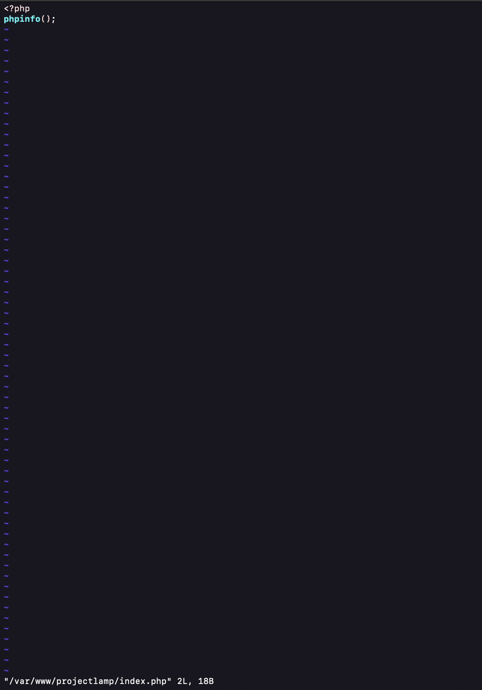

4. Now refresh the page.

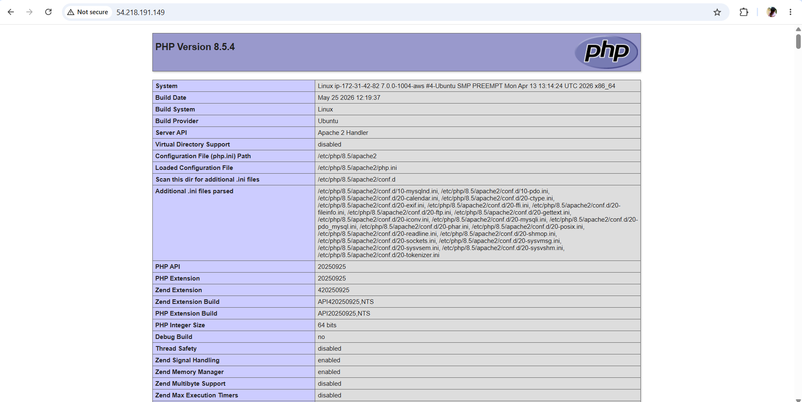

This page displays detailed information about the server's PHP configuration and environment. It is commonly used for troubleshooting, verifying PHP installation, and confirming that the server settings are configured correctly.

After reviewing the necessary information, it is recommended to delete the file because it exposes sensitive details about the PHP environment and the Ubuntu server. If needed in the future, the file can be recreated easily for further diagnostics.

```bash
sudo rm /var/www/projectlamp/index.php
```

---

## Conclusion

The LAMP stack offers a reliable and flexible foundation for building and deploying web applications. By following the steps outlined in this documentation, a fully functional LAMP environment was successfully set up and configured, providing the necessary infrastructure to develop, manage, and scale web applications efficiently.
