# WEB STACK IMPLEMENTATION (LEMP STACK) IN AWS

## Introduction:
The LEMP stack is a widely used open-source platform for developing and hosting web applications. It consists of four core technologies: Linux as the operating system, Nginx as the web server, MySQL as the database management system, and PHP (or alternatively Perl or Python) as the server-side scripting language. This documentation provides an overview of the installation, configuration, and implementation of the LEMP stack.

## Step 0: Prerequisites

1. EC2 Instance of t3.micro type and Ubuntu 26.04 LTS (HVM) was lunched in the us-east-1d region using the AWS console.

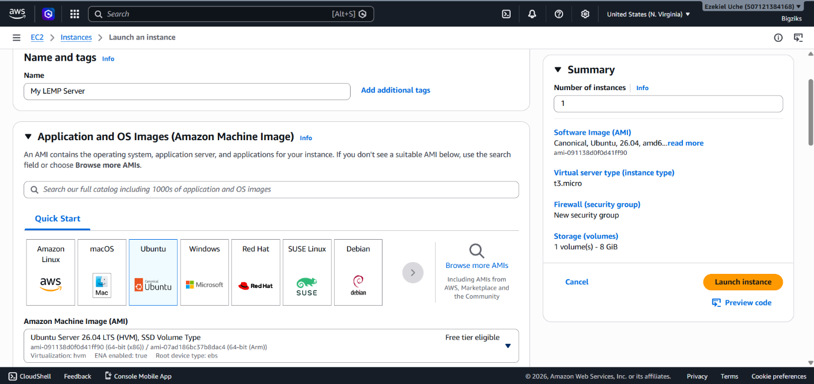

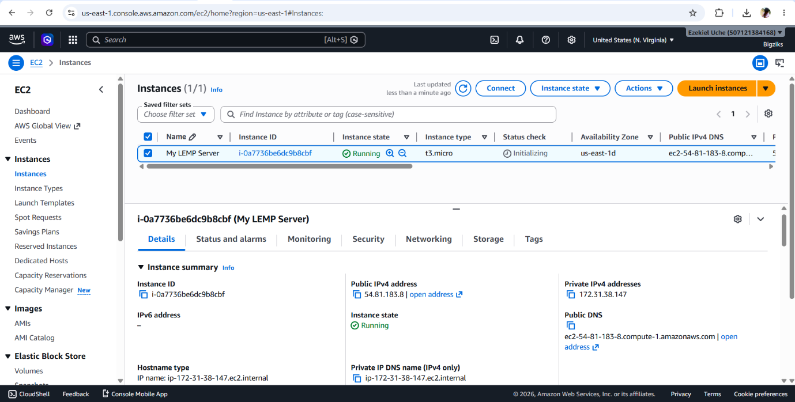

2. Created SSH key pair named my-ec2-key to access the instance on port 22

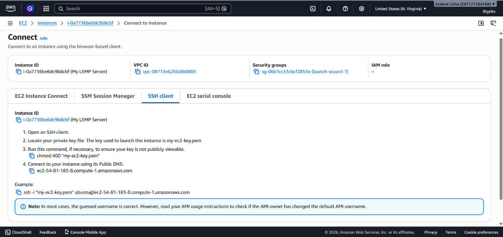

3. The security group was configured with the following inbound rules:
   - Allow traffic on port 80 (HTTP) with source from anywhere on the internet.
   - Allow traffic on port 443 (HTTPS) with source from anywhere on the internet.
   - Allow traffic on port 22 (SSH) with source from any IP address. This is opened by default.

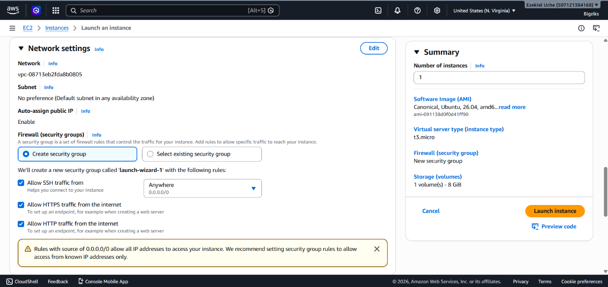

4. The default VPC and Subnet was used for the networking configuration.

5. The private ssh key that got downloaded was located, permission was changed for the private key file and then used to connect to the instance by running

```
chmod 400 my-ec2-key.pem
ssh -i "my-ec2-key.pem" ubuntu@ec2-54-81-183-8
```

Where username=ubuntu and public ip address=54-81-183-8

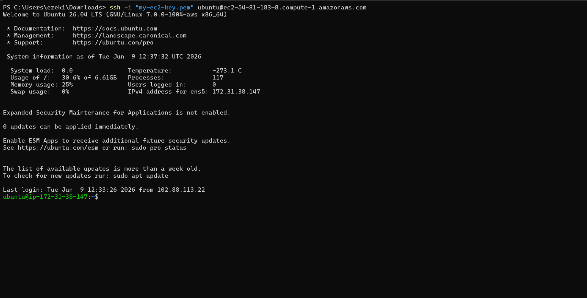

## Step 1 - Install nginx web server

1. Update and upgrade the server's package index

```
sudo apt update
sudo apt upgrade -y
```

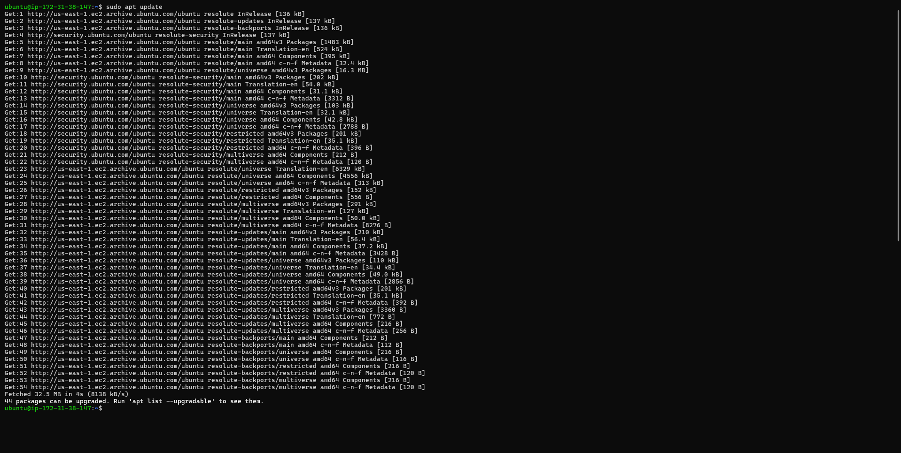

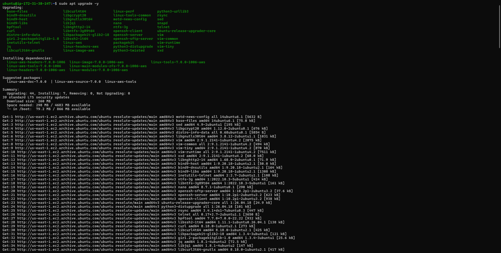

2. Install nginx

```
sudo apt install nginx -y
```

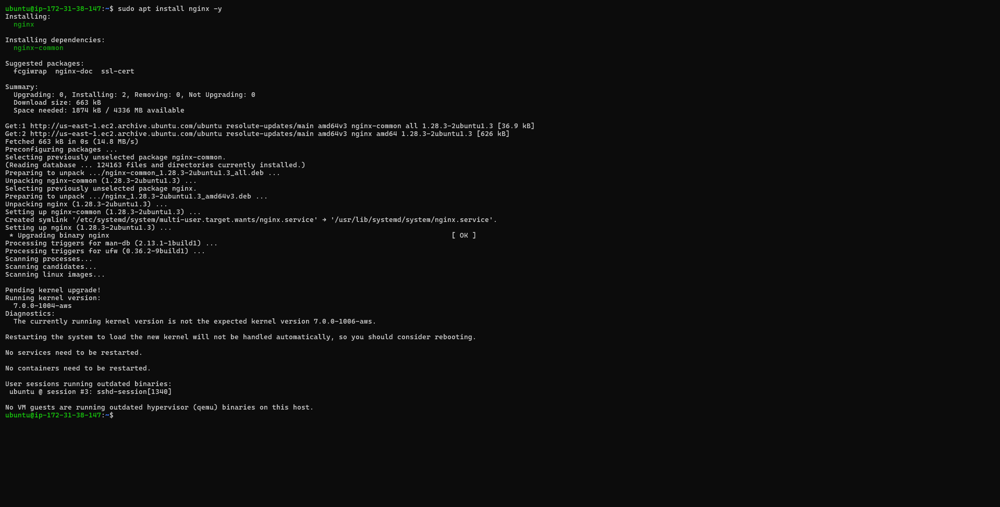

3. Verify that nginx is active and running

```
sudo systemctl status nginx
```

If it's green and running, then nginx is correctly installed

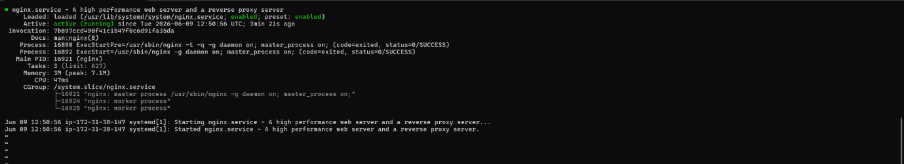

4. Access nginx locally on the Ubuntu shell

```
curl http://127.0.0.1:80
```

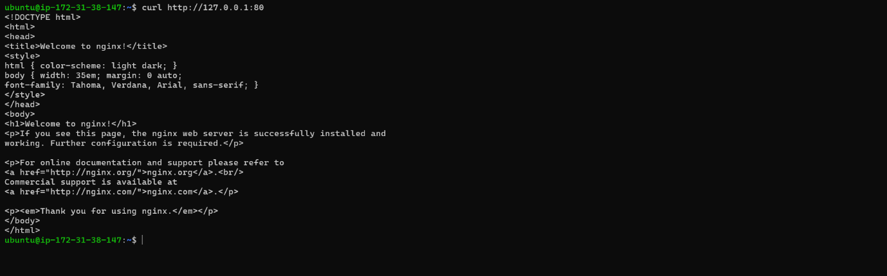

5. Test with the public IP address if the Nginx server can respond to request from the internet using the url on a browser.

```
http://54.81.183.8:80
```

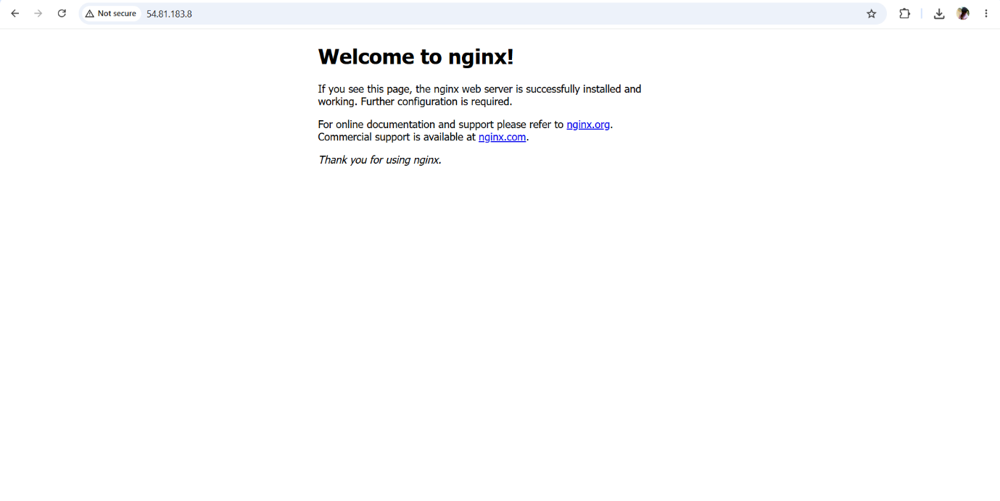

This shows that the web server is correctly installed and it is accessible through the firewall.

6. Another way to retrieve the public ip address other than check the aws console

```
curl -s http://169.254.169.254/latest/meta-data/public-ipv4
```

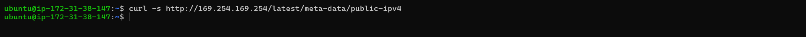

## Step 2 - Install MySQL

1. Install a relational database (RDB)

MySQL was installed in this project. It is a popular relational database management system used within PHP environments.

```
sudo apt install mysql-server
```

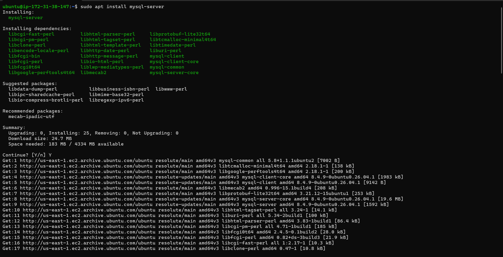

2. Log in to mysql console

```
sudo mysql
```

This connects to the MySQL server as the administrative database user root infered by the use of sudo when running the command.

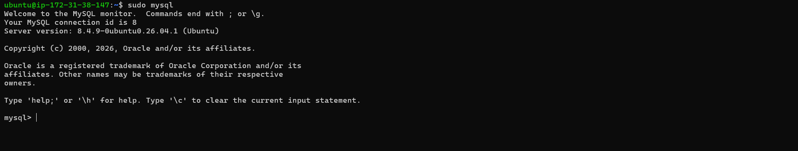

3. Set a password for root user using mysql_native_password as default authentication method.

Here, the user's password was defined as "PassWord.1"

```
ALTER USER 'root'@'localhost' IDENTIFIED WITH mysql_native_password BY 'PassWord.1';
```

4. Run an Interactive script to secure MySQL

The security script comes pre-installed with mysql. This script removes some insecure settings and lock down access to the database system.

```
sudo mysql_secure_installation
```

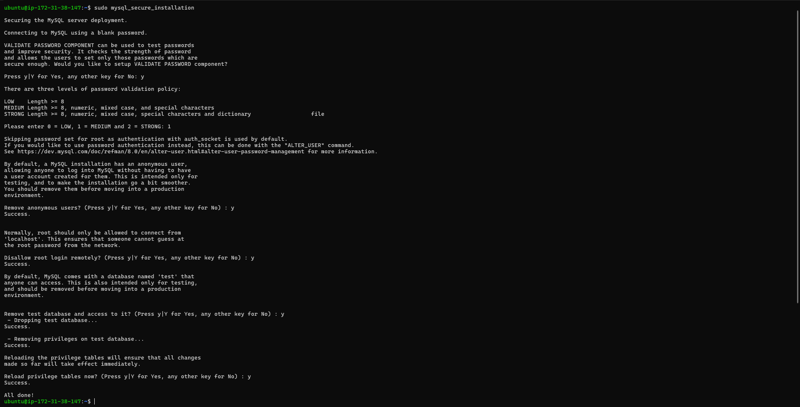

5. After changing root user password, log in to MySQL console.

A command prompt for password was noticed after running the command below.

```
sudo mysql -p
```

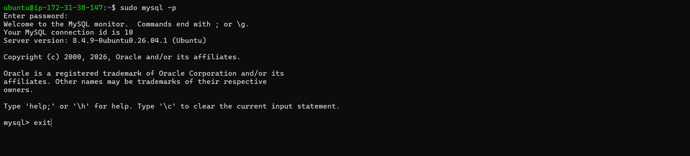

Exit MySQL shell

```
exit
```

## Step 3 - Install PHP

1. Install php

Install php-fpm (PHP fastCGI process manager) and tell nginx to pass PHP requests to this software for processing. Also, install php-mysql, a php module that allows PHP to communicate with MySQL-based databases. Core PHP packages will automatically be installed as dependencies.

The following were installed:
- php-fpm (PHP fastCGI process manager)
- php-mysql

```
sudo apt install php-fpm php-mysql -y
```

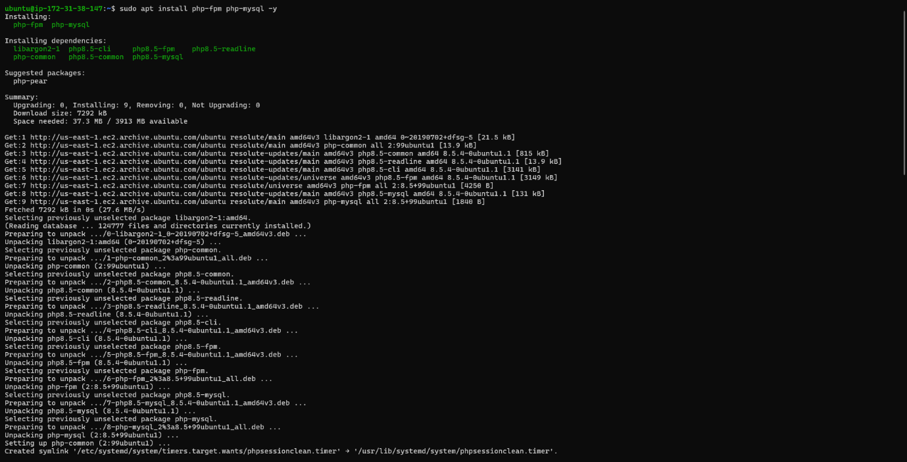

## Step 4 - Configure nginx to use PHP processor

1. Create a root web directory for your_domain

```
sudo mkdir /var/www/projectLEMP
```

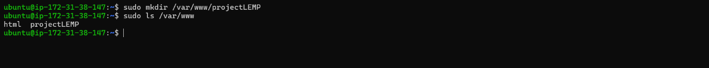

2. Assign the directory ownership with $USER which will reference the current system user

```
sudo chown -R $USER:$USER /var/www/projectLEMP
```

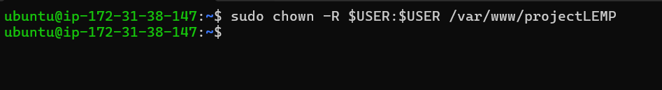

3. Create a new configuration file in Nginx's "sites-available" directory.

```
sudo nano /etc/nginx/sites-available/projectLEMP
```

Paste in the following bare-bones configuration:

```
server {
    listen 80;
    server_name projectLEMP www.projectLEMP;
    root /var/www/projectLEMP;

    index index.html index.htm index.php;

    location / {
        try_files $uri $uri/ =404;
    }

    location ~ \.php$ {
        include snippets/fastcgi-php.conf;
        fastcgi_pass unix:/var/run/php/php8.1-fpm.sock;
    }

    location ~ /\.ht {
        deny all;
    }
}
```

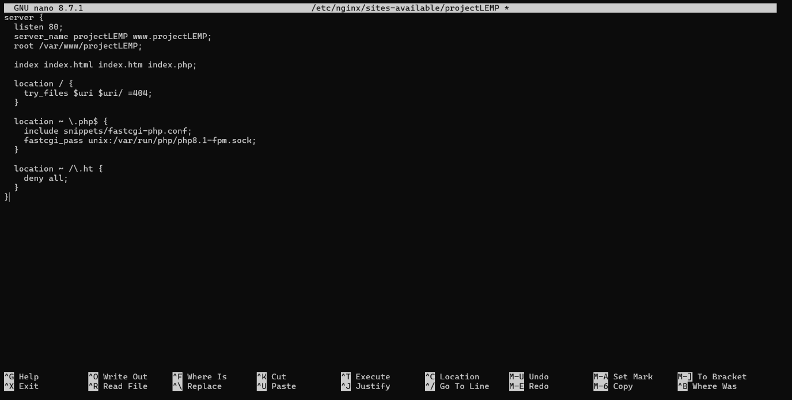

Here's what each directives and location blocks does:

- **listen** - Defines what port nginx listens on. In this case it will listen on port 80, the default port for HTTP.
- **root** - Defines the document root where the files served by this website are stored.
- **index** - Defines in which order Nginx will prioritize the index files for this website. It is a common practice to list index.html files with a higher precedence than index.php files to allow for quickly setting up a maintenance landing page for PHP applications. You can adjust these settings to better suit your application needs.
- **server_name** - Defines which domain name and/or IP addresses the server block should respond for. Point this directive to your domain name or public IP address.
- **location /** - The first location block includes the try_files directive, which checks for the existence of files or directories matching a URI request. If Nginx cannot find the appropriate result, it will return a 404 error.
- **location ~ .php$** - This location handles the actual PHP processing by pointing Nginx to the fastcgi-php.conf configuration file and the php7.4-fpm.sock file, which declares what socket is associated with php-fpm.
- **location ~ /.ht** - The last location block deals with .htaccess files, which Nginx does not process. By adding the deny all directive, if any .htaccess files happen to find their way into the document root, they will not be served to visitors.

4. Activate the configuration by linking to the config file from Nginx's sites-enabled directory

```
sudo ln -s /etc/nginx/sites-available/projectLEMP /etc/nginx/sites-enabled/
```

This will tell Nginx to use this configuration when next it is reloaded.

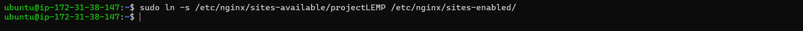

5. Test the configuration for syntax error

```
sudo nginx -t
```

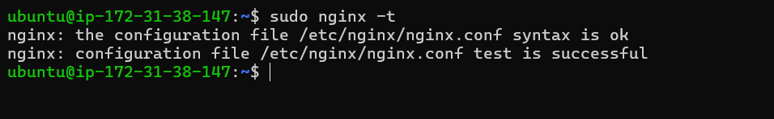

6. Disable the default Nginx host that currently configured to listen on port 80

```
sudo unlink /etc/nginx/sites-enabled/default
```

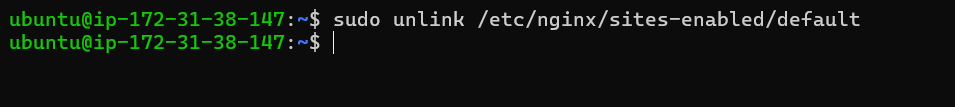

7. Reload Nginx to apply the changes

```
sudo systemctl reload nginx
```

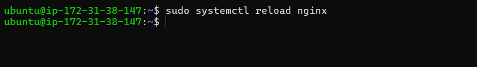

8. The new website is now active but the web root /var/www/projectLEMP is still empty. Create an index.html file in this location so to test the virtual host work as expected.

```
sudo echo 'Hello LEMP from hostname' $(curl -s http://169.254.169.254/latest/meta-data/public-hostname) 'with public IP' $(curl -s http://169.254.169.254/latest/meta-data/public-ipv4) > /var/www/projectLEMP/index.html
```

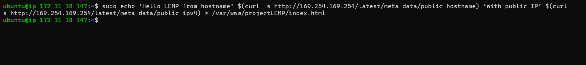

Open the website on a browser using IP address

```
http://54.81.183.8:80
```

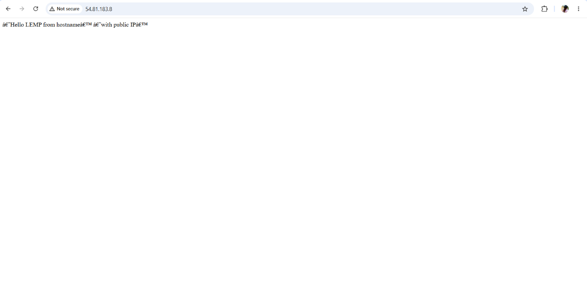

Open it with public dns name (port is optional)

```
http://<public-DNS-name>:80
```

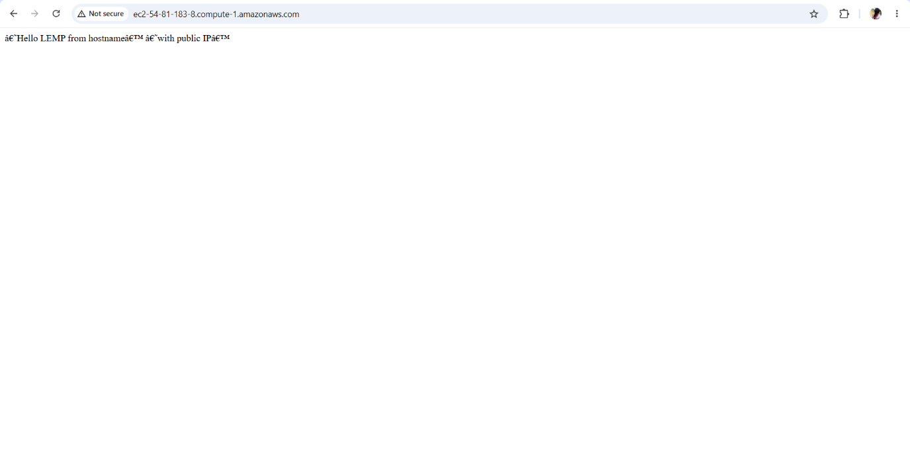

This file can be left in place as a temporary landing page for the application until an index.php file is set up to replace it. Once this is done, remove or rename the index.html file from the document root as it will take precedence over index.php file by default.

The LEMP stack is now fully configured. At this point, the LEMP stack is completely installed and fully operational.

## Step 5 - Test PHP with Nginx

Test the LEMP stack to validate that Nginx can handle the .php files off to the PHP processor.

1. Create a test PHP file in the document root. Open a new file called info.php within the document root.

```
sudo nano /var/www/projectLEMP/info.php
```

Past in:

```php
<?php
phpinfo();
```

2. Access the page on the browser and attach /info.php

```
http://54.81.183.8/info.php
```

While trying to access the page on the browser with /info.php attached, I encountered a "502 Bad Gateway error". Investigation revealed that Nginx was configured to use PHP 8.1-FPM, while the installed PHP version was 8.5. Updating the fastcgi_pass directive to use php8.5-fpm.sock resolved the issue and successfully enabled PHP processing through Nginx.

This was troubleshooted by updating the Nginx server configuration with PHP version php8.5

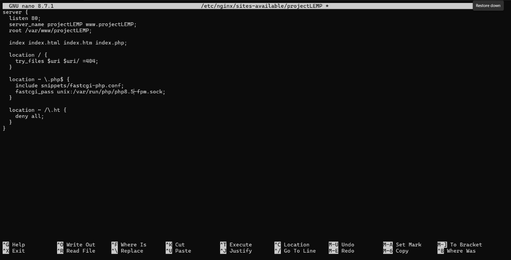

Ater updating the Nginx server, the URL was tested again on the browser and there no error.

```
http://54.81.183.8/info.php
```

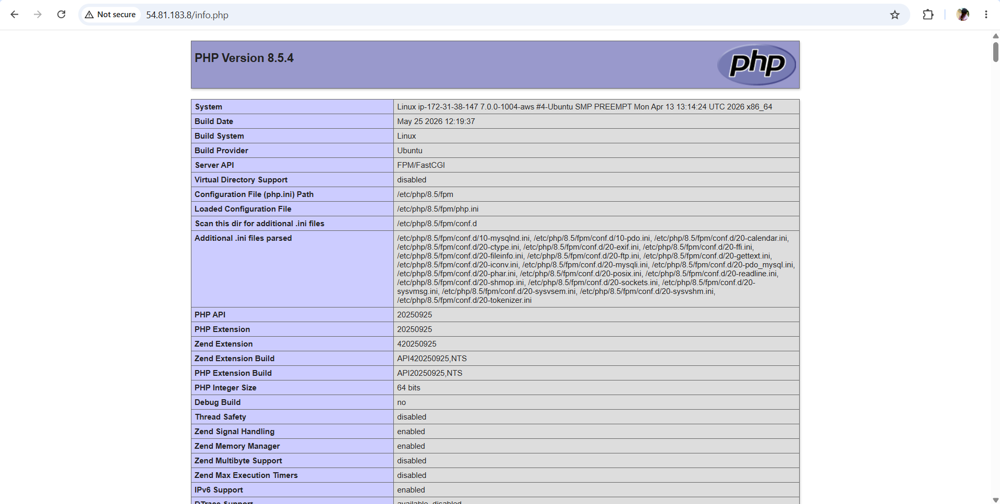

After checking the relevant information about the server through this page, It's best to remove the file created as it contains sensitive information about the PHP environment and the ubuntu server. It can always be recreated if the information is needed later.

```
sudo rm /var/www/projectLEMP/info.php
```

## Step 6 - Retrieve Data from MySQL database with PHP

Create a new user with the mysql_native_password authentication method in order to be able to connect to MySQL database from PHP.

Create a database named todo_database and a user named todo_user

1. First, connect to the MySQL console using the root account.

```
sudo mysql -p
```

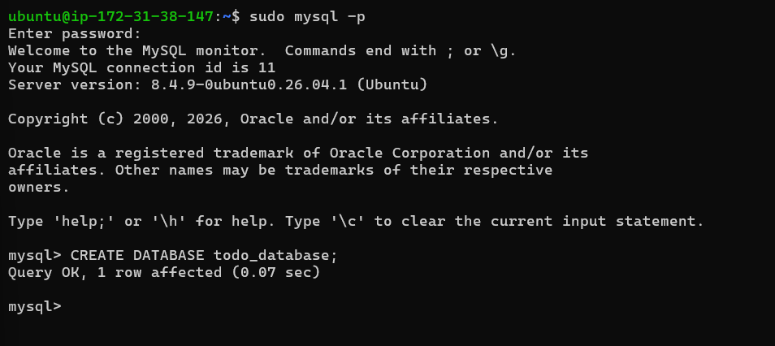

2. Create a new database

```
CREATE DATABASE todo_database;
```

3. Create a new user and grant the user full privileges on the new database.

```
CREATE USER 'todo_user'@'%' IDENTIFIED WITH mysql_native_password BY 'PassWord.1';
GRANT ALL ON todo_database.* TO 'todo_user'@'%';
```

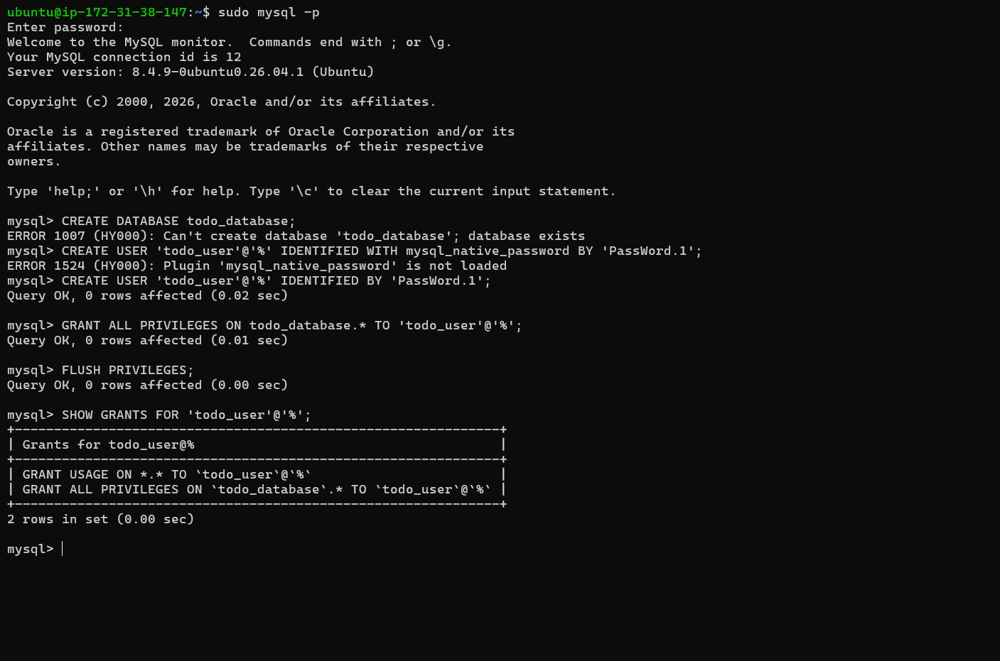

```
exit
```

4. Login to MySQL console with the user custom credentials and confirm that you have access to todo_database.

```
mysql -u todo_user -p
```

```
SHOW DATABASES;
```

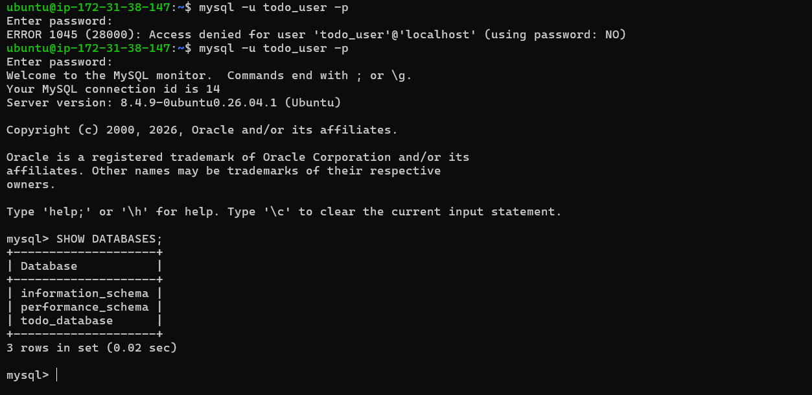

The -p flag will prompt for password used when creating the example_user

5. Create a test table named todo_list.

From MySQL console, run the following:

```
CREATE TABLE todo_database.todo_list (
    item_id INT AUTO_INCREMENT,
    content VARCHAR(255),
    PRIMARY KEY(item_id)
);
```

6. Insert a few rows of content to the test table.

```
INSERT INTO todo_database.todo_list (content) VALUES ("My first important item");
INSERT INTO todo_database.todo_list (content) VALUES ("My second important item");
INSERT INTO todo_database.todo_list (content) VALUES ("My third important item");
INSERT INTO todo_database.todo_list (content) VALUES ("and this one more thing");
```

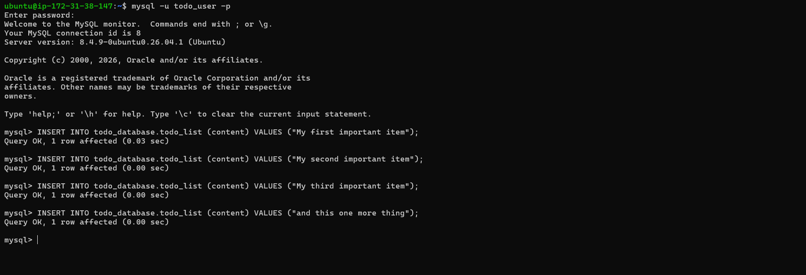

7. To confirm that the data was successfully saved to the table run:

```
SELECT * FROM todo_database.todo_list;
```

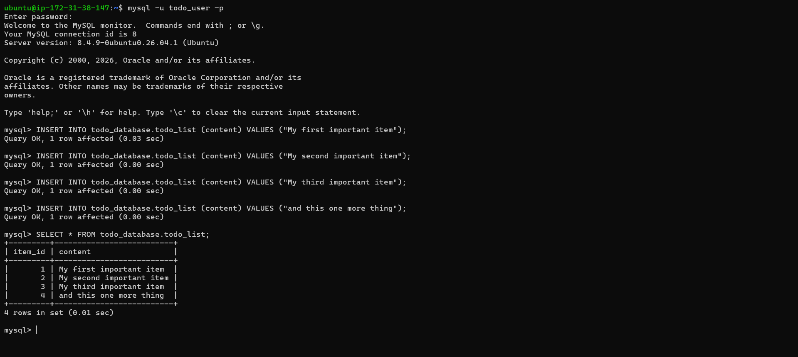

```
exit
```

Create a PHP script that will connect to MySQL and query the content.

1. Create a new PHP file in the custom web root directory

```
sudo nano /var/www/projectLEMP/todo_list.php
```

The PHP script connects to MySQL database and queries for the content of the todo_list table, displays the results in a list. If there's a problem with the database connection, it will throw an exception.

Copy the content below into the todo_list.php script.

```php
<?php
$user = "todo_user";
$password = "PassWord.1";
$database = "todo_database";
$table = "todo_list";

try {
    $db = new PDO("mysql:host=localhost;dbname=$database", $user, $password);
    echo "<h2>TODO</h2><ol>";
    foreach($db->query("SELECT content FROM $table") as $row) {
        echo "<li>" . $row['content'] . "</li>";
    }
    echo "</ol>";
} catch (PDOException $e) {
    print "Error!: " . $e->getMessage() . "<br/>";
    die();
}
?>
```

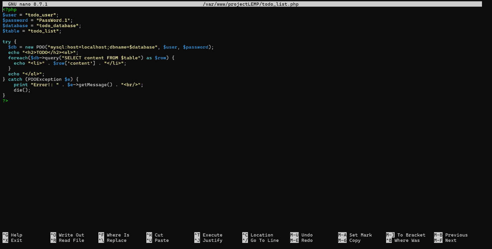

2. Now access this page on the browser by using the domain name or public IP address followed by /todo_list.php

```
http://54.84.193.38/todo_list.php
```

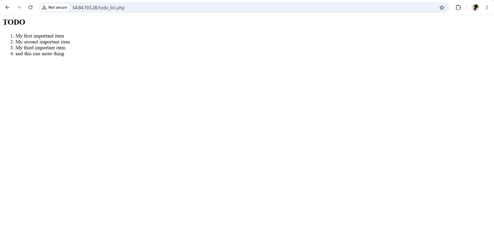

## Conclusion

The LEMP stack offers a reliable and efficient platform for developing, hosting, and serving web applications. By combining Linux, Nginx, MySQL (or MariaDB), and PHP, developers can build, deploy, and manage scalable, secure, and high-performance web solutions.
