# Load Balancer Solution With Apache

## Introduction

As web applications grow and attract more users, relying on a single web server becomes a significant risk. If that server experiences heavy traffic, performance issues, or downtime, the entire application becomes unavailable. This creates a poor user experience and reduces the reliability of the service.

To address this challenge, organizations use load balancers to distribute incoming client requests across multiple web servers. This improves application availability, enhances performance, and provides fault tolerance by ensuring that no single server becomes a bottleneck or point of failure.

In this project, I configured an Apache HTTP Server as a load balancer on an Ubuntu EC2 instance to distribute HTTP requests between two RHEL web servers hosting the Tooling application. I also verified that traffic was successfully routed to both backend servers and explored local DNS name resolution using the /etc/hosts file to simplify backend server management.

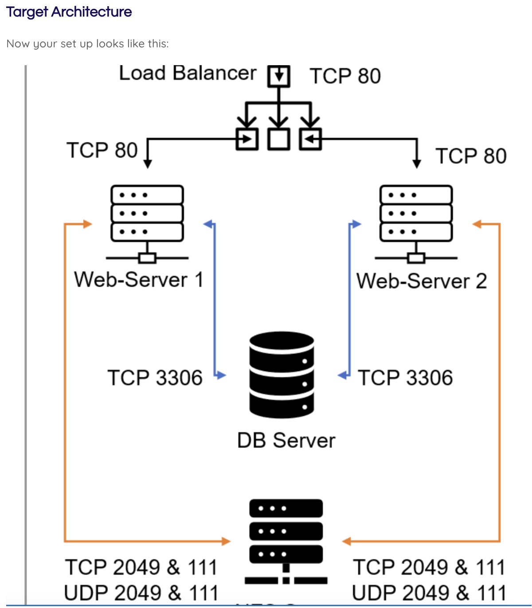

The diagrame below shows the architecture of the solution

## Goal

Deploy and configure an Apache Load Balancer for Tooling Website solution on a separate Ubuntu EC2 instance. Make sure that users can be served by Web servers through the Load Balancer.

## Prerequisites

Ensure that the following servers are installedd and configure already.

- Two RHEL9 Web Servers
- One MySQL DB Server (based on Ubuntu 26.04)
- One RHEL9 NFS Server

## Prerequisites Configurations

- Apache (httpd) is up and running on both Web Servers.
- /var/www directories of both Web Servers are mounted to /mnt/apps of the NFS Server.
- All neccessary TCP/UDP ports are opened on Web, DB and NFS Servers.
- Client browsers can access both Web Servers by their Public IP addresses or Public DNS names and can open the Tooling Website (e.g, http://<Public-IP-Address-or-Public-DNS-Name>/index.php)

## Step 1 - Configure Apache As A Load Balancer

1. Create an Ubuntu Server 26.04 EC2 instance and name it Project-8-apache-lb

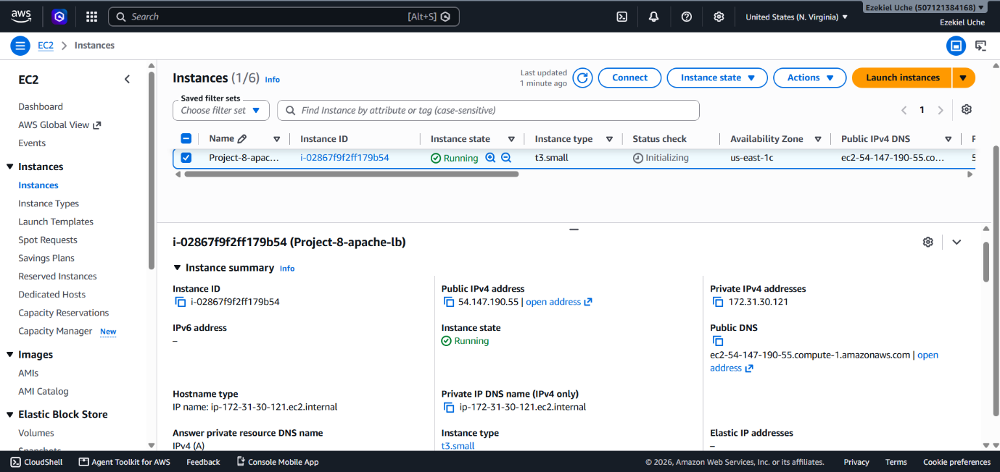

2. Open TCP port 80 on Project-8-apache-lb by creating an Inbounb Rule in Security Group

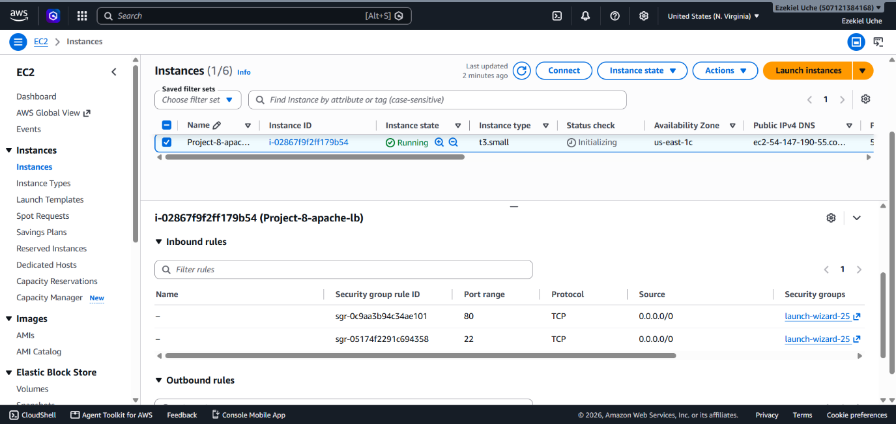

3. Instal Apache Load Balancer on Project-8-apache-lb and configure it to point traffic coming to LB to both Web Servers.

### i. Install Apache2

Access the instance

```
ssh -i "my-ec2-key.pem" ec2-user@54.147.190.55
```

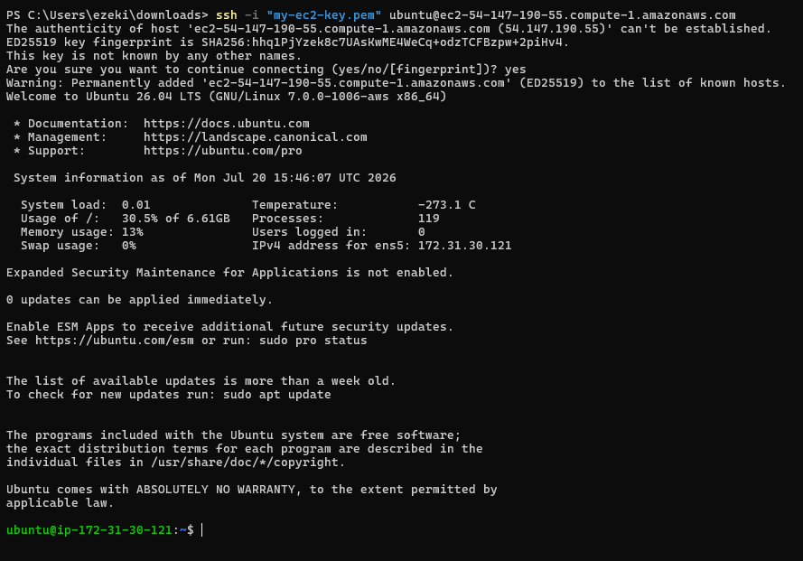

Update and upgrade Ubuntu

```
sudo apt update && sudo apt upgrade
```

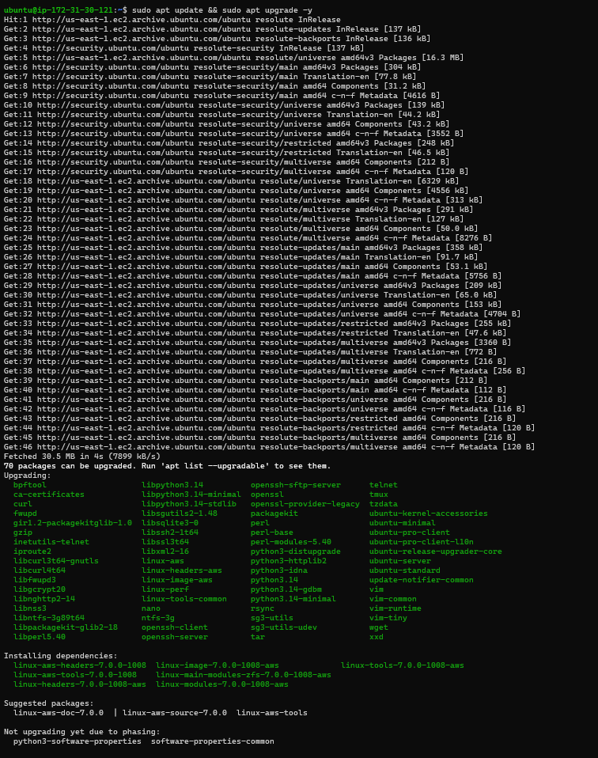

Install Apache

```
sudo apt install apache2 -y
```

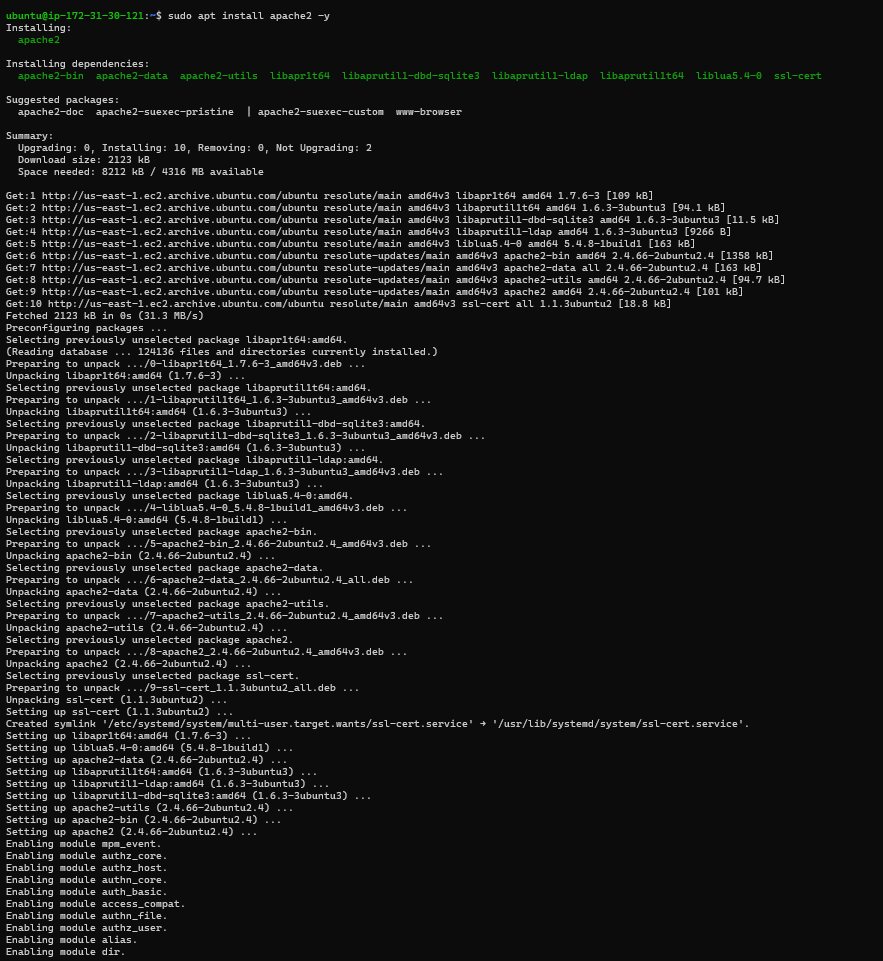

```
sudo apt-get install libxml2-dev
```

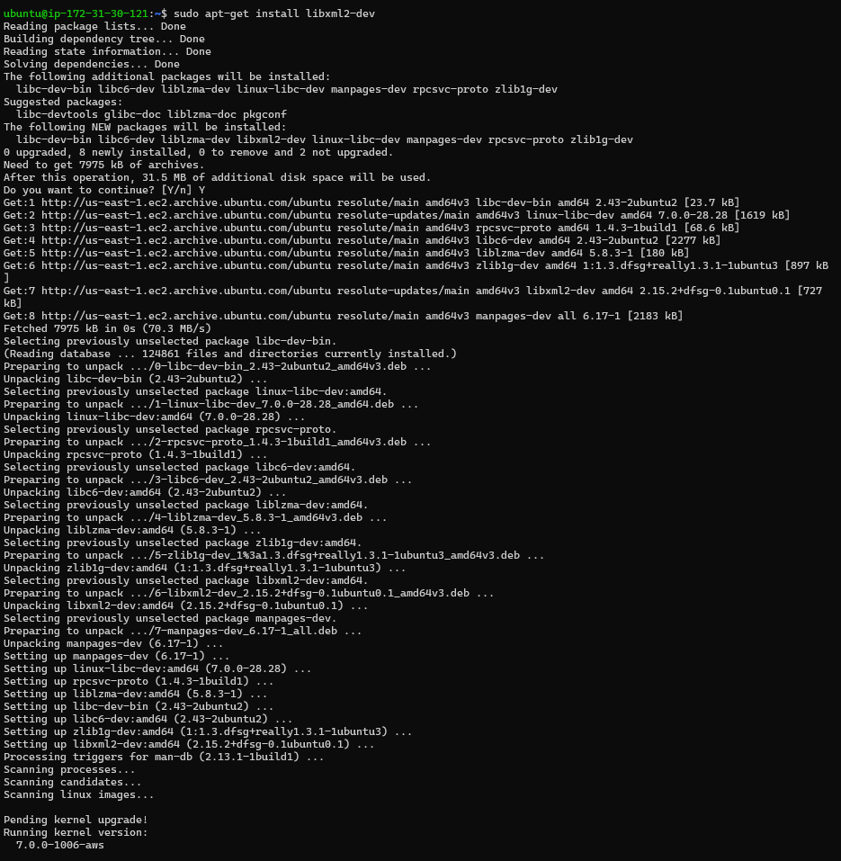

### ii. Enable the following modules

```
sudo a2enmod rewrite
sudo a2enmod proxy
sudo a2enmod proxy_balancer
sudo a2enmod proxy_http
sudo a2enmod headers
sudo a2enmod lbmethod_bytraffic
```

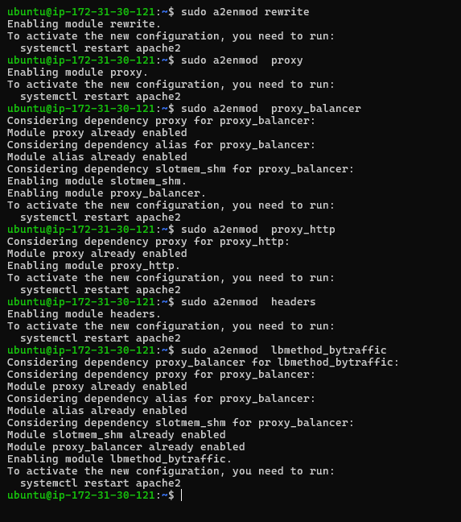

### iii. Restart Apache2 Service

```
sudo systemctl restart apache2
sudo systemctl status apache2
```

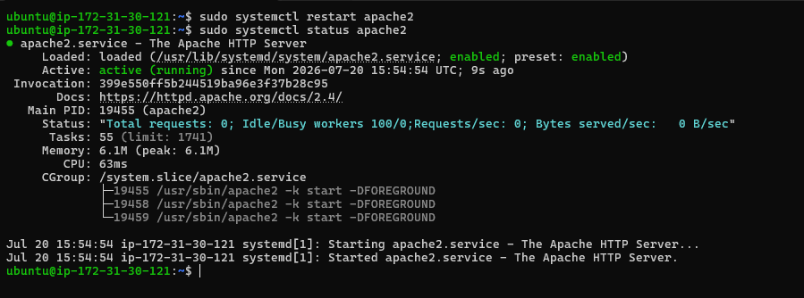

### Configure Load Balancing

i. Open the file 000-default.conf in sites-available

```
sudo vi /etc/apache2/sites-available/000-default.conf
```

ii. Add this configuration into the section <VirtualHost *:80> </VirtualHost>

```
<Proxy "balancer://mycluster">
BalancerMember http://172.31.24.139:80 loadfactor=5 timeout=1
BalancerMember http://172.31.17.238:80 loadfactor=5 timeout=1
ProxySet lbmethod=bytraffic
# ProxySet lbmethod=byrequests
</Proxy>

ProxyPreserveHost on
ProxyPass / balancer://mycluster/
ProxyPassReverse / balancer://mycluster/
```

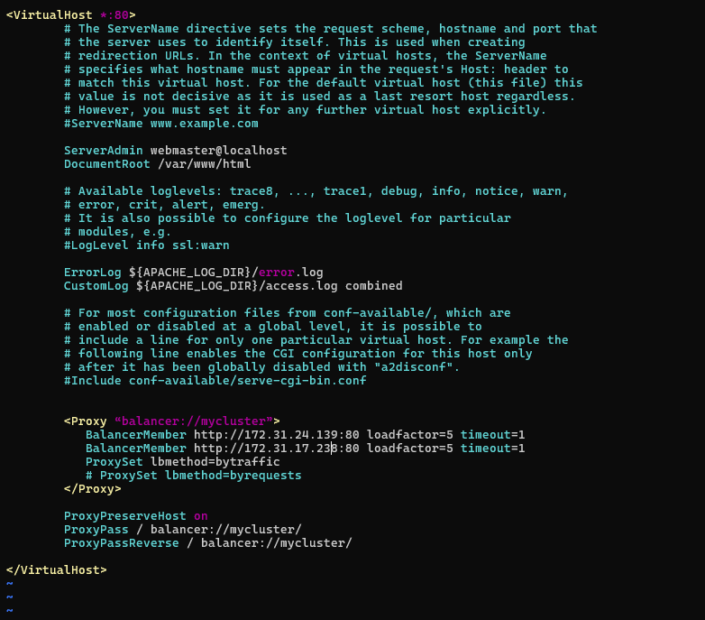

iii. Restart Apache

```
sudo systemctl restart apache2
```

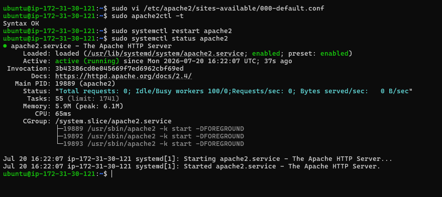

bytraffic balancing method with distribute incoming load between the Web Servers according to currentraffic load. The proportion in which traffic must be distributed can be controlled bt loadfactor parameter.

Other methods such as bybusyness, byrequests, heartbeat can also be adopted.

### 4. Verify that the configuration works

i. Access the website using the LB's Public IP address or the Public DNS name from a browser

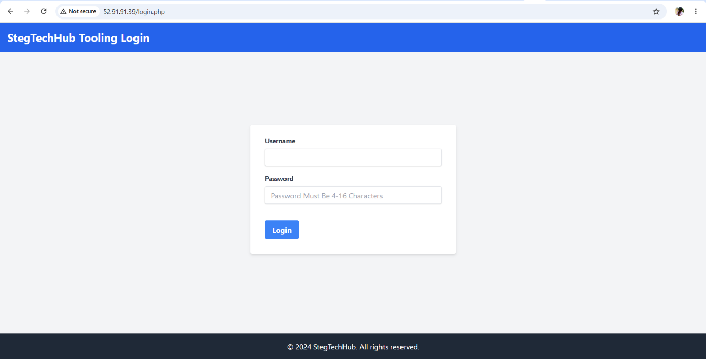

Note: If in the previous project, /var/log/httpd was mounted from the Web Server to the NFS Server, unmount them and ensure that each Web Servers has its own log directory.

### ii. Unmount the NFS directory

Check if the Web Server's log directory is mounted to NSF

On each Web Servers, run:

```
mount | grep httpd
```

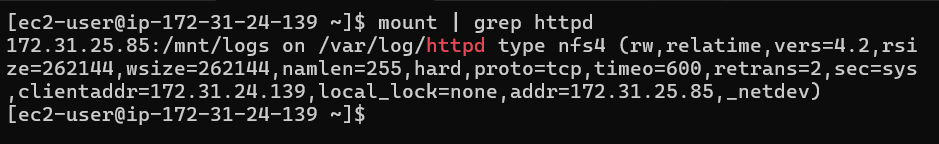
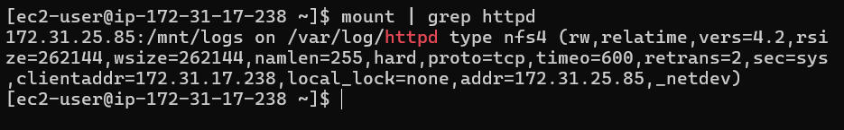

If you see something like this:

```
172.31.x.x:/mnt/logs on /var/log/httpd type nfs4 (...)
```

Then unmount it on both web servers:

```
sudo umount -f /var/log/httpd
```

If the directory is busy, the services using it needs to be stopped first.

```
sudo systemctl stop httpd
```

After that, restart Apache on each web server:

```
sudo systemctl restart httpd
```

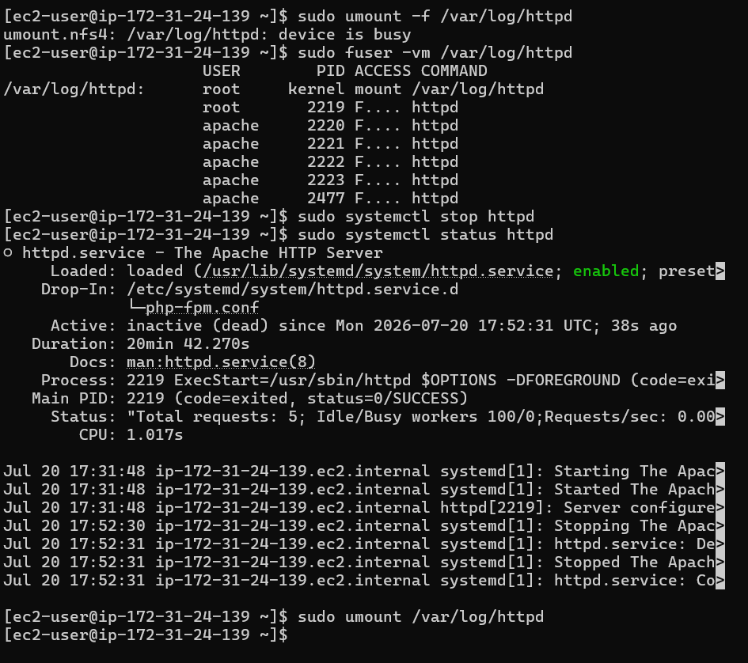
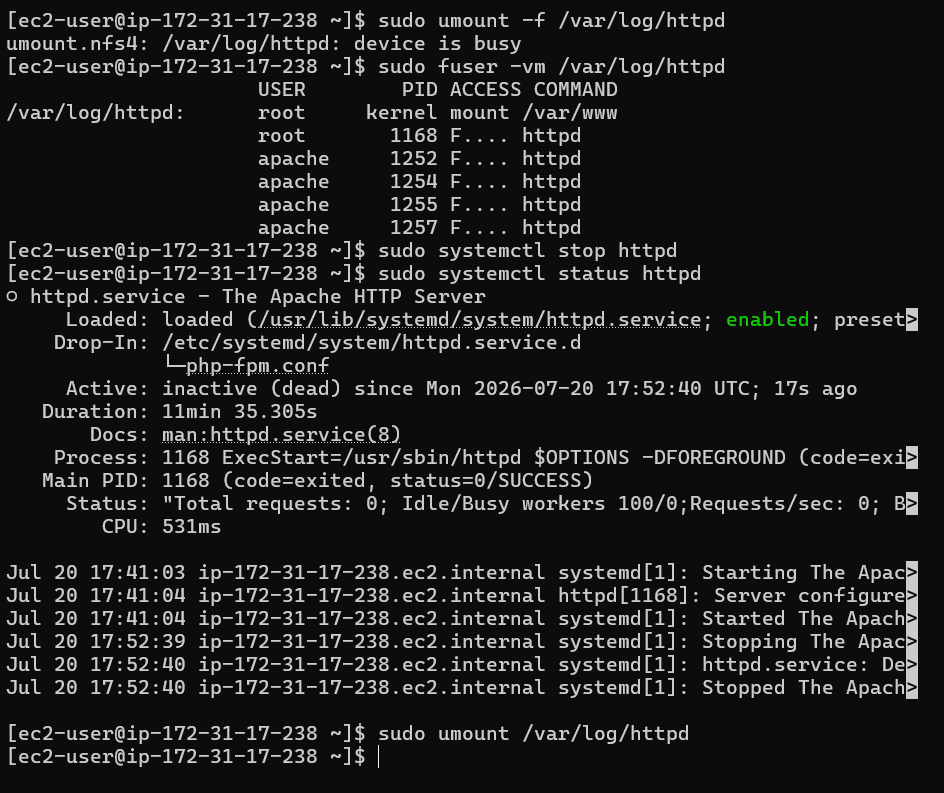

iii. Open two ssh consoles for both Web Server and run the command:

```
sudo tail -f /var/log/httpd/access_log
```

Wbe Server 1 access_log

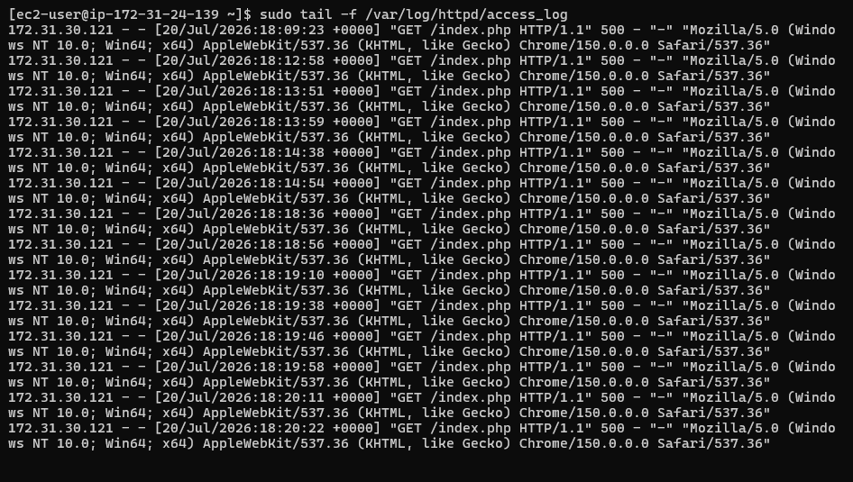

Wbe Server 2 access_log

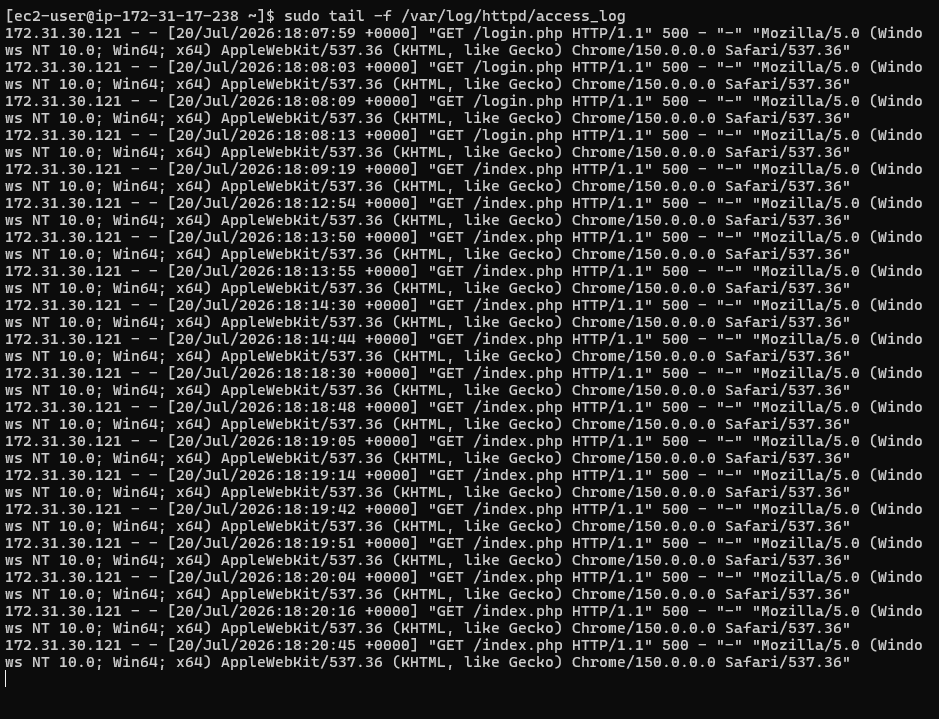

iv. Refresh the browser page several times and ensure both Web Servers receive HTTP and GET requests. New records must apear in each web server log files. The number of request to each servers will be approximately the same since loadfactor is set to the same value for both servers. This means that traffic will be evenly distributed between them.

Web Server 1 access_log


Web Server 2 access_log

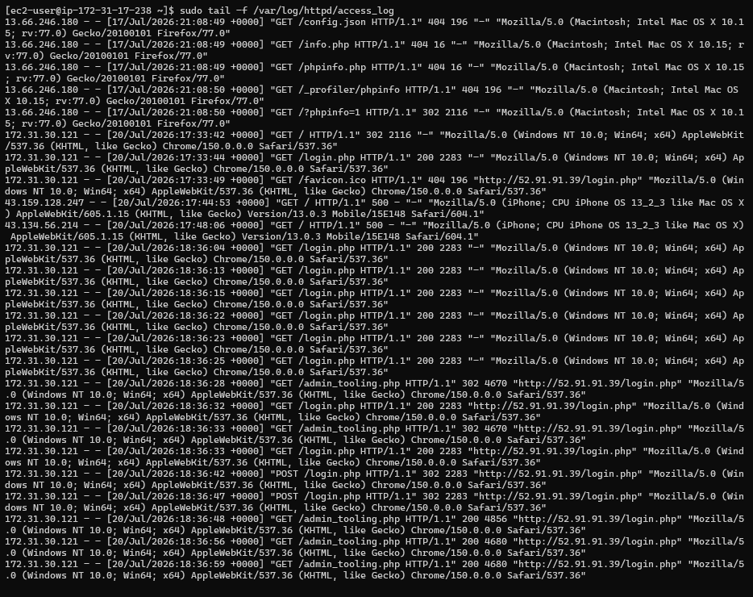

## Optional Step - Configure Local DNS Names Resolution

Sometimes it is tedious to remember and switch between IP addresses, especially if there are lots of servers to manage. It is best to configure local domain name resolution. The easiest way is use /etc/hosts file, although this approach is not very scalable, but it is very easy to configure and shows the concept well.

Configure the IP address to domain name mapping for our Load Balancer.

Open the hosts file

```
sudo vi /etc/hosts
```

Add two records into file with Local IP address and arbitrary name for the Web Servers

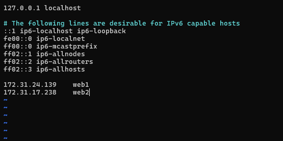

Update the LB config file with those arbitrary names instead of IP addresses

```
sudo vi /etc/apache2/sites-available/000-default.conf
```

```
BalancerMember http://Web1:80 loadfactor=5 timeout=1
BalancerMember http://Web2:80 loadfactor=5 timeout=1
```

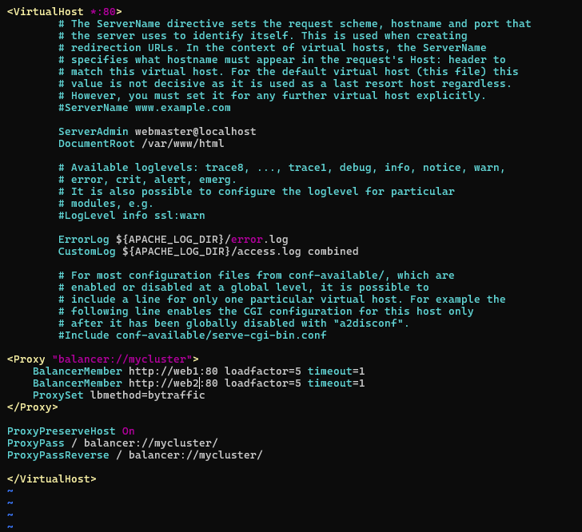

Try to curl the Web Servers from LB locally

```
curl http://Web1
```


```
curl http://Web2
```

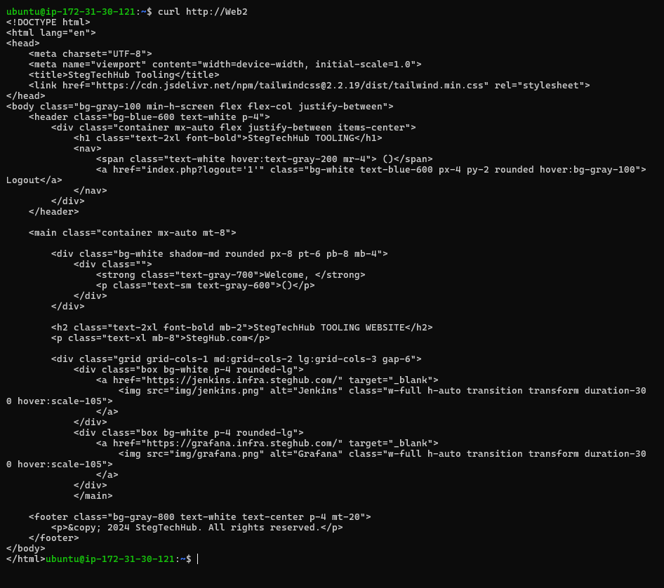

Remember, This is only internal configuration and also local to the LB server, these names will neither be 'resolvable' from other servers internally nor from the Internet.

## In Conclusion

The mod_proxy_balancer module in Apache HTTP Server offers robust features for load balancing, including support for sticky sessions, health checks, and various load balancing algorithms. Properly configuring these options ensures high availability, scalability, and reliability for web applications.
