# MERN Web Stack Implementation on AWS

## Introduction

The MERN stack is a modern JavaScript-based technology stack widely used for developing scalable and interactive web applications. It consists of four powerful technologies that work seamlessly together to deliver a complete full-stack development environment:
MongoDB: A NoSQL document-oriented database that provides flexible and efficient data storage.
Express.js: A lightweight Node.js framework that simplifies the creation of APIs and server-side applications.
React.js: A JavaScript library used for building dynamic, responsive, and reusable user interfaces.
Node.js: A runtime environment that enables JavaScript code to execute on the server side.
This documentation provides a step-by-step guide to deploying a MERN stack application on an AWS EC2 instance. It covers server setup, backend configuration, database integration, frontend development, and application testing, resulting in a fully functional To-Do web application.

## Step 0: Prerequisites

#### Launch an Amazon EC2 Instance

An Amazon EC2 instance running Ubuntu 26.04 LTS (HVM) was launched in the US East (N. Virginia) - us-east-1 region using the AWS Management Console. A t3.micro instance type was selected for this project because it provides sufficient computing resources for deploying and testing a MERN stack application while remaining cost-effective and eligible for the AWS Free Tier.

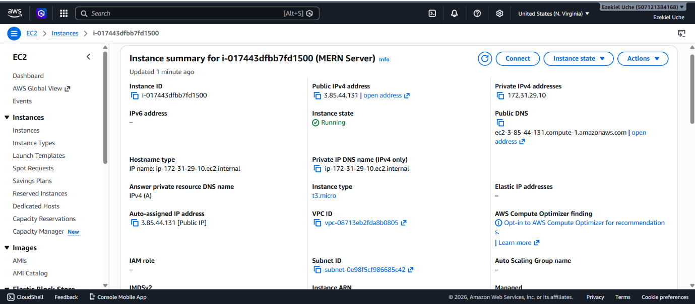

#### Configure SSH Access

An SSH key pair named my-ec2-key was attached to the instance to enable secure remote access over port 22.

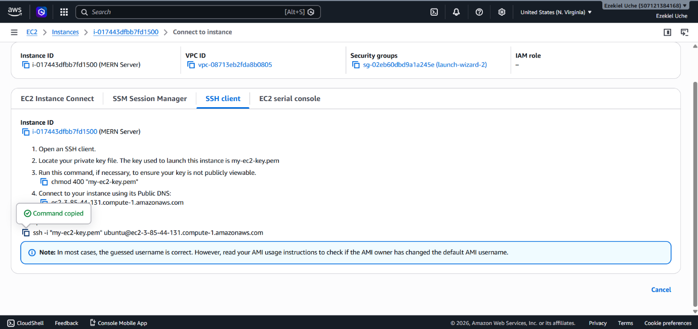

#### Configure Security Group Rules

The EC2 security group was configured with the following inbound rules:
Port 80 (HTTP): Allow traffic from anywhere (0.0.0.0/0)
Port 443 (HTTPS): Allow traffic from anywhere (0.0.0.0/0)
Port 22 (SSH): Allow secure remote access

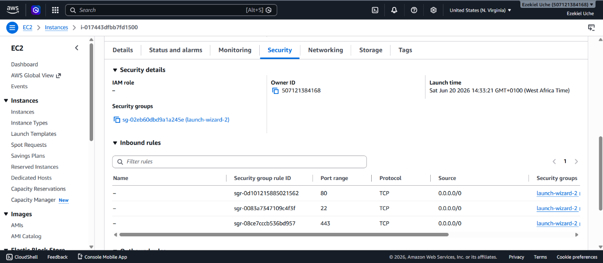

#### Connect to the EC2 Instance

The permissions of the private key file were updated before establishing an SSH connection to the server using the following commands:
chmod 400 my-ec2-key.pem
ssh -i "my-ec2-key.pem" ubuntu@ec2-3-85-44-131
Replace 3-85-44-131 with your EC2 instance's public IP address if it differs.

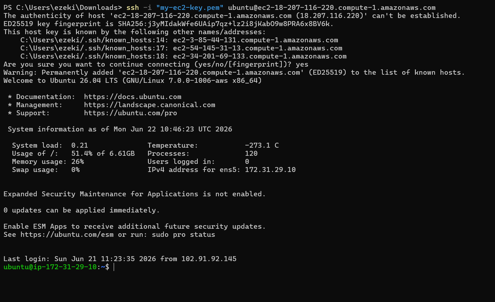

## Step 1 - Backend Configuration

1. Update and upgrade the server's package index
sudo apt update && sudo apt upgrade -y

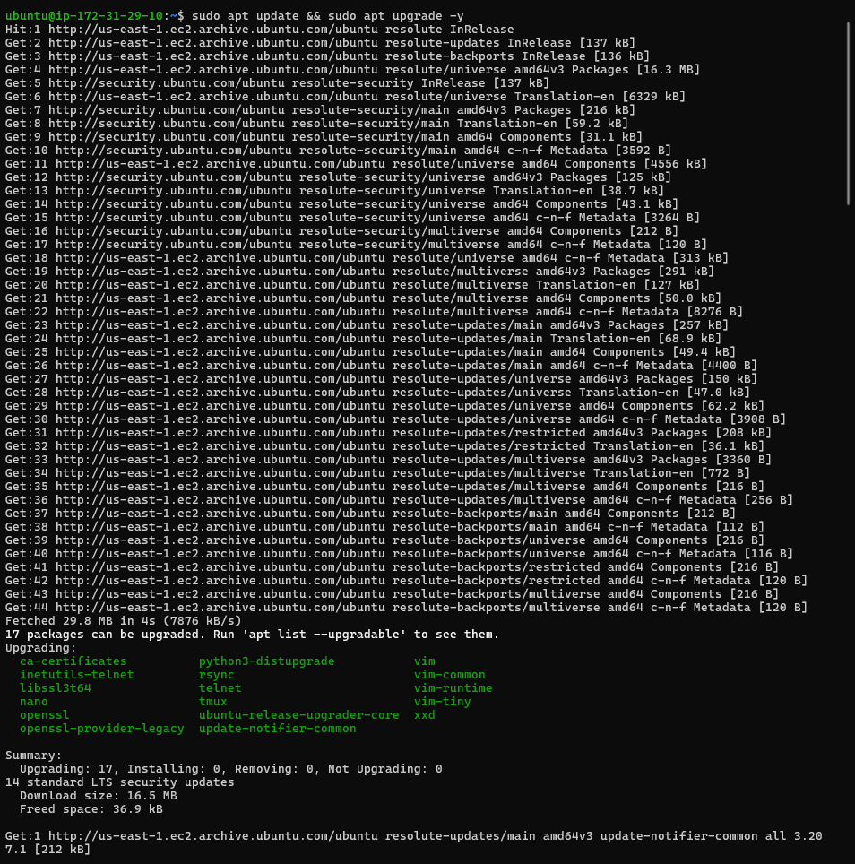

2. Get the location of Node.js software from ubuntu repositories.
curl fsSL https://deb.nodesource.com/setup_18.x | sudo -E bash -

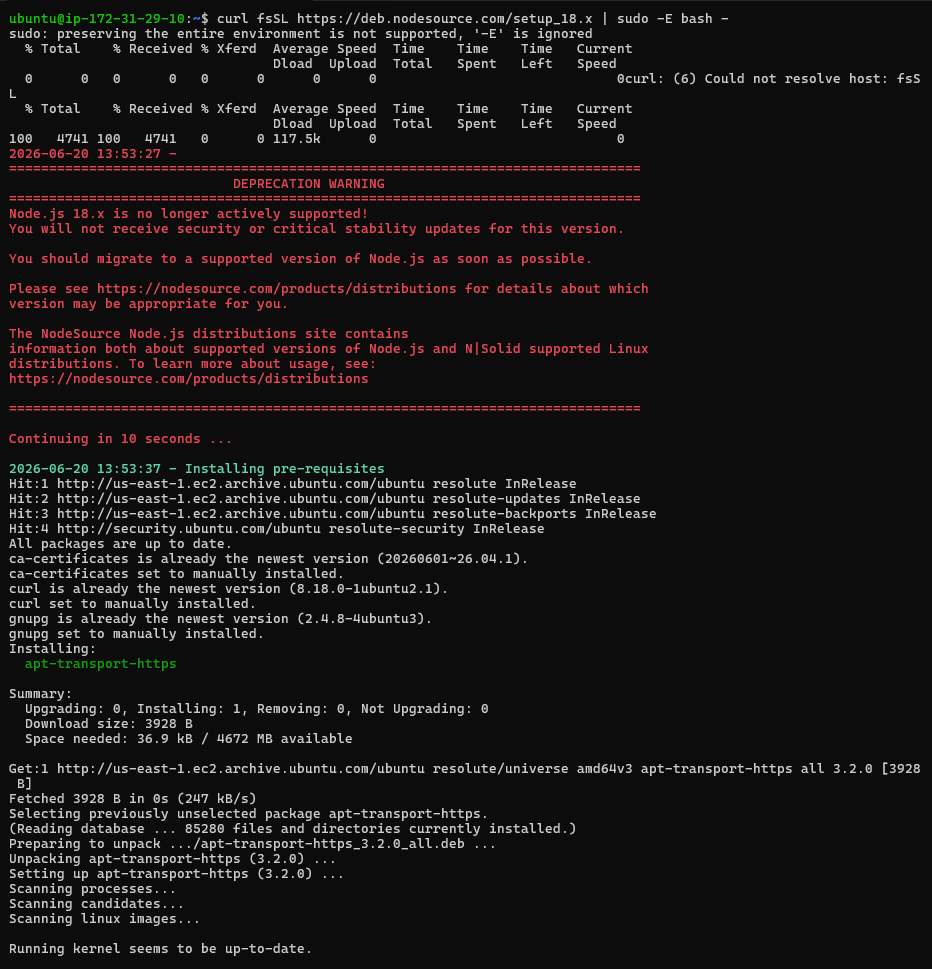

3. Install node.js with the command below.
sudo apt-get install nodejs -y

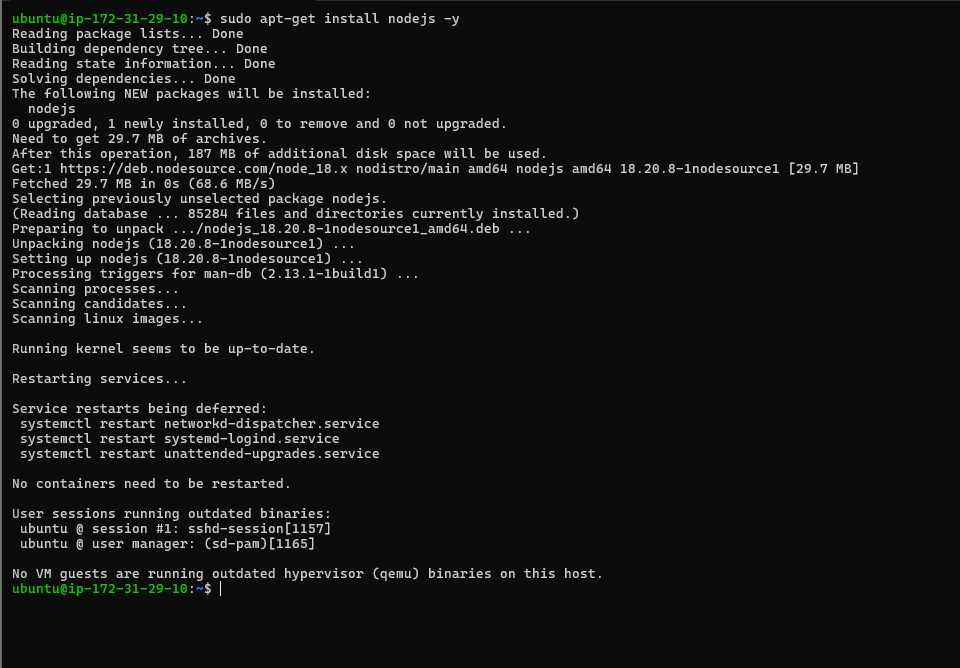

Note: the above command installs both node.js and npm. NPM is a package manager for Node just as apt is a package manager for Ubuntu. It is used to install Node modules and packages and to manage dependency conflicts.
4. Verify the Node installation with the command below.
node -v        // Gives the node version

npm -v        // Gives the node package manager version

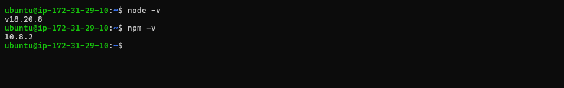

### Application Code Setup

1. Create a new directory for the TO-DO project and switch to it. Then initialize the project directory.
mkdir Todo
ls
cd Todo
npm init

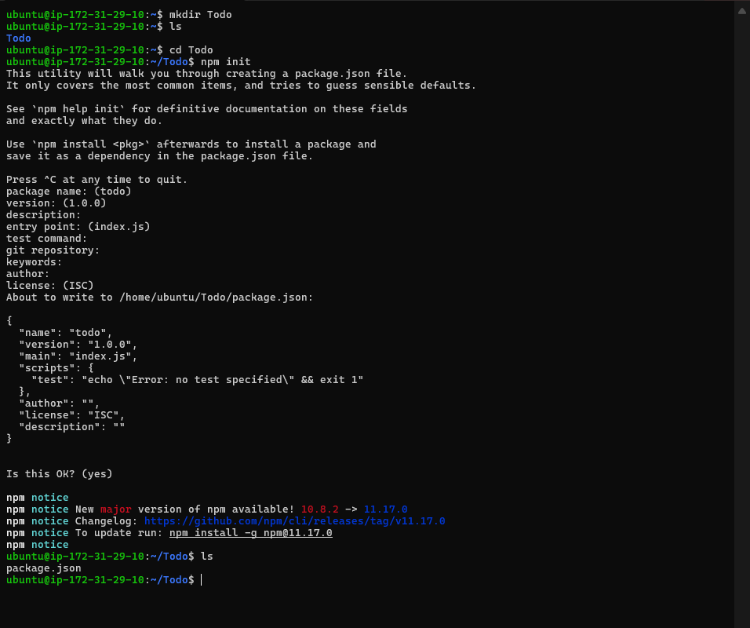

This is to initialize the project directory and in the process, creates a new file called package.json. This file will contain information about your application and the dependencies it needs to run. Follow the prompts after running the command. You can press "Enter" several times to accept default values, then accept to write out the package.json file by typing yes.

### Install ExpressJs

Express is a framework for Node.js. It simplifies development and abstracts a lot of low level details. For example, express helps to define routes of your application based on HTTP methods and URLs.
1. Install Express using npm
npm install express

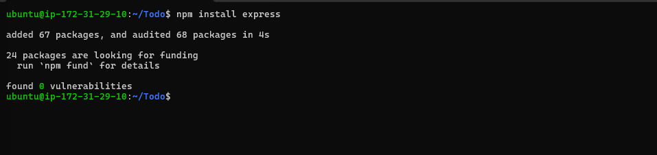

2. Create a file index.js and run ls to confirm the file
touch index.js
ls

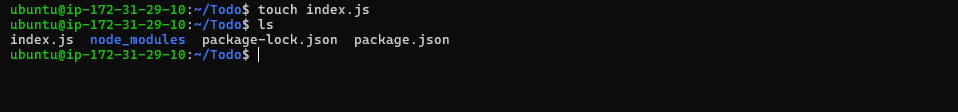

3. Install dotenv module
npm install dotenv

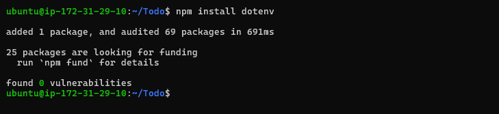

4. Open index.js file
vim index.js
Type the code below into it
const express = require('express');
require('dotenv').config();

const app = express();

const port = process.env.PORT || 5000;

app.use((req, res, next) => {
res.header("Access-Control-Allow-Origin", "*");
res.header("Access-Control-Allow-Headers", "Origin, X-Requested-With, Content-Type, Accept");
next();
});

app.use((req, res, next) => {
res.send('Welcome to Express');
});

app.listen(port, () => {
console.log(`Server running on port ${port}`);
});

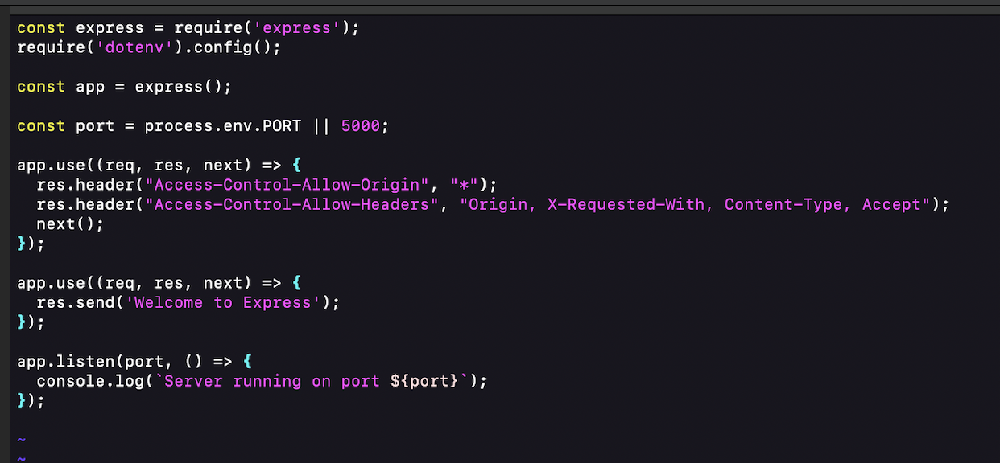

Note: Port 5000 have been specified to be used in the code. This was required later on the browser.

5. Start the server to see if it works. Open your terminal in the same directory as your index.js file. Run
node index.js

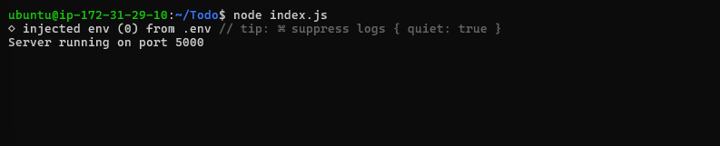

Port 5000 was opened in ec2 security group.

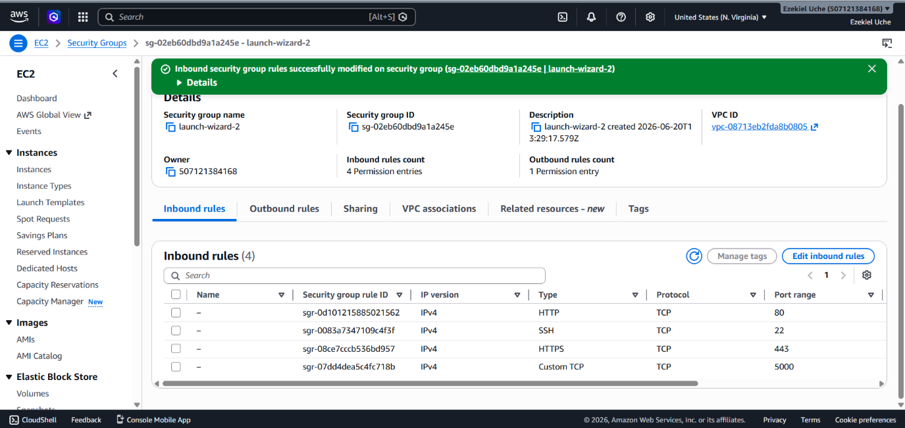

Access the server with the public IP followed by the port
http://3.85.44.131:5000

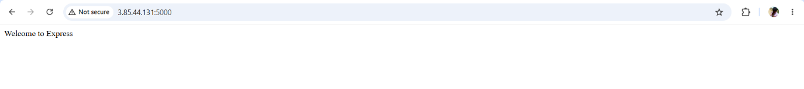

### Routes

There are three actions that the ToDo application needs to be able to do:
Create a new task
Display list of all task
Delete a completed task
Each task was associated with some particular endpoint and used different standard HTTP request methods: POST, GET, DELETE.
For each task, routes were created which defined various endpoints that the ToDo app depends on.
1. Create a folder routes, switch to routes directory and create a file api.js. Open the file
mkdir routes
cd routes
touch api.js
vim api.js

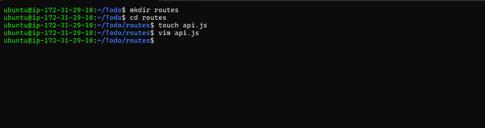

Copy the code below into the file
const express = require('express');
const router = express.Router();

router.get('/todos', (req, res, next) => {

});

router.post('/todos', (req, res, next) => {

});

router.delete('/todos/:id', (req, res, next) => {

});

module.exports = router;

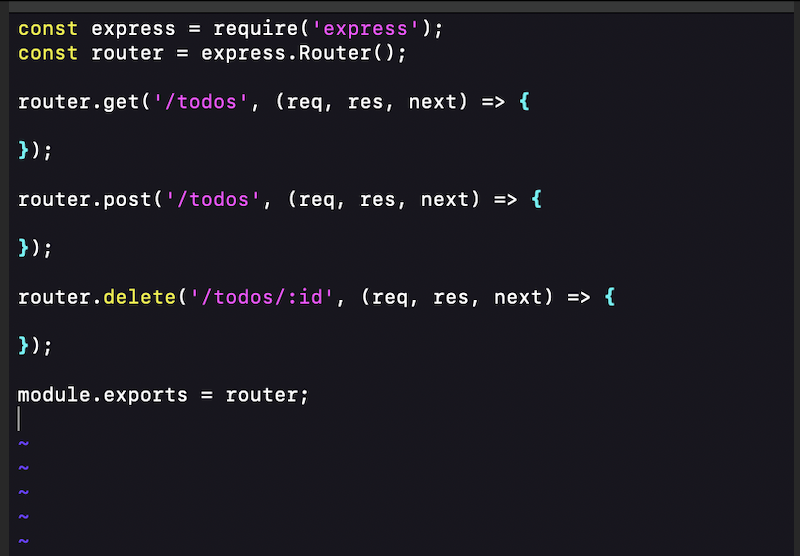

### Models

A model is at the heart of JavaScript based applications and it is what makes it interactive.
Models was used to define the database schema. This is important in order be able to define the fields stored in each Mongodb document.
In essence, the schema is a blueprint of how the database is constructed, including other data fields that may not be required to be stored in the database. These are known as virtual properties. To create a schema and a model, mongoose was installed, which is a Node.js package that makes working with mongodb easier.
1. Change the directory back to Todo folder and install mongoose
cd ..
npm install mongoose

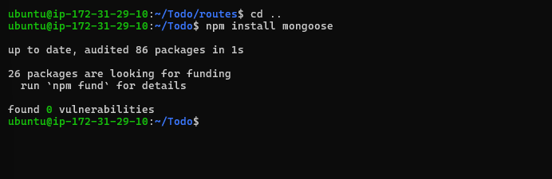

2. Create a new folder models, switch to models directory, create a file todo.js inside models. Open the file
mkdir models
cd models
touch todo.js
vim todo.js

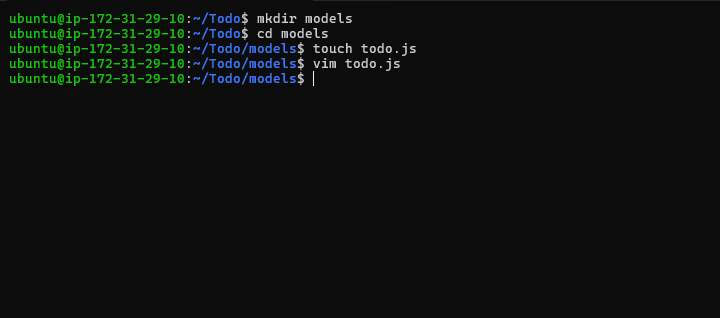

Past the code below into the file
const mongoose = require('mongoose');
const Schema = mongoose.Schema;

// Create schema for todo
const TodoSchema = new Schema({
action: {
type: String,
required: [true, 'The todo text field is required']
}
});

// Create model for todo
const Todo = mongoose.model('todo', TodoSchema);

module.exports = Todo;

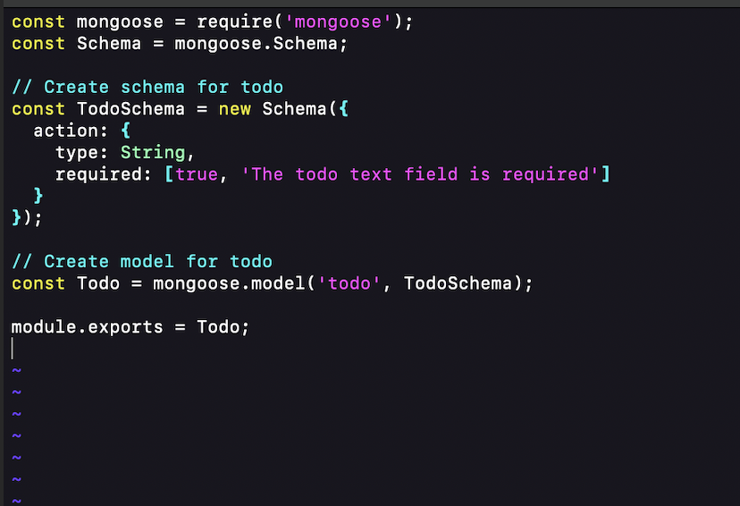

The routes was updated from the file api.js in the 'routes' directory to make use of the new model.
3. In Routes directory, open api.js and delete the code inside with :%d.
vim api.js
Paste the new code below into it
const express = require('express');
const router = express.Router();
const Todo = require('../models/todo');

router.get('/todos', (req, res, next) => {
// This will return all the data, exposing only the id and action field to the client
Todo.find({}, 'action')
.then(data => res.json(data))
.catch(next);
});

router.post('/todos', (req, res, next) => {
if (req.body.action) {
Todo.create(req.body)
.then(data => res.json(data))
.catch(next);
} else {
res.json({
error: "The input field is empty"
});
}
});

router.delete('/todos/:id', (req, res, next) => {
Todo.findOneAndDelete({"_id": req.params.id})
.then(data => res.json(data))
.catch(next);
});

module.exports = router;

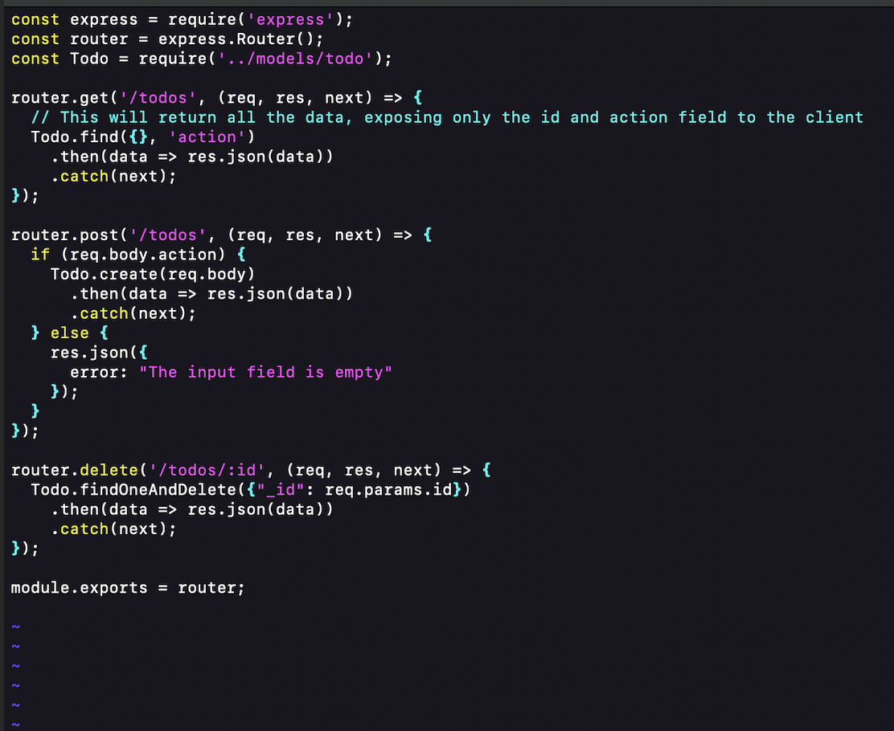

### MongoDB Database

mLab provides MongoDB database as a service solution (DBaaS). MongoDB has two cloud database management system components: mLab and Atlas, Both were formerly cloud databases managed by MongoDB (MongoDB acquired mLab in 2018, with certain differences). In November, MongoDB merged the two cloud databases and as such, mLab.com redirects to the MongoDB Atlas website.
1. Create a MongoDB database and collection inside mLab
AWS cloud provider, in region N. Virginia (us-east-1) was selected.
MongoDB Cluster Overview

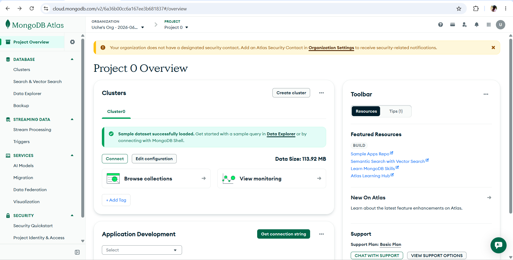

Access from anywhere to the MongoDB database was allowed (Not secure but it is ideal for testing), time of deleting the entry was changed from 6 hours to 1 week.

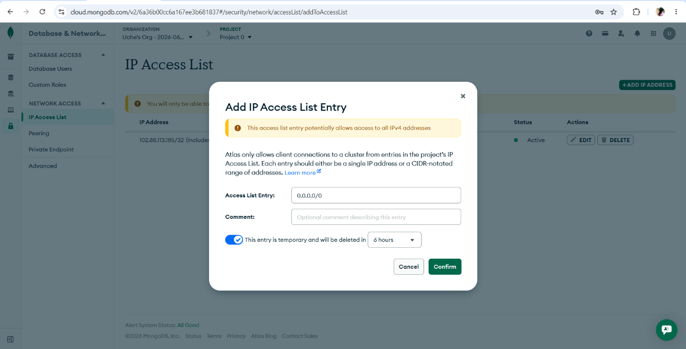

A database named to-do-database and collections named todos was created.

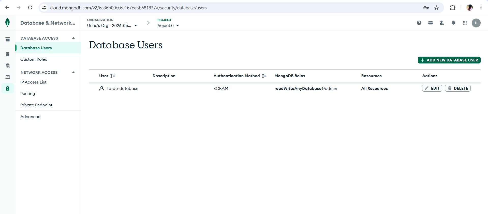

Get the connection string

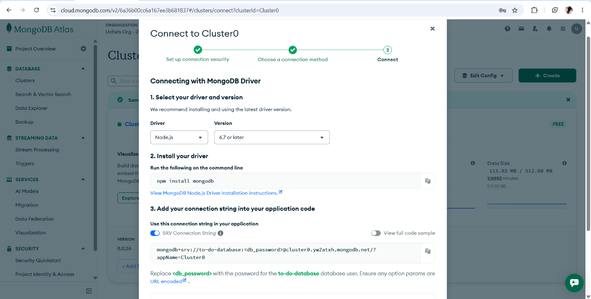

2. Create a file in your Todo directory and name it .env, open the file
touch .env && vim .env

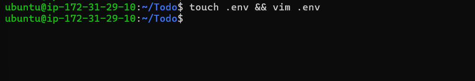

Add connection string below to access the database
DB = 'mongodb+srv://<username>:<password>@<network-address>/<dbname>?retryWrites=true&w=majority'

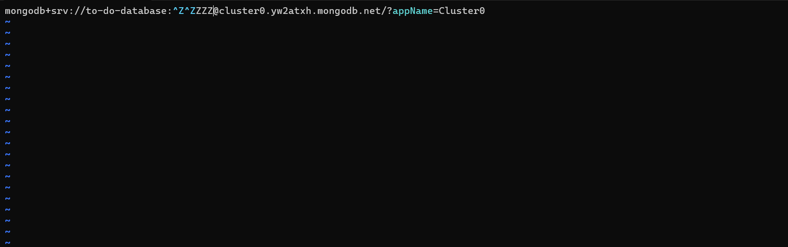

3. Update the index.js to reflect the use of .env so that Node.js can connect to the database.
vim index.js
Delete existing content in the file, and update it with the entire code below:
const express = require('express');
const bodyParser = require('body-parser');
const mongoose = require('mongoose');
const routes = require('./routes/api');
const path = require('path');
require('dotenv').config();

const app = express();

const port = process.env.PORT || 5000;

// Connect to the database
mongoose.connect(process.env.DB, { useNewUrlParser: true, useUnifiedTopology: true })
.then(() => console.log(`Database connected successfully`))
.catch(err => console.log(err));

// Since mongoose promise is deprecated, we override it with Node's promise
mongoose.Promise = global.Promise;

app.use((req, res, next) => {
res.header("Access-Control-Allow-Origin", "*");
res.header("Access-Control-Allow-Headers", "Origin, X-Requested-With, Content-Type, Accept");
next();
});

app.use(bodyParser.json());

app.use('/api', routes);

app.use((err, req, res, next) => {
console.log(err);
next();
});

app.listen(port, () => {
console.log(`Server running on port ${port}`);
});

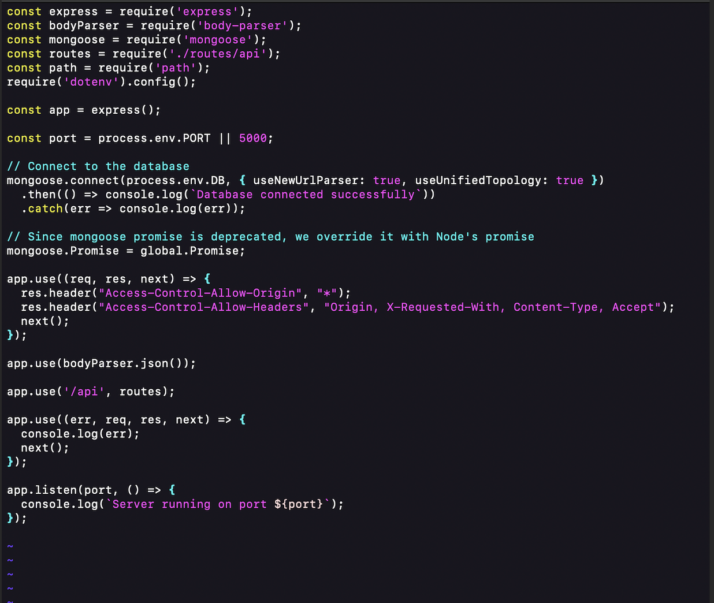

Using environment variables to store information is considered more secure and best practice to separate configuration and secret data from the application, instead of writing connection strings directly inside the index.js application file.
4. Start your server using the command
node index.js

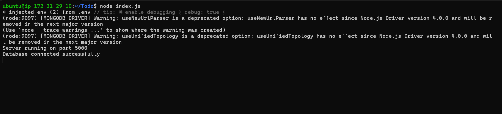

There was a deprecation warning as diplayed in the image above. To silent this warning, { useNewUrlParser: true, useUnifiedTopology: true } was removed from the code.

### Testing Backend Code without Frontend using RESTful API

Postman was used to test the backend code. The endpoints were tested. For the endpoints that require body, JSON was sent back with the necessary fields since it's what was set up in the code.
1. Open Postman and Set the header
http://54.145.31.13:5000/api/todos

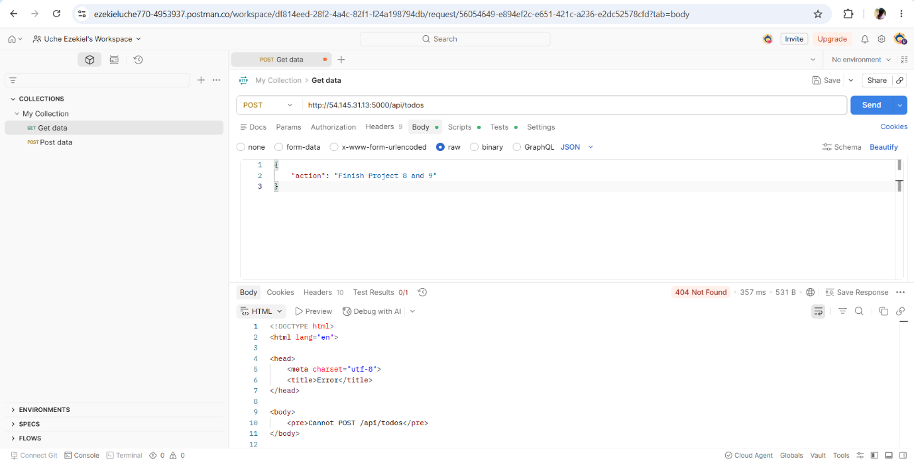

Create POST requests to the API

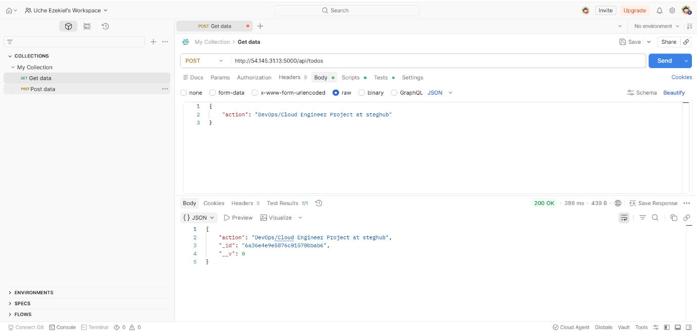

Check Database Collections

Make a GET requests to the API
This request retrieves all existing records from our To-Do application (backend requests these records from the database and sends us back as a response to GET request).

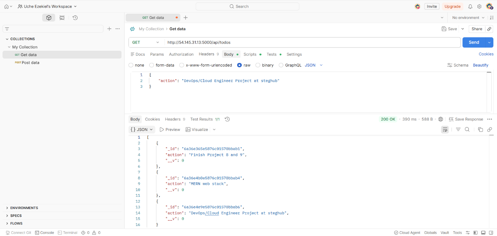

Create a DELETE requests to the API

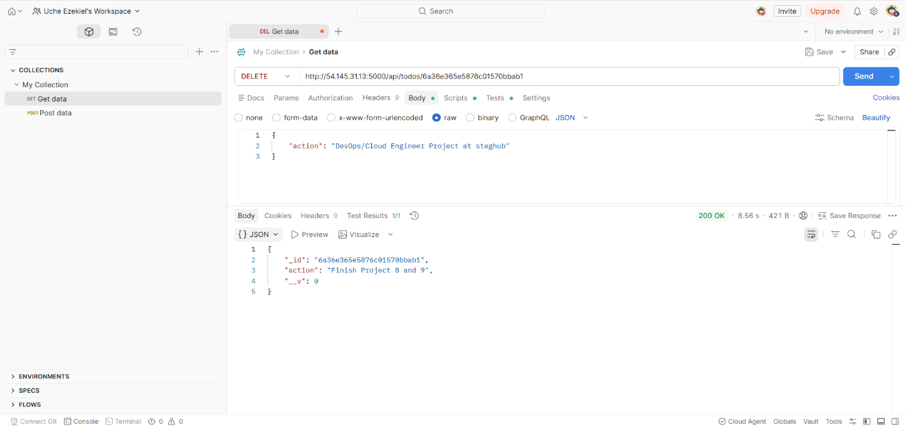

Check Database Collections

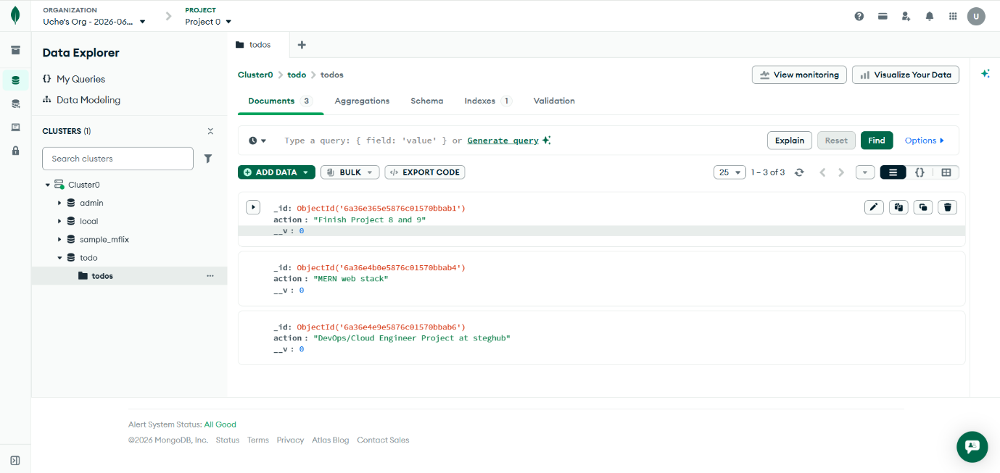

## Step 2 - Frontend Creation

It is time to create a user interface for a Web client (browser) to interact with the application via API
1. In the same root directory as your backend code, which is the Todo directory, run:
npx create-react-app client

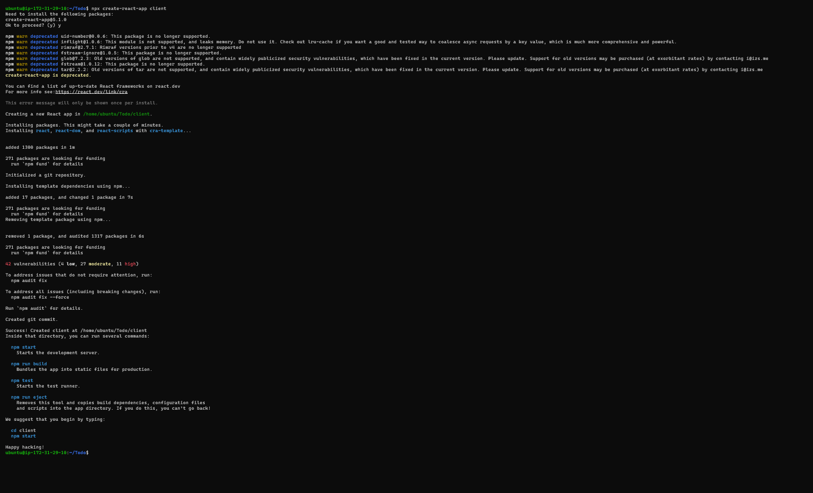

This created a new folder in the Todo directory called client, where all the react code was added.

### Running a React App

Before testing the react app, the following dependencies needs to be installed in the project root directory.
Install concurrently. It is used to run more than one command simultaneously from the same terminal window.
npm install concurrently --save-dev

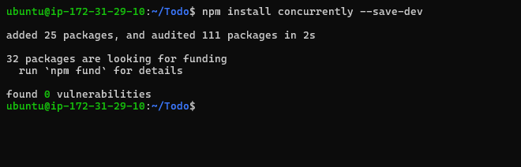

Install nodemon. It is used to run and monitor the server. If there is any change in the server code, nodemon will restart it automatically and load the new changes.
npm install nodemon --save-dev

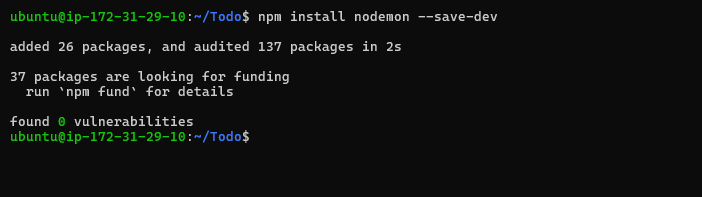

In Todo folder open the package.json file, change the highlighted part of the below screenshot and replace with the code below:
"scripts": {
"start": "node index.js",
"start-watch": "nodemon index.js",
"dev": "concurrently \"npm run start-watch\" \"cd client && npm start\""
}

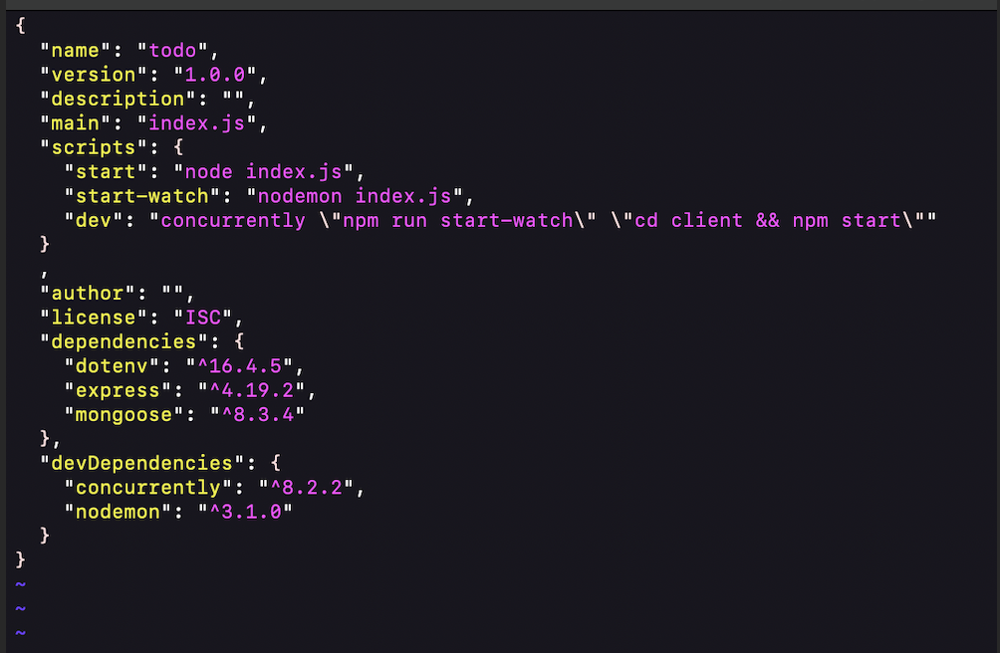

### Configure Proxy In package.json

Change directory to "client"
cd client
Open the package.json file
vim package.json

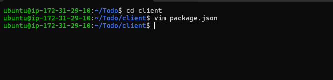

Add the key value pair in the package.json file
"proxy": "http://localhost:5000"

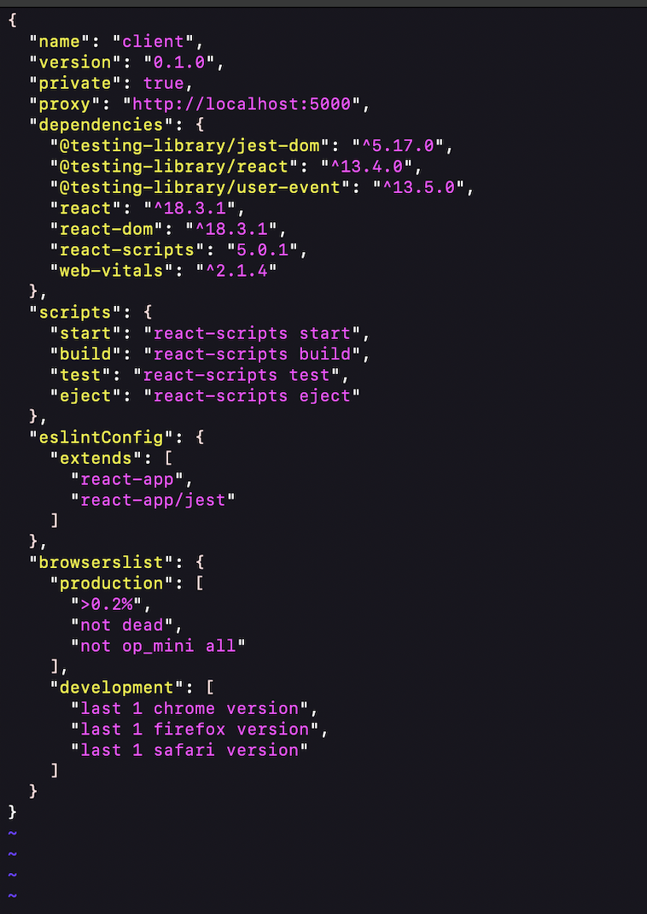

The whole purpose of adding the proxy configuration above is to make it possible to access the application directly from the browser by simply calling the server url like http://locathost:5000 rather than always including the entire path like http://localhost:5000/api/todos
Ensure you are inside the Todo directory, and simply do:
cd ..
npm run dev

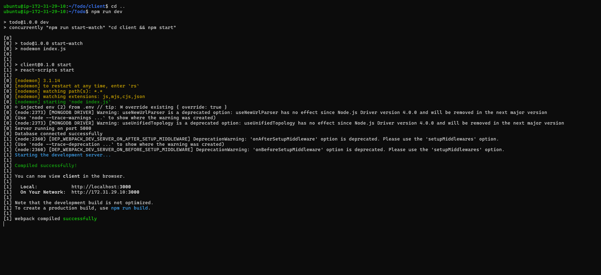

The app opened and started running on localhost:3000
Note: In order to access the application from the internet, TCP port 3000 had been opened on EC2.

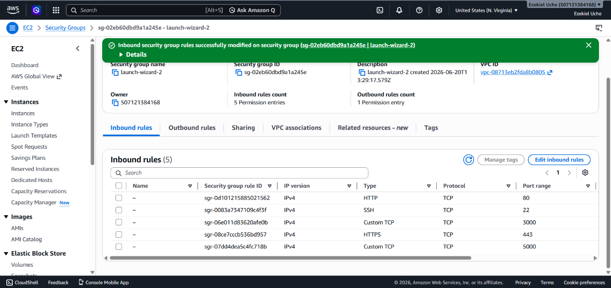

### Creating React Components

One of the advantages of react is that it makes use of components, which are reusable and also makes code modular. For the Todo app, there are two stateful components and one stateless component. From Todo directory, run:
cd client
Move to the "src" directory
cd src
2. Inside your src folder, create another folder called "components", Inside the 'components' directory create three files "Input.js", "ListTodo.js" and "Todo.js".
cd src
mkdir components
cd components
touch Input.js ListTodo.js Todo.js

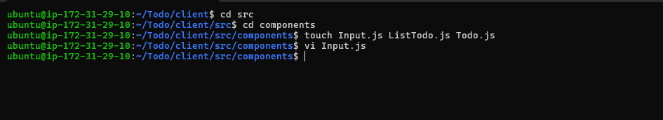

Open Input.js file
vim Input.js
Paste in the following:
import React, { Component } from 'react';
import axios from 'axios';

class Input extends Component {
state = {
action: ""
}

handleChange = (event) => {
this.setState({ action: event.target.value });
}

addTodo = () => {
const task = { action: this.state.action };

if (task.action && task.action.length > 0) {
axios.post('/api/todos', task)
.then(res => {
if (res.data) {
this.props.getTodos();
this.setState({ action: "" });
}
})
.catch(err => console.log(err));
} else {
console.log('Input field required');
}
}

render() {
let { action } = this.state;
return (

<input type="text" onChange={this.handleChange} value={action} />
<button onClick={this.addTodo}>add todo</button>

);
}
}

export default Input;

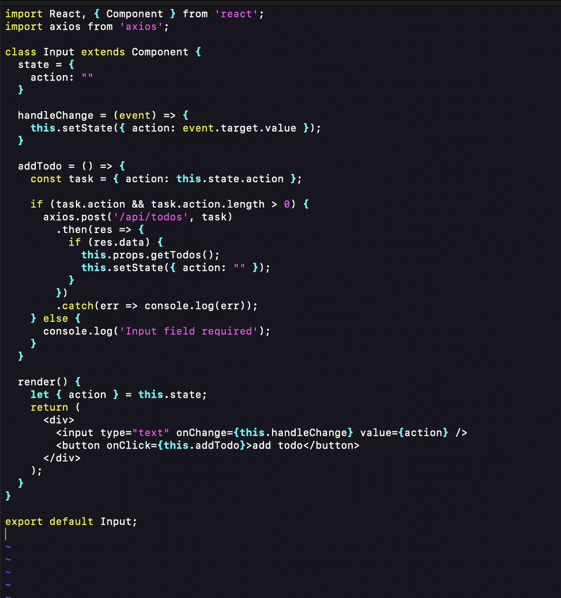

In oder to make use of Axios, which is a Promise based HTTP client for the browser and node.js, you need to cd into your client from your terminal and run yarn add axios or npm install axios.
Move to the client folder
cd ../..
Install Axios
npm install axios

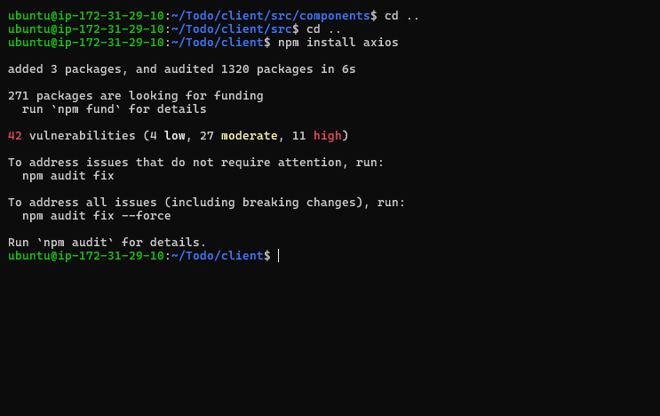

Go to components directory
cd src/components
After that open the ListTodo.js
vim ListTodo.js
Copy and paste the following code:
import React from 'react';

const ListTodo = ({ todos, deleteTodo }) => {
return (
<ul>
{
todos && todos.length > 0 ? (
todos.map(todo => {
return (
<li key={todo._id} onClick={() => deleteTodo(todo._id)}>
{todo.action}
</li>
);
})
) : (
<li>No todo(s) left</li>
)
}
</ul>
);
}

export default ListTodo;

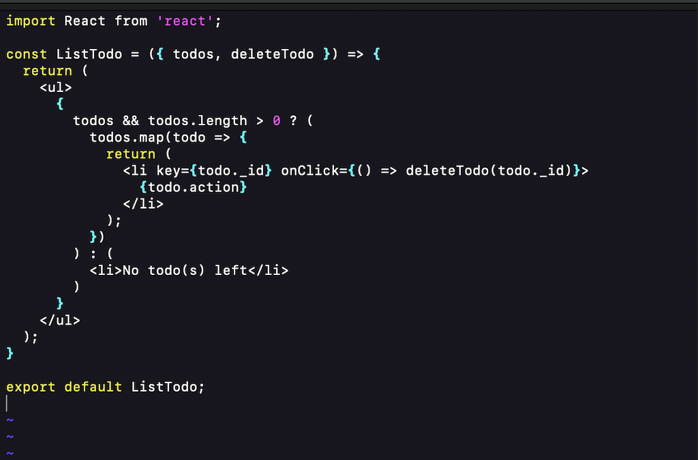

Then in the Todo.js file, write the following code
vim Todo.js
import React, { Component } from 'react';
import axios from 'axios';

import Input from './Input';
import ListTodo from './ListTodo';

class Todo extends Component {
state = {
todos: []
}

componentDidMount() {
this.getTodos();
}

getTodos = () => {
axios.get('/api/todos')
.then(res => {
if (res.data) {
this.setState({
todos: res.data
});
}
})
.catch(err => console.log(err));
}

deleteTodo = (id) => {
axios.delete(`/api/todos/${id}`)
.then(res => {
if (res.data) {
this.getTodos();
}
})
.catch(err => console.log(err));
}

render() {
let { todos } = this.state;
return (

<h1>My Todo(s)</h1>
<Input getTodos={this.getTodos} />
<ListTodo todos={todos} deleteTodo={this.deleteTodo} />

);
}
}

export default Todo;

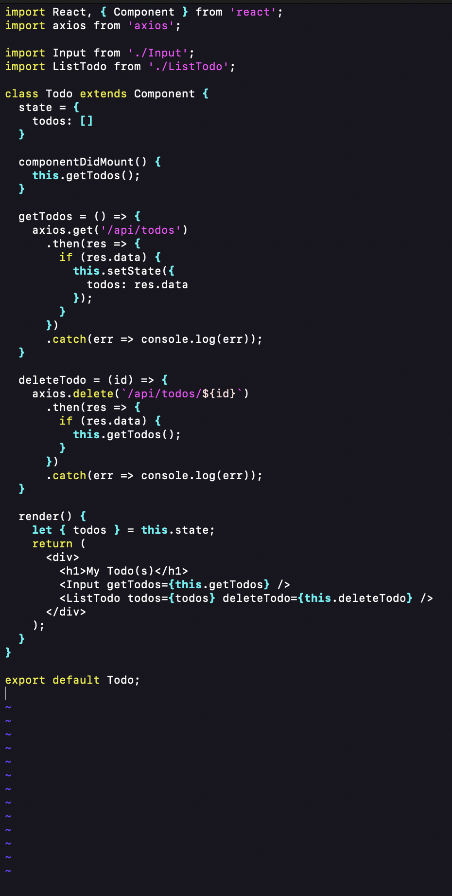

We need to make a little adjustment to our react code. Delete the logo and adjust our App.js to look like this
Move to src folder
cd ..
Ensure to be in the src folder and run:
vim App.js
Copy and paste the following code
import React from 'react';
import Todo from './components/Todo';
import './App.css';

const App = () => {
return (

<Todo />

);
}

export default App;

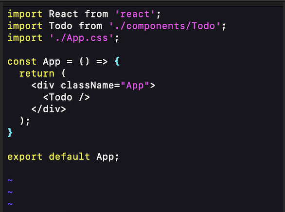

In the src directory, open the App.css
vim App.css
Paste the following code into it
.App {
text-align: center;
font-size: calc(10px + 2vmin);
width: 60%;
margin-left: auto;
margin-right: auto;
}

input {
height: 40px;
width: 50%;
border: none;
border-bottom: 2px #101113 solid;
background: none;
font-size: 1.5rem;
color: #787a80;
}

input:focus {
outline: none;
}

button {
width: 25%;
height: 45px;
border: none;
margin-left: 10px;
font-size: 25px;
background: #101113;
border-radius: 5px;
color: #787a80;
cursor: pointer;
}

button:focus {
outline: none;
}

ul {
list-style: none;
text-align: left;
padding: 15px;
background: #171a1f;
border-radius: 5px;
}

li {
padding: 15px;
font-size: 1.5rem;
margin-bottom: 15px;
background: #282c34;
border-radius: 5px;
overflow-wrap: break-word;
cursor: pointer;
}

@media only screen and (min-width: 300px) {
.App {
width: 80%;
}

input {
width: 100%;
}

button {
width: 100%;
margin-top: 15px;
margin-left: 0;
}
}

@media only screen and (min-width: 640px) {
.App {
width: 60%;
}

input {
width: 50%;
}

button {
width: 30%;
margin-left: 10px;
margin-top: 0;
}
}

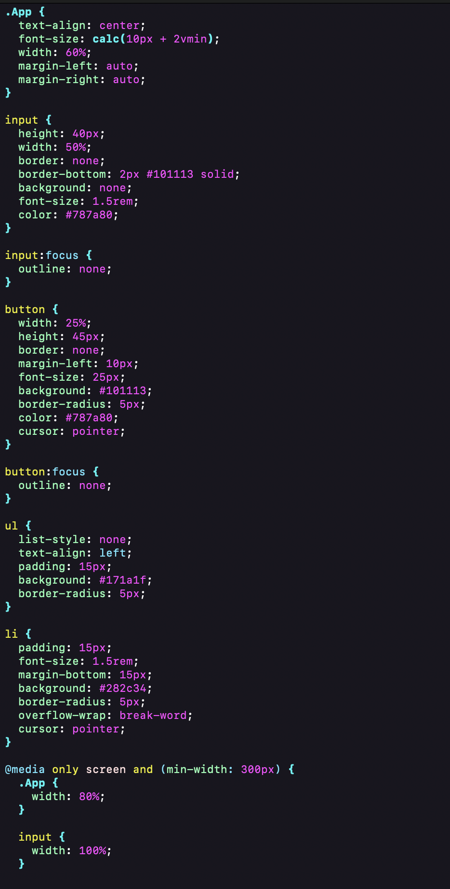

In the src directory, open the index.css
vim index.css

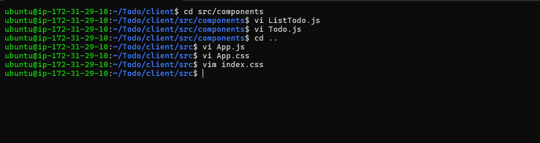

Copy and paste the code below:
body {
margin: 0;
padding: 0;
font-family: -apple-system, BlinkMacSystemFont, "Segoe UI", "Roboto", "Oxygen", "Ubuntu", "Cantarell", "Fira Sans", "Droid Sans", "Helvetica Neue", sans-serif;
-webkit-font-smoothing: antialiased;
-moz-osx-font-smoothing: grayscale;
box-sizing: border-box;
background-color: #282c34;
color: #787a80;
}

code {
font-family: source-code-pro, Menlo, Monaco, Consolas, "Courier New", monospace;
}

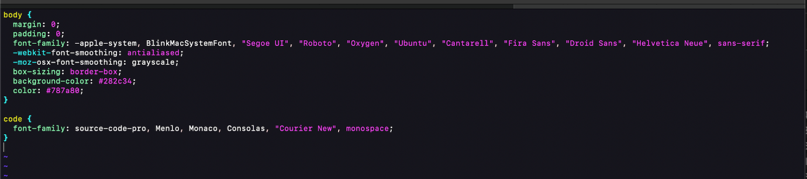

Go to the Todo directory
cd ../..
Run:
npm run dev

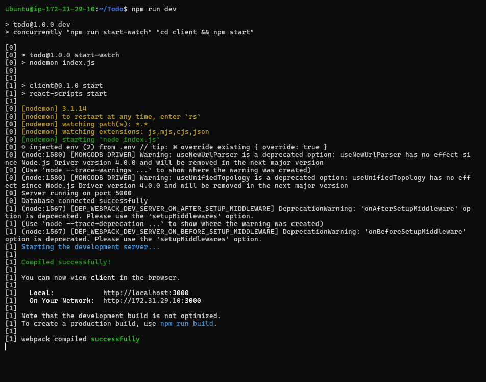

At this point, the To-Do app is ready and fully functional with the functionality discussed earlier: Creating a task, deleting a task, and viewing all the tasks.
The client can now be viewed in the browser

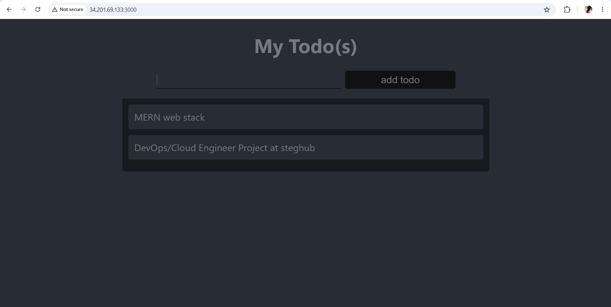

Add some todos via the browser .

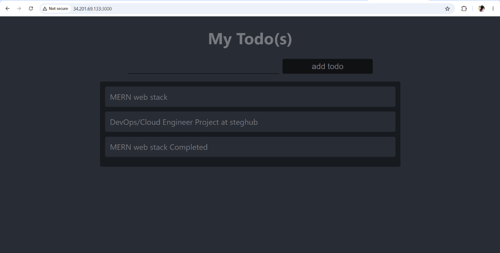

Check on the MongoDB database

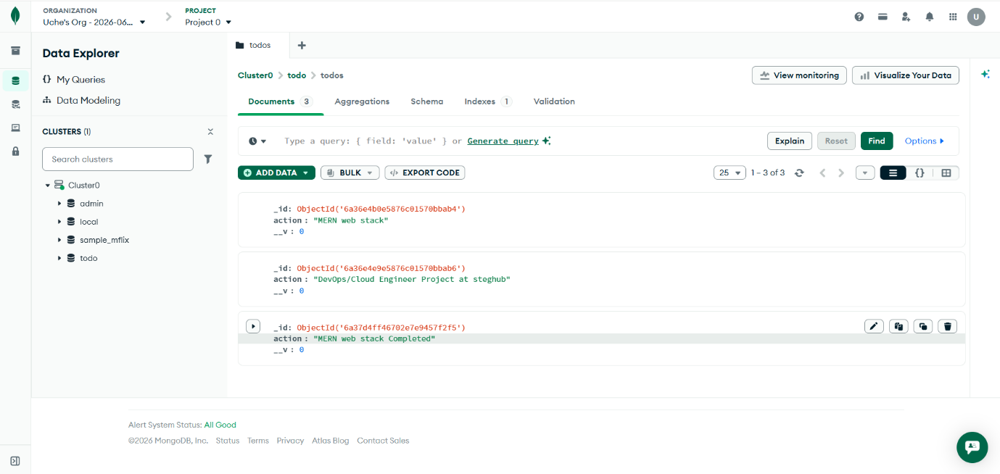

## Conclusion

This project demonstrates the successful implementation of a complete MERN stack application hosted on AWS. By integrating MongoDB for data management, Express.js and Node.js for backend services, and React.js for the frontend interface, a responsive and efficient To-Do application was developed and deployed.
The implementation highlights key concepts such as RESTful API development, database connectivity, environment variable management, React component architecture, and cloud deployment. Following the procedures outlined in this guide provides a solid foundation for building, deploying, and managing scalable full-stack web applications using the MERN stack on AWS infrastructure.
