# Web Solution With WordPress

## Step 1 - Prepare a Web Server

1.  Launch a RedHat EC2 instance that serve as Web Server. Create 3 volumes in the same AZ as the web server ec2 each of 10GB and attache all 3 volumes one by one to the web server.

    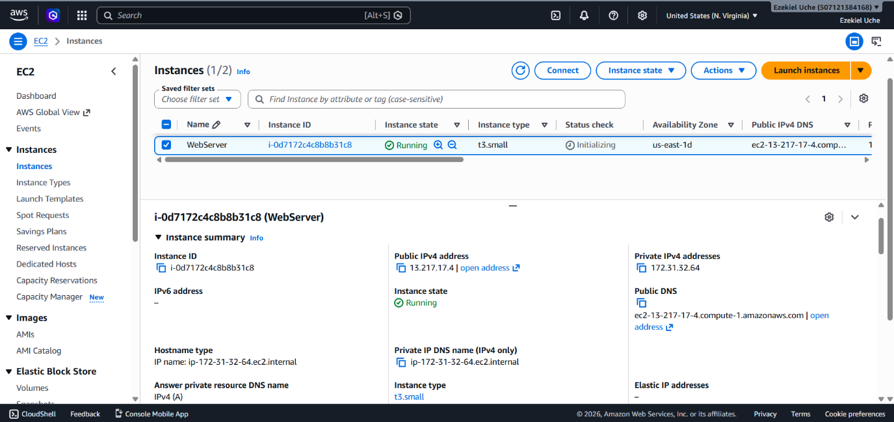
    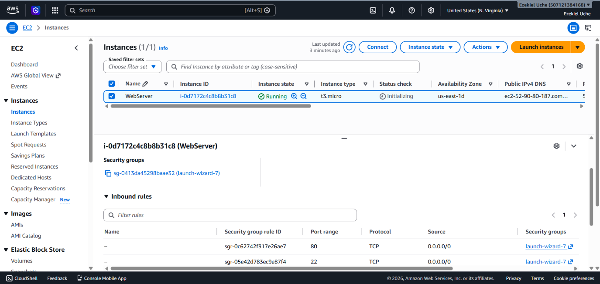
    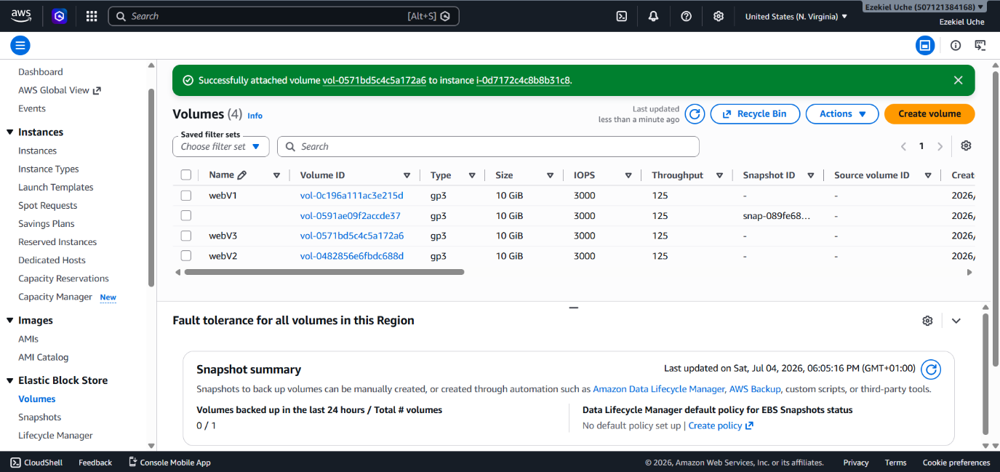

2.  Open up the Linux terminal to begin configuration.

        ssh -i "ec2key.pem" ec2-user@ec2-52-90.80.187

    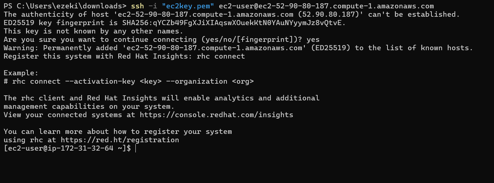

3.  Use `lsblk` to inspect what block devices are attached to the server. All devices in Linux reside in /dev/ directory. Inspect with `ls /dev/` and ensure all 3 newly created devices are there. Their name will likely be `nvme1n1`, `nvme2n1` and `nvme3n1`.

        Lsblk

    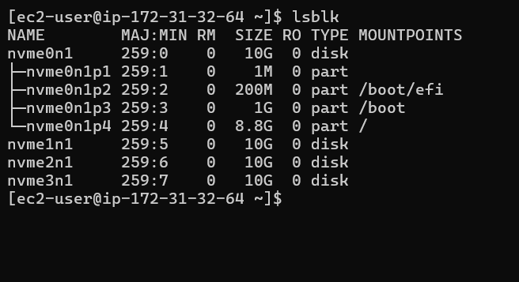

4.  Use `df -h` to see all mounts and free space on the server.

        df -h

    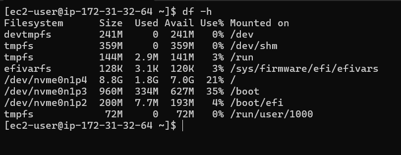

5a. Use `gdisk` utility to create a single partition on each of the 3 disks.

    sudogdisk /dev/nvme1n1

    sudogdisk /dev/nvme2n1

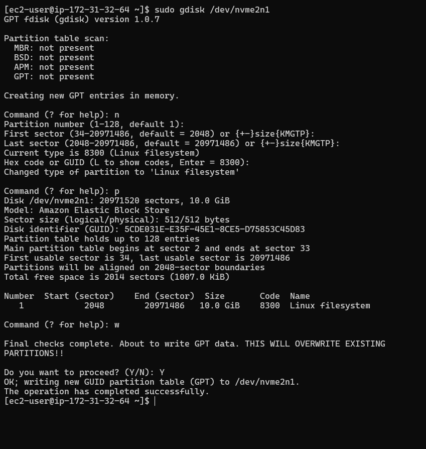

    sudogdisk /dev/nvme3n1

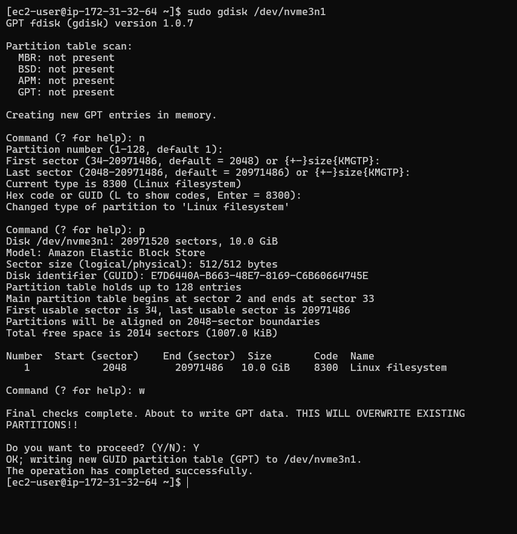

5b. Use `lsblk` utility to view the newly configured partitions on each of the 3 disks

    Lsblk

6.  Install `lvm` package

        sudo yum install lvm2 -y

    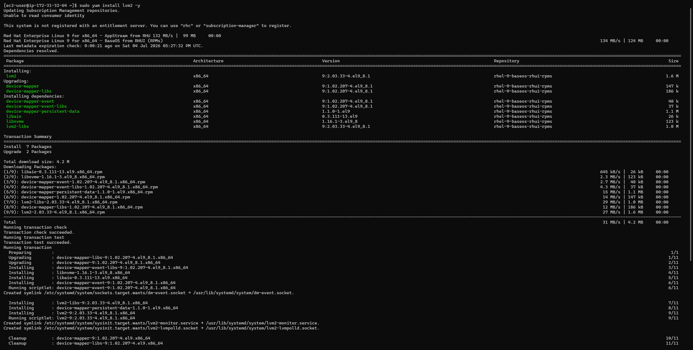

7.  Use `pvcreate` utility to mark each of the 3 dicks as physical volumes (PVs) to be used by LVM. Verify that each of the volumes have been created successfully.

        sudopvcreate/dev/nvme1n1p1 /dev/nvme2n1p1 /dev/nvme3n1p1
        sudopvs

    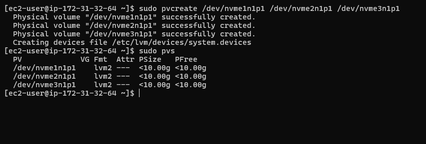

8.  Use `vgcreate` utility to add all 3 PVs to a volume group (VG). Name the VG `webdata-vg`. Verify that the VG has been created successfully

        sudovgcreatewebdata-vg /dev/nvme1n1p1 /dev/nvme2n1p1 /dev/nvme3n1p1
        sudovgs

    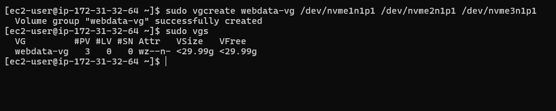

9.  Use `lvcreate` utility to create 2 logical volume, `apps-lv` (Use half of the PV size), and `logs-lv` (Use the remaining space of the PV size). Verify that the logical volumes have been created successfully.

    Note: apps-lv is used to store data for the Website while logs-lv is used to store data for logs.

        sudolvcreate -n apps-lv -L 14G webdata-vg
        sudolvcreate -n logs-lv -L 14G webdata-vg
        sudolvs

    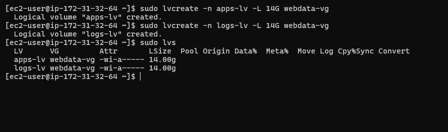

10a. Verify the entire setup

    sudovgdisplay -v   #view complete setup, VG, PV and LV

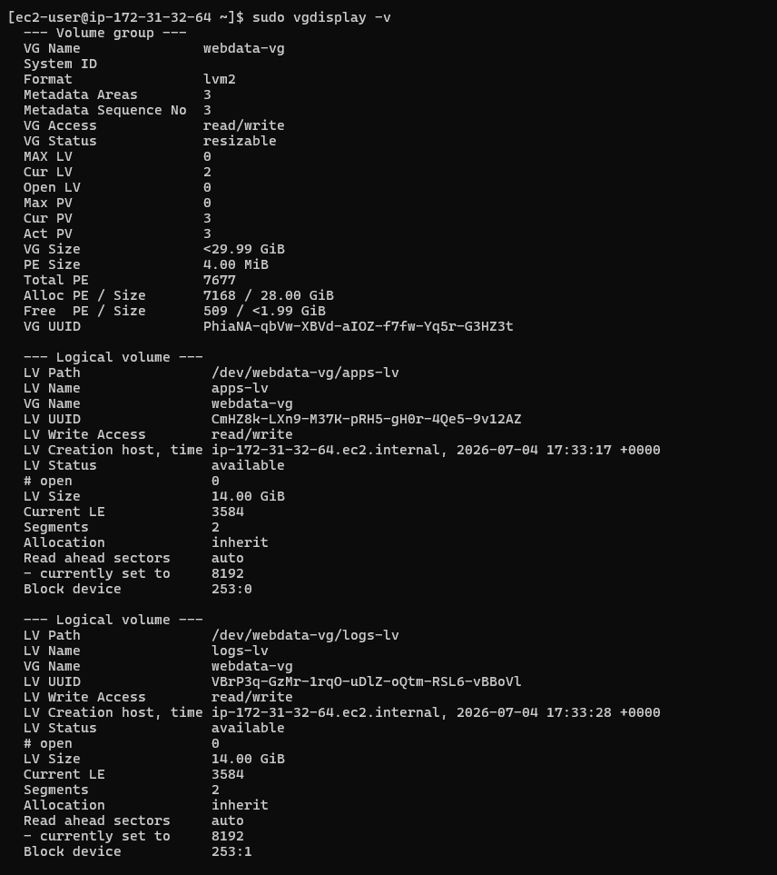

    lsblk

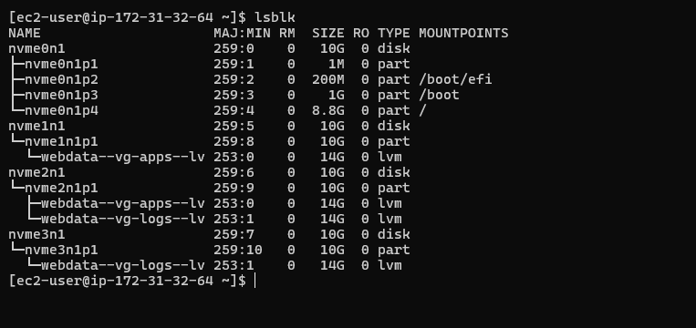

10b. Use `mkfs.ext4` to format the logical volumes with ext4 filesystem

    sudomkfs.ext4 /dev/webdata-vg/apps-lv
    sudomkfs.ext4 /dev/webdata-vg/logs-lv

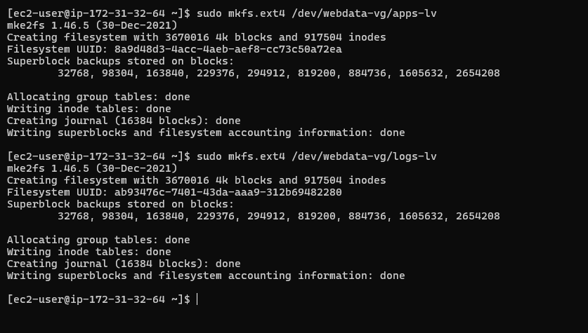

11. Create `/var/www/html` directory to store website files and `/home/recovery/logs` to store backup of log data

        sudomkdir -p /var/www/html
        sudomkdir -p /home/recovery/logs

    Mount /var/www/html on apps-lv logical volume

        sudo mount /dev/webdata-vg/apps-lv /var/www/html

    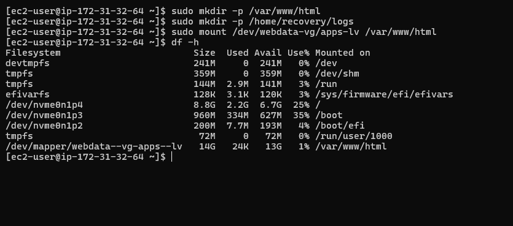

12. Use `rsync` utility to backup all the files in the log directory `/var/log` into `/home/recovery/logs` (This is required before mounting the file system)

        sudorsync -av /var/log /home/recovery/logs

    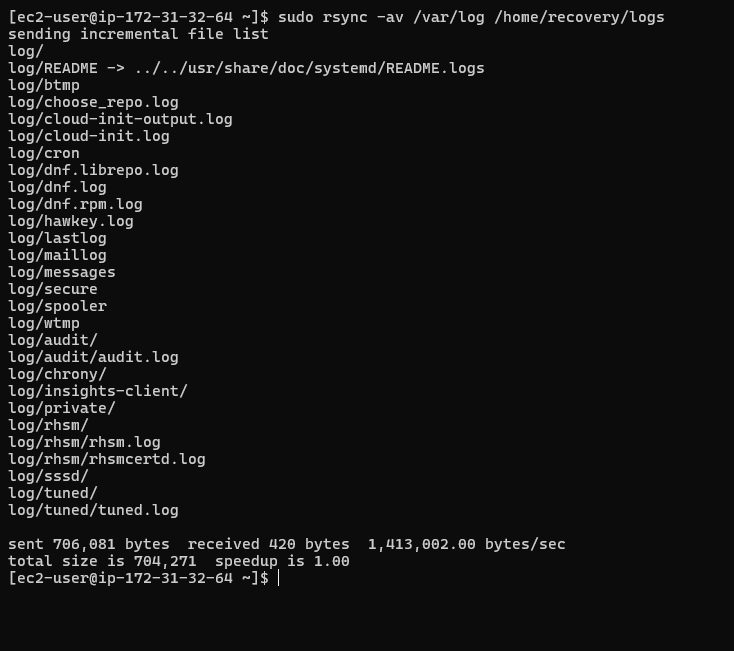

13. Mount `/var/log` on `logs-lv` logical volume (All existing data on /var/log is deleted with this mount process which was why the data was backed up)

        sudo mount /dev/webdata-vg/logs-lv /var/log
        ls -l /var/log

    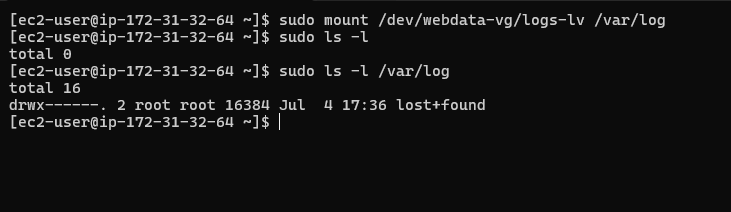

14. Restore log file back into `/var/log` directory

        sudorsync -av /home/recovery/logs/log/ /var/log

    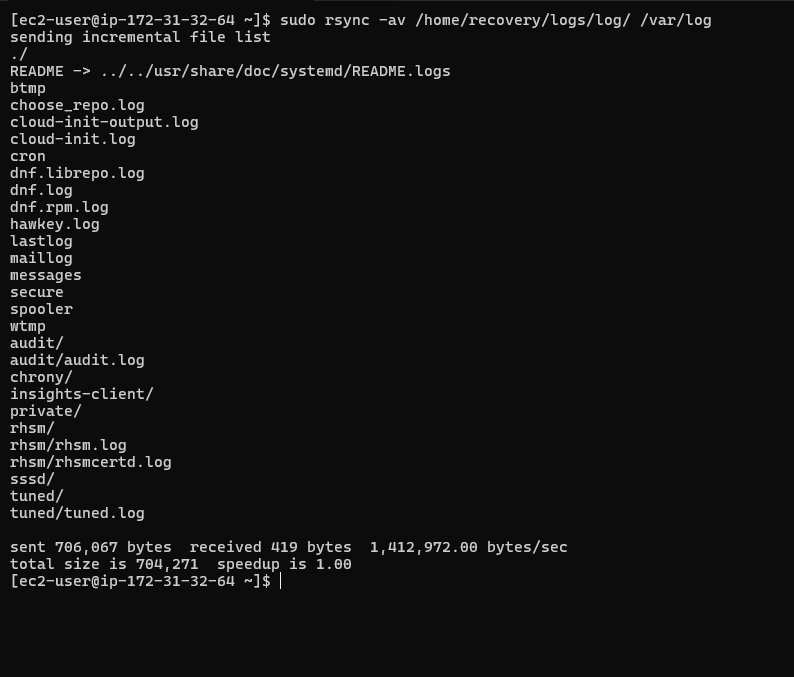

15. Update `/etc/fstab` file so that the mount configuration will persist after restart of the server

    Get the `UUID` of the device and Update the `/etc/fstab` file with the format shown inside the file using the `UUID`. Remember to remove the leading and ending quotes.

        sudoblkid   # To fetch the UUID
        sudo vi /etc/fstab

    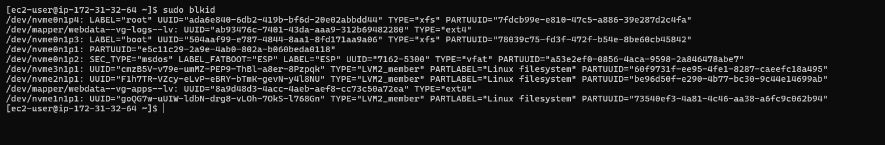

16. Test the configuration and reload daemon. Verify the setup

        sudo mount -a   # Test the configuration
        sudosystemctl daemon-reload
        df -h   # Verifies the setup

    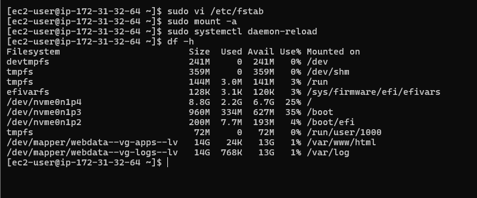

## Step 2 - Prepare the Database Server

Launch a second RedHat EC2 instance that will have a role - DB Server. Repeat the same steps as for the Web Server, but instead of `apps-lv`, create `dv-lv` and mount it to `/db` directory.

1.  Create 3 volumes in the same AZ as the DB Server ec2 each of 10GB and attache all 3 volumes one by one to the DB Server.

    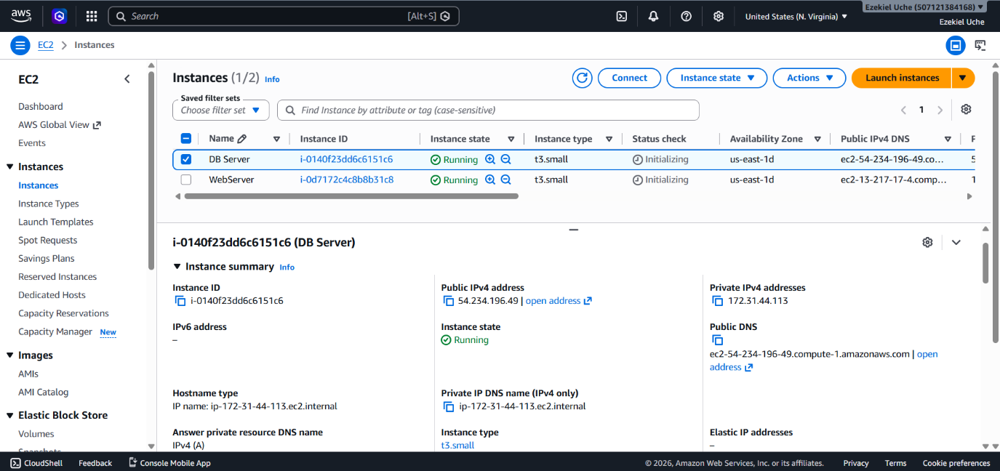
    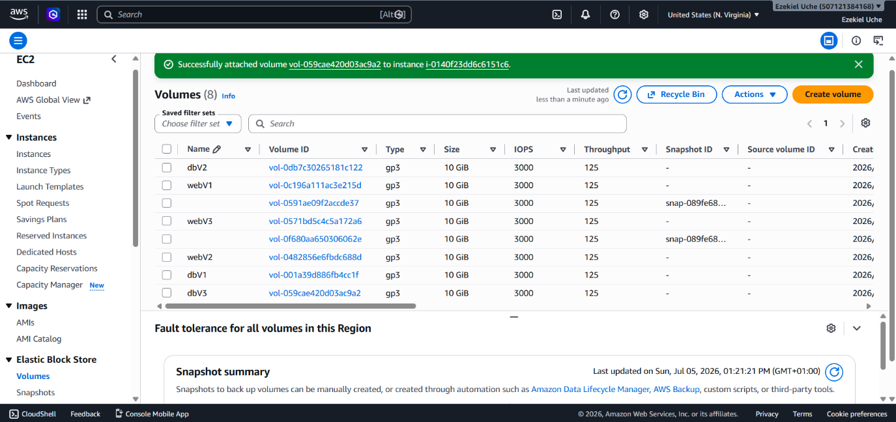

2.  Open up the Linux terminal to begin configuration.

        ssh -i "ec2key.pem" ec2-user@ec2-184-73-32-89

    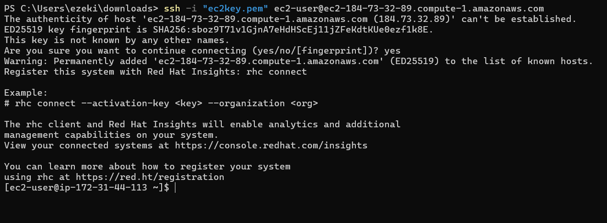

3.  Use `lsblk` to inspect what block devices are attached to the server. Their name will likely be `nvme1n1`, `nvme2n1` and `nvme3n1`.

        Lsblk

    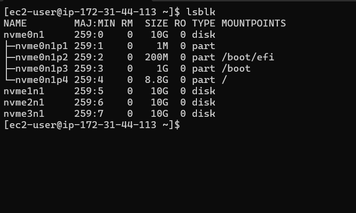

4a. Use `gdisk` utility to create a single partition on each of the 3 disks.

    sudogdisk /dev/nvme1n1

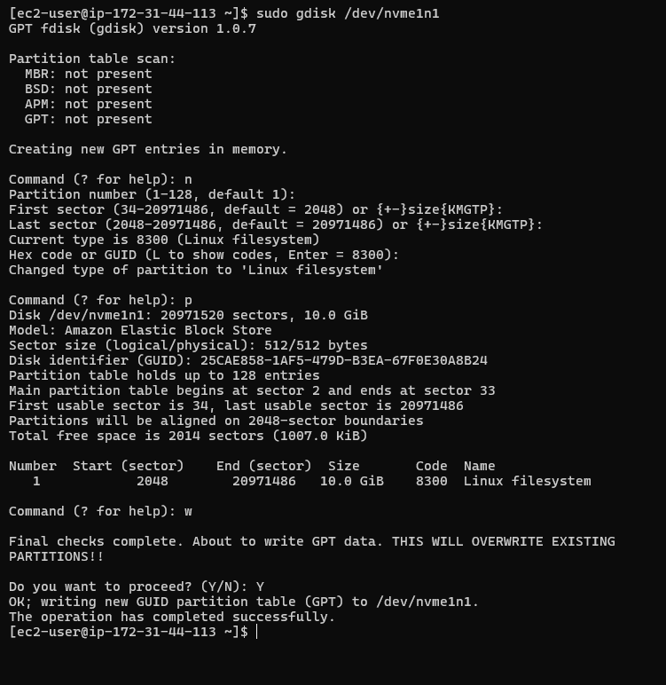

    sudogdisk /dev/nvme2n1

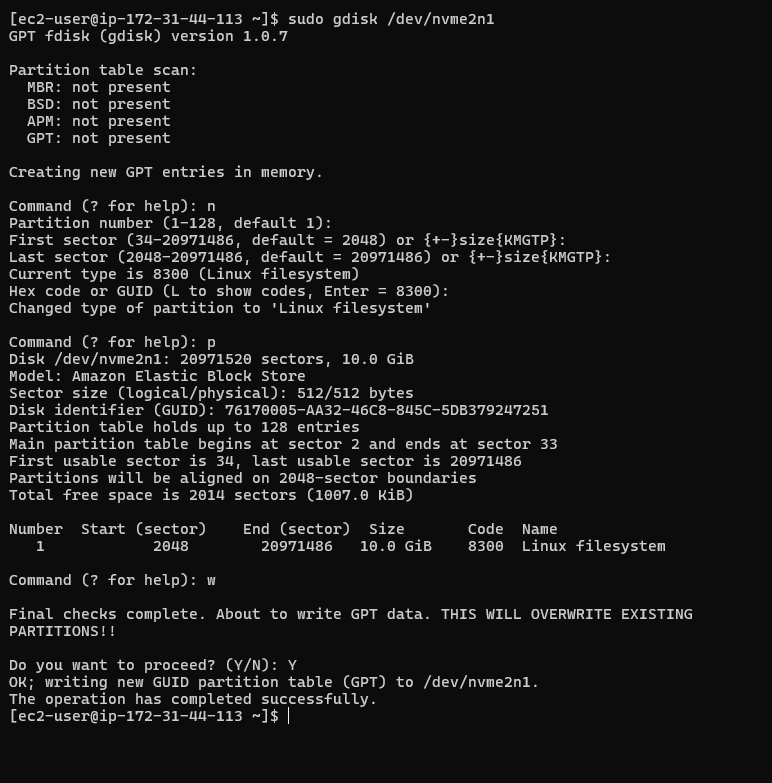

    sudogdisk /dev/nvme3n1

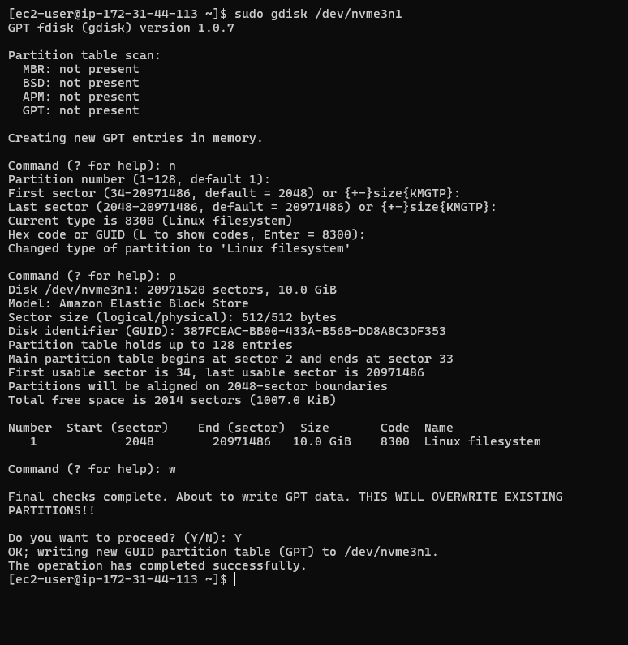

4b. Use `lsblk` utility to view the newly configured partitions on each of the 3 disks

    lsblk

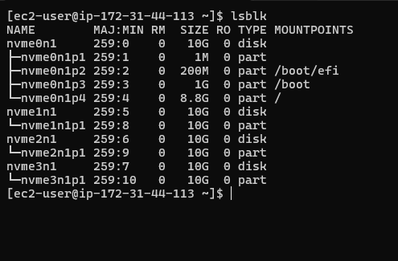

5.  Install `lvm` package

        sudo yum install lvm2 -y

    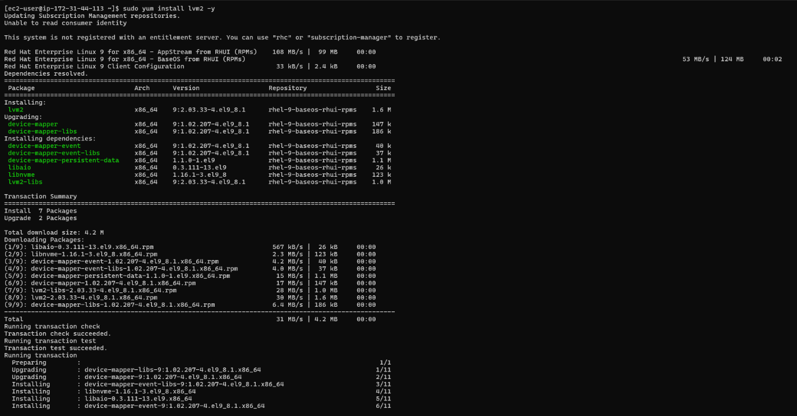

6.  Use `pvcreate` utility to mark each of the 3 dicks as physical volumes (PVs) to be used by LVM. Also, use `vgcreate` utility to add all 3 PVs to a volume group (VG). Name the VG `database-vg`. Verify that each of the volumes and the VG have been created successfully.

        sudopvcreate /dev/nvme1n1p1 /dev/nvme2n1p1 /dev/nvme3n1p1
        sudopvs

    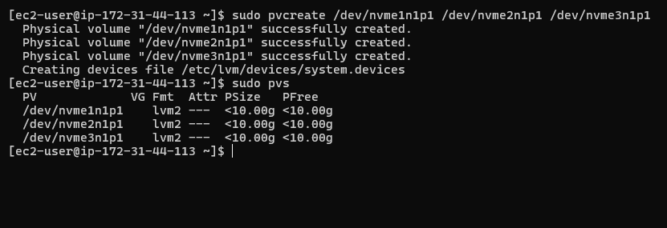

        sudovgcreate database-vg /dev/nvme1n1p1 /dev/nvme2n1p1 /dev/nvme3n1p1
        sudovgs

    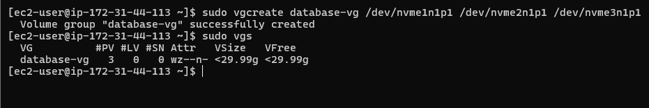

7.  Use `lvcreate` utility to create a logical volume, `db-lv` (Use 20G of the PV size since it is the only LV to be created). Verify that the logical volumes have been created successfully.

        sudolvcreate -n db-lv -L 20G database-vg
        sudolvs

    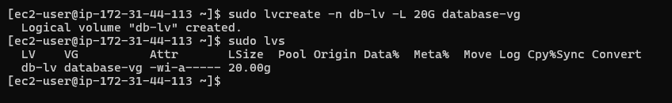

8.  Use `mkfs.ext4` to format the logical volumes with ext4 filesystem and monut `/db` on `db-lv`

        sudomkfs.ext4 /dev/database-vg/db-lv
        sudo mount /dev/database-vg/db-lv /db

    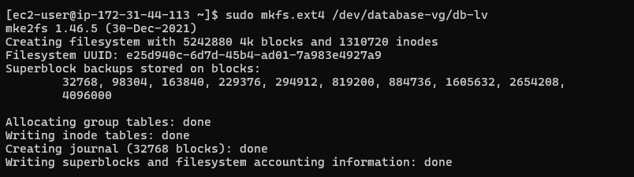
    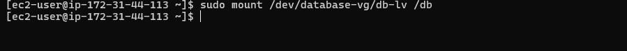

9.  Update `/etc/fstab` file so that the mount configuration will persist after restart of the server

    Get the `UUID` of the device

        sudoblkid

    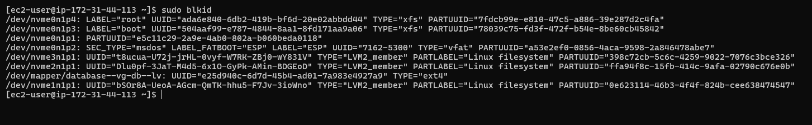

    Update the `/etc/fstab` file with the format shown inside the file using the `UUID`. Remember to remove the leading and ending quotes.

        sudo vi /etc/fstab

    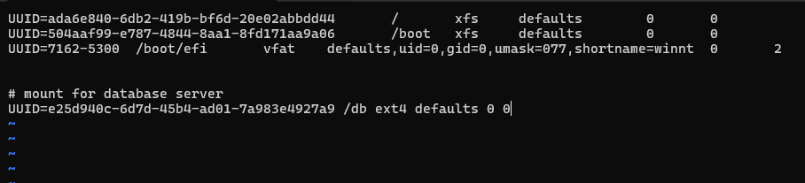

10. Test the configuration and reload daemon. Verify the setup

        sudo mount -a   # Test the configuration
        sudosystemctl daemon-reload
        df -h   # Verifies the setup

    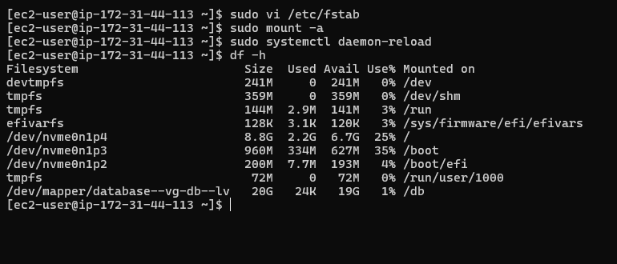

## Step 3 - Install WordPress on the Web Server EC2

1.  Update the repository

        sudo yum -y update

2.  Install wget, Apache and it's dependencies

        sudodnf -y installwget httpd php-json

    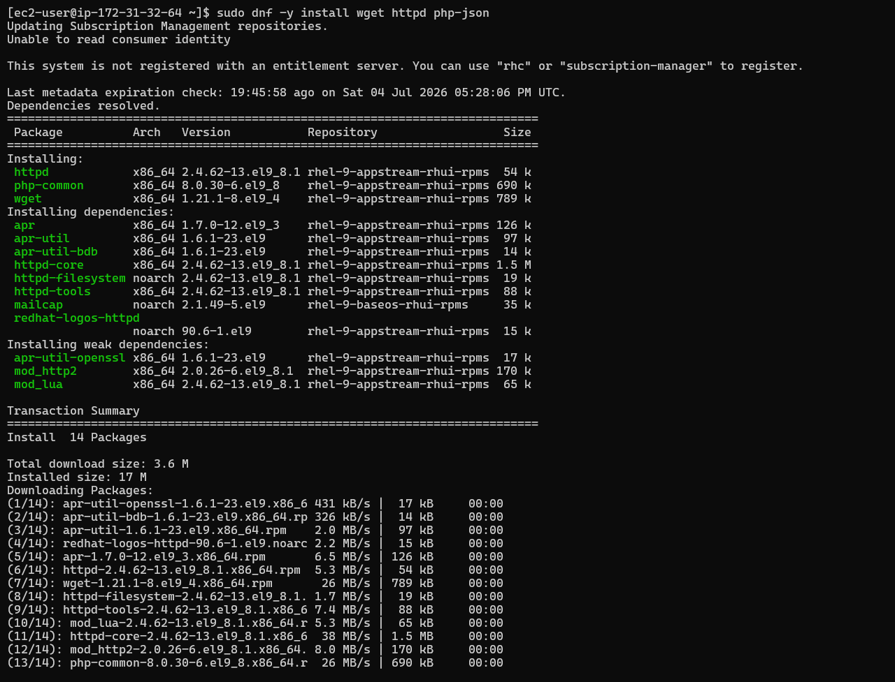

3.  Install the latest version of PHP and it's dependencies using the Remi repository

    Install the EPEL repository

    The package manager `dnf` was used here. It generally offers better performance and more efficient dependency resolution. `dnf` is the modern, actively maintained package manager, while yum is older and gradually being phased out.

    The system version of the RHEL EC2 is version "9"

        sudodnf install https://dl.fedoraproject.org/pub/epel/epel-release-latest-9.noarch.rpm

    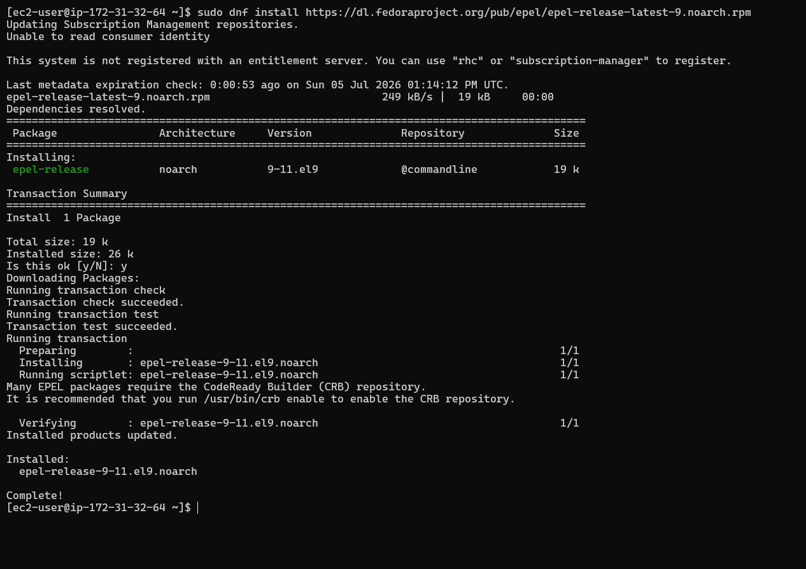

    Install yum utils and enable remi-repository

        sudodnf install dnf-utils http://rpms.remirepo.net/enterprise/remi-release-9.rpm

    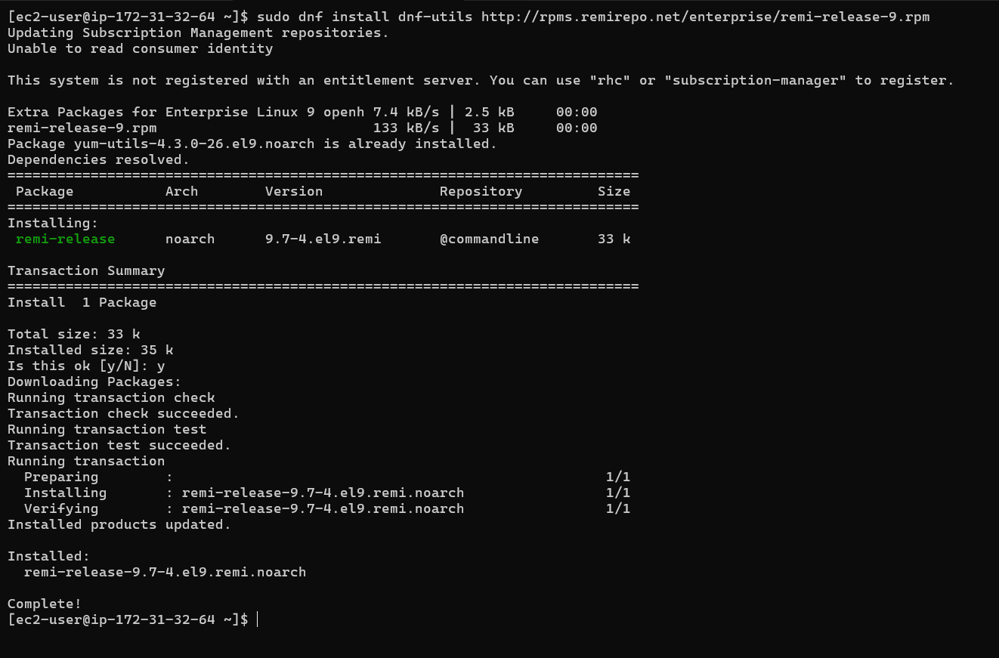

    After the successful installation of yum-utils and Remi-packages, search for the PHP modules which are available for download by running the command.

        sudodnf module list php

    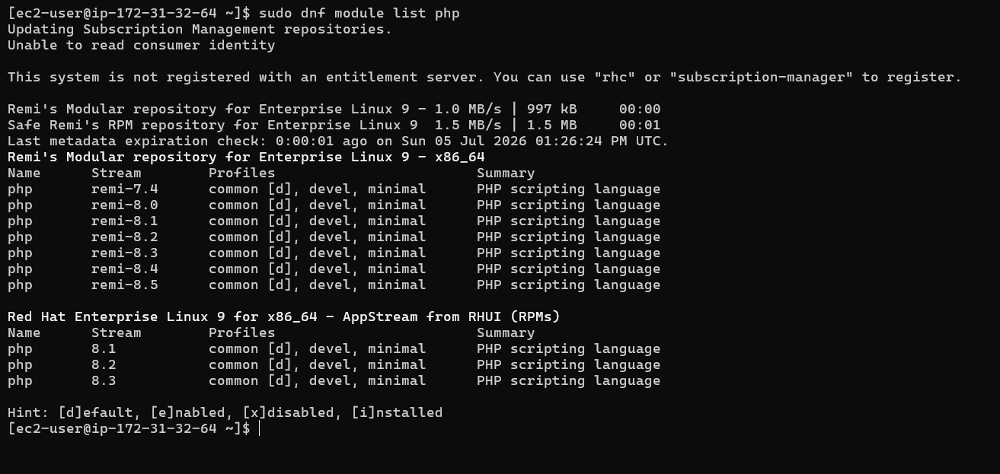

    The output above indicates that if the currently installed version of PHP is PHP 8.1, there is need to install the newer release, PHP 8.2. Reset the PHP modules.

        sudodnf module reset php

    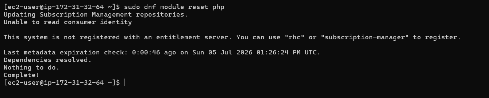

    Having run reset, enable the PHP 8.2 module by running

        sudodnf module enable php:remi-8.2

    Install PHP, PHP-FPM (FastCGI Process Manager) and associated PHP modules using the command.

        sudodnf install phpphp-opcachephp-gdphp-curl php-mysqlnd

    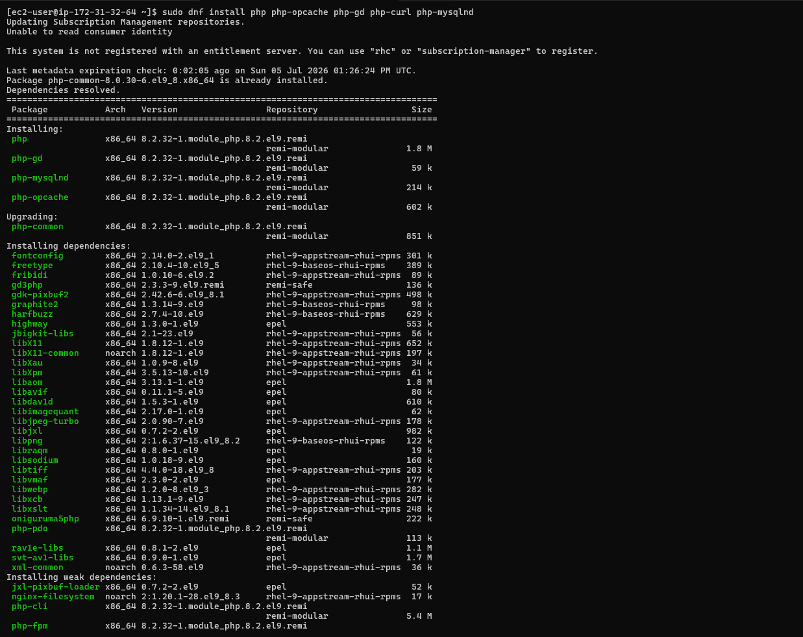

    To verify the version installed to run.

        php -v

    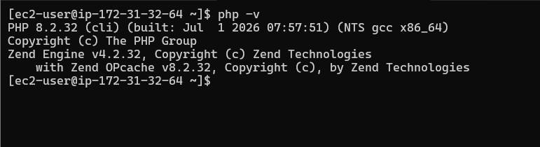

    Start, enable and check status of PHP-FPM on boot-up.

        sudosystemctl start php-fpm
        sudosystemctl enable php-fpm
        sudosystemctl status php-fpm

    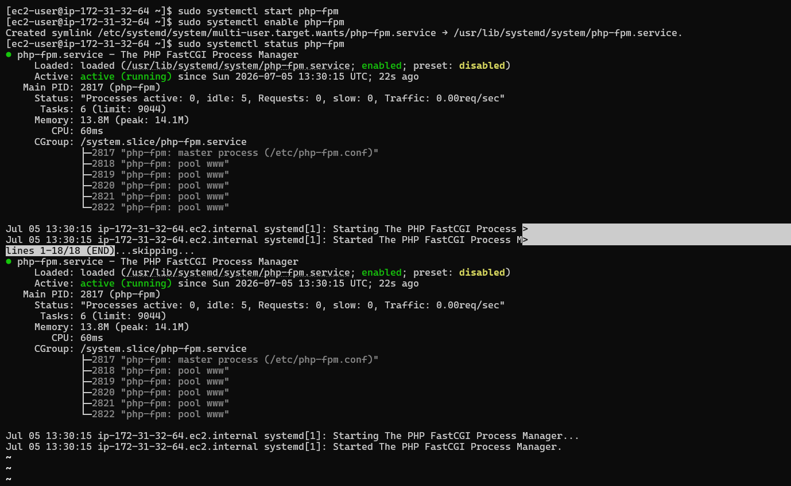

4.  Configure SELinux Policies

    To instruct SELinux to allow Apache to execute the PHP code via PHP-FPM run.

        sudochown -R apache:apache /var/www/html
        sudochcon -t httpd_sys_rw_content_t /var/www/html -R
        sudosetsebool -P httpd_execmem 1
        sudosetsebool -P httpd_can_network_connect=1
        sudosetsebool -P httpd_can_network_connect_db=1

    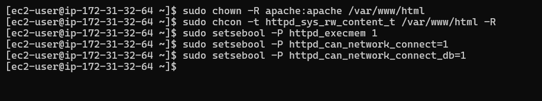

    Restart Apache web server for PHP to work with Apache web server.

        sudosystemctl restart httpd

    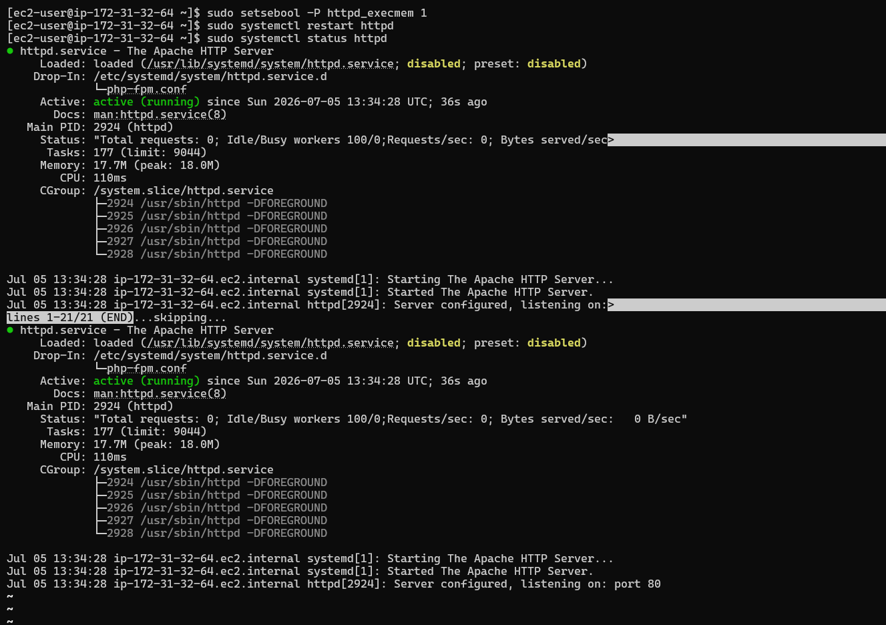

    Test to see the default Apache page on a browser using the public IP address

    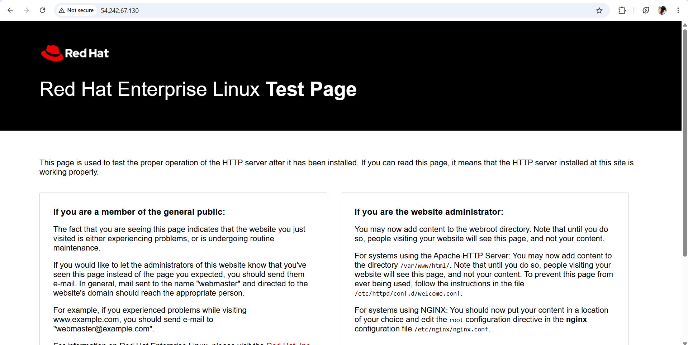

5.  Download WordPress

    Download wordpress and copy wordpress content to /var/www/html

        sudomkdirwordpress && cd wordpress
        sudowget http://wordpress.org/latest.tar.gz
        sudo tar xzvf latest.tar.gz   # Extract wordpress

    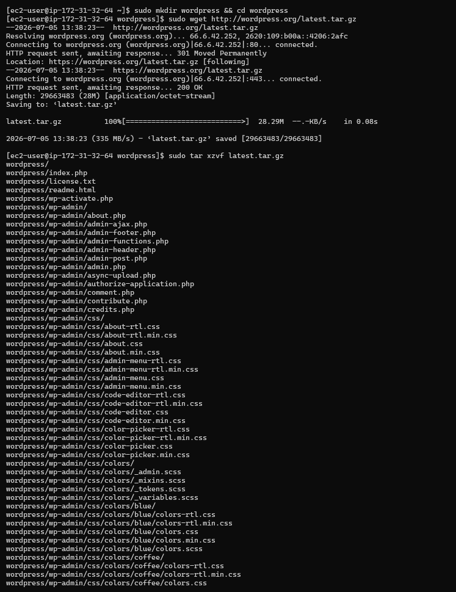

    After extraction, `cd` into the extracted `wordpress` and `Copy` the content of `wp-config-sample.php` to `wp-config.php`.

    This will copy and create the file wp-config.php

        sudo cp -R wp-config-sample.php wp-config.php

    

    Exit from the extracted `wordpress`. Copy the content of the extracted `wordpress` to `/var/www/html`.

        cd ..
        sudo cp -R wordpress/. /var/www/html/

    

6.  Install MySQL on DB Server EC2

    Update the EC2

        sudo yum update -y

    

    Install MySQL Server

        sudo yum install mysql-server -y

    

    Verify that the service is up and running. If it is not running, restart the service and enable it so it will be running even after reboot.

        sudosystemctl start mysqld
        sudosystemctl enable mysqld
        sudosystemctl status mysqld

    

7.  Configure DB to work with WordPress

    Run mysql secure script

        sudomysql_secure_installation

    

    Create database

    The user "wordpress" will be connecting to the database using the Web Server private IP address

        sudomysql -u root -p
        CREATE DATABASE wordpress_db;
        CREATE USER 'wordpress'@'172.31.32.64' IDENTIFIED WITH mysql_native_password BY 'PassWord.1';
        GRANT ALL PRIVILEGES ON wordpress_db.* TO 'wordpress'@'172.31.32.64' WITH GRANT OPTION;
        FLUSH PRIVILEGES;
        show databases;
        exit

    

    Set the bind address

    The bind address is set to the private IP address of the DB Server for more security instead of to any IP address (0.0.0.0)

        sudo vi /etc/my.cnf
        sudosystemctl restart mysqld
        [mysqld]
        bind-address = 172.31.44.133

8.  Configure WordPress to connect to remote database

    Open MySQL port 3306 on the DB Server EC2.

    For extra security, access to the DB Server is allowed only from the Web Server IP address. In the inbound rule, /32 is configured as source.

    

    Install mysql server on the Web Server EC2.

    WordPress has its own database, therefore it needs a database server to store it's information such as: Username, Email, Passwords, First name and Last name of the users on the wordpress website on a database.

        sudo yum install mysql-server

    

        sudosystemctl start mysqld
        sudosystemctl enable mysqld
        sudosystemctl status mysqld

    

    Open `wp-config.php` file and edit the database information

        cd /var/www/html
        sudo vi wp-config.php
        sudosystemctl restart httpd

    

    The private IP address of the DB Server is set as the `DB_HOST` because the DB Server and the Web Server resides in the same subnet which makes it possible for them to communicate directly. The private IP address is not an internet routable address.

    

    Disable the Apache default page

    Here the default page can be renamed.

        sudo mv /etc/httpd/conf.d/welcome.conf /etc/httpd/conf.d/welcome.conf_backup

    

    Connect to the DB Server from the Web Server

        sudomysql -h 172.31.44.113 -u wordpress -p
        show databases;
        exit;

    

    Access the web page again with the Web Server public IP address and install wordpress on the browser

    
    
    
    

At this point, the implementation of this project is complete and WordPress is available to be used.
